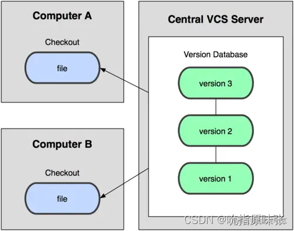
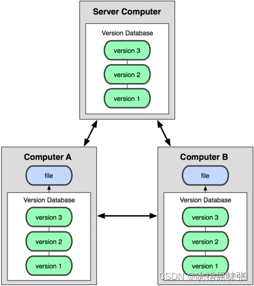
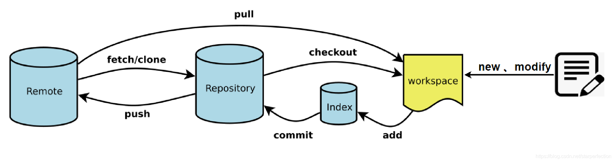

# 新建代码库

```bash
# 在当前目录新建一个Git代码库
$ git init

# 新建一个目录，将其初始化为Git代码库
$ git init [project-name]

# 下载一个项目和它的整个代码历史
$ git clone [url]
```

# 配置
Git的设置文件为`.gitconfig`，它可以在用户主目录下（全局配置），也可以在项目目录下（项目配置）。

```bash
# 显示当前的Git配置
$ git config --list

# 设置提交代码时的用户信息
$ git config [--global] user.name "[name]"
$ git config [--global] user.email "[email address]"
```
# 增加/删除文件

```bash
# 添加指定文件到暂存区
$ git add [file1] [file2] ...

# 添加指定目录到暂存区，包括子目录
$ git add [dir]

# 添加当前目录的所有文件到暂存区
$ git add .

```
# 代码提交

```bash
# 提交暂存区到仓库区
$ git commit -m [message]

# 提交暂存区的指定文件到仓库区
$ git commit [file1] [file2] ... -m [message]

```
# 分支

```bash
# 列出所有本地分支
$ git branch

# 列出所有远程分支
$ git branch -r

# 列出所有本地分支和远程分支
$ git branch -a

# 新建一个分支，但依然停留在当前分支
$ git branch [branch-name]

# 新建一个分支，并切换到该分支
$ git checkout -b [branch]

# 建立追踪关系，在现有分支与指定的远程分支之间
$ git branch --set-upstream [branch] [remote-branch]

# 合并指定分支到当前分支
$ git merge [branch]

# 删除分支
$ git branch -d [branch-name]

# 删除远程分支
$ git push origin --delete [branch-name]
$ git branch -dr [remote/branch]
```
# 标签
```bash
# 列出所有tag
$ git tag

# 新建一个tag在当前commit
$ git tag [tag]

# 新建一个tag在指定commit
$ git tag [tag] [commit]

# 删除本地tag
$ git tag -d [tag]

```
# 查看信息

```bash
# 显示有变更的文件
$ git status

# 显示当前分支的版本历史
$ git log

# 显示commit历史，以及每次commit发生变更的文件
$ git log --stat


# 显示暂存区和工作区的差异
$ git diff

# 显示当前分支的最近几次提交
$ git reflog
```
# 远程同步

```bash
# 下载远程仓库的所有变动
$ git fetch [remote]

# 查看本地分支和远程分支映射关系
$ git branch -vv

# 建立当前分支与远程分支的映射关系
$ git branch -u [remote]/[remote-branch]

# 撤销本地分支与远程分支的映射关系
$ git branch --unset-upstream

# 显示所有远程仓库
$ git remote -v

# 显示某个远程仓库的信息
$ git remote show [remote]

# 增加一个新的远程仓库，并命名
$ git remote add [shortname] [url]

# 拉取远程仓库分支并创建本地分支(本地分支会和远程分支建立映射关系)
$ git checkout -b [local-branch] [remote]/[remote-branch]

# 取回远程仓库的变化，并与本地分支合并
$ git pull [remote] [branch]

# 上传本地指定分支到远程仓库
$ git push [remote] [branch]

# 强行推送当前分支到远程仓库，即使有冲突
$ git push -f [remote] [branch]

# 推送本地分支到远程仓库，并建立本地分支与远程分支的关联
# 以后再重复同样同样分支的推送时，只需使用git push
$ git push -u [remote] [branch]

# 推送所有分支到远程仓库
$ git push [remote] --all
```
# 撤销

```bash
# 恢复暂存区的指定文件到工作区
$ git checkout [file]

# 恢复某个commit的指定文件到暂存区和工作区
$ git checkout [commit] [file]

# 恢复暂存区的所有文件到工作区
$ git checkout .

# 撤销指定 commit
$ git revert [commit]

# 撤销工作区中所有未提交文件的修改内容  
$ git reset --hard HEAD

```


# 其他

## Git是什么？
Git 是一个开源的分布式版本控制系统。
- Git的最基本作用是版本控制，可以记录一个或若干个文件的内容变化。
- Git可以实现多人协同办公。

## Git跟SVN有啥区别？(分布式版本控制系统和集中式版本控制系统的区别？)
Git是分布式版本控制系统，SVN是集中式版本控制系统。

- 集中化的版本控制系统，都有一个单一的集中管理的服务器，保存所有文件的修订版本，而协同工作的人们都通过客户端连到这台服务器，取出最新的文件或者提交更新。  
这么做最显而易见的缺点是中央服务器的单点故障。如果宕机一小时，那么在这一小时内，谁都无法提交更新，也就无法协同工作。要是中央服务器的磁盘发生故障，碰巧没做备份，或者备份不够及时，就会有丢失数据的风险。最坏的情况是彻底丢失整个项目的所有历史更改记录。  



- 分布式版本控制系统的客户端并不只提取最新版本的文件快照，而是把代码仓库完整地镜像下来。这么一来，任何一处协同工作用的服务器发生故障，事后都可以用任何一个镜像出来的本地仓库恢复。因为每一次的提取操作，实际上都是一次对代码仓库的完整备份。




## 分布式版本控制系统相对于集中式版本控制系统的优势是什么？
- 工作时不需要联网。首先，分布式版本控制系统根本没有“中央服务器”，每个人的电脑上都是一个完整的版本库，这样，工作的时候，就不需要联网了，因为版本库就在自己的电脑上。
- 更加安全。集中式版本控制系统，一旦中央服务器出了问题，所有人都无法工作。
分布式版本控制系统，每个人电脑中都有完整的版本库，所以某人的机器挂了，并不影响其它人。


## 简单说一下Git的四个区域



上图中：
- workspace：工作区。本地文件夹中存放项目代码的地方。
- index/cache/staging area：暂存区。用于临时存放改动，位于.git/index
- local repository（commit history）：本地仓库。安全存放数据的位置，这里面有提交到所有版本的数据。
- remote repository：远程仓库。托管代码的远程服务器

观察上图可知：
- 修改未add：workspace有改动
- 修改且add：workspace和index/cache/staging area有改动
- 修改、add、commit：workspace、staging area和local repository有改动


## 初次使用GIt提交远程仓库的流程 
```bash
git config [--global] user.name "[name]"             // 配置用户名称
git config [--global] user.email "[email address]"   // 配置用户邮箱
cd <existing_repo>                   // 进入工程目录
git init                             // 初始化当前目录为仓库
git add .(filename)                  // 将当前目录中的所有文件或指定文件加入版本管理(添加文件到暂存区) 
git commit -m “First commit”         // 将修改提交到本地仓库(将暂存区增加到仓库中)
git remote add origin 远程仓库地址 // 指定远程仓库地址       
git push -u origin master             // 把本地仓库的文件推送到远程仓库master分支，建立远程分支与本地分支的关联，这样下次进行推送时，使用git push即可                             
```

## 本地文件修改提交至远程仓库流程
```bash
git add .(filename)                  // 将当前目录中的所有文件或指定文件加入版本管理 
git commit -m "Change"    // 将修改提交到本地仓库(将暂存区增加到仓库中)
git push origin master  // 把本地仓库的文件推送到远程仓库master分支
```


## 我们在本地工程常会修改一些配置文件，这些文件不需要被提交，该如何操作？
首先利用命令touch .gitignore新建文件

```bash
$ touch .gitignore
```

然后往文件中添加需要忽略哪些文件夹下的什么类型的文件

```bash
$ vim .gitignore
$ cat .gitignore
/target/class
.settings
.imp
*.ini
```
上述`.gitignore`文件的含义是，忽略/target/class文件夹下所有后缀名为.settings，.imp的文件，忽略所有后缀名为.ini的文件。


## 如果代码出现bug,你们是如何解决的?
创建一个bug分支,然后进行bug处理,处理完毕后,合并到review分支,组长review成功后才能够合并到master

合并完成之后删除bug分支

回到dev分支继续开发。


## 能不能说一下git fetch和git pull命令之间的区别？
简单来说：git fetch branch是把名为branch的远程分支拉取到本地；而git pull branch是在fetch的基础上，把branch分支与当前分支进行merge；因此pull = fetch + merge。

