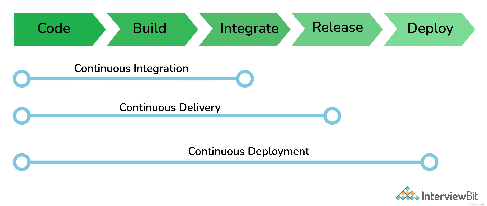

## 什么是 Jenkins？

Jenkins 是一个持续集成 (CI Continuous Integration) 工具，它可以帮助开发人员和测试人员协同工作，可以用来构建自动化测试。

## 什么是 CI/CD？

CI 是 Continuous Integration，意思是持续集成。

CD 有两种含义，一种是 Continuous Delivery，持续交付，另一种是 Continuous Deploy 持续部署。

我的理解是，通过 CI/CD，可以使软件开发的整个过程（开发→构建→测试→交付→部署）自动化，相比于传统的软件开发流程，可以减少在开发应用程序时引入错误的机会。

> 软件开发的传统流程是：开发人员在开发环境中完成软件开发，单元测试，测试通过，提交到代码版本管理库;开发人员通知运维人员项目可以发布，然后运维人员下载代码进行打包和构建，生成应用制品;运维人员使用部署脚本将生成的制品部署到测试环境，并提示测试人员可以进行产品的测试;测试人员开始进行手动、自动化测试，测试完成后提醒运维人员可以进行预生产环境部署;运维人员开始进行预生产环境部署，然后测试人员进行测试，测试完成后，开始部署生产环境。最终一直到软件发布。

## 自动化测试平台中，Jenkins 的工作流程是什么？

编写的自动化测试脚本在本地测试通过后，将若干个测试脚本及测试所需资源上传至 Gitlab 中。

在 TaaS 上，配置测试场景和测试 Job。

Job 开始执行后，Jenkins 将根据 Job 的配置，自动从 Gitlab 中拉取代码，并且将其部署至 Job 指定的测试机器上，开始运行自动化测试脚本。

运行结束后，通过 Jenkins 可以查看 Job 的执行过程及执行后产生的测试报告。