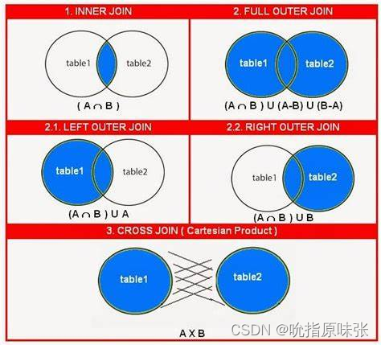

# DQL(Data Query Language)：数据查询语言

在SQL语句中每个关键字都会按照顺序往下执行，而每一步操作，会生成一个虚拟表，最后的虚拟表就是最终结果。

## MySQL 查询语句关键字书写顺序

```sql
SELECT DISTINCT <select_list>
FROM <left_table>
<join_type> JOIN <right_table> ON <join_condition>
WHERE <where_condition>
GROUP BY <group_by_list>
WITH{CUBE|ROLLUP}
HAVING <having_condition>
ORDER BY <order_by_list>
LIMIT <limit_number>

参考：https://blog.csdn.net/ai_shuyingzhixia/article/details/80559155
```

## MySQL 查询语句关键字执行顺序

```sql
FROM ： 对FROM左边的表和右边的表计算笛卡尔积，产生虚表VT1；
ON ： 对虚拟表VT1进行ON筛选，只有那些符合条件的行才会被记录在虚拟表VT2中；
JOIN ：如果是OUT JOIN，那么将保留表中（如左表或者右表）未匹配的行作为外部行添加到虚拟表VT2中，从而产生虚拟表VT3；
WHERE ：对虚拟表VT3进行WHERE条件过滤，只有符合的记录才会被放入到虚拟表VT4；
GROUP BY：根据GROUP BY子句中的列，对虚拟表VT4进行分组操作，产生虚拟表VT5；
WITH{CUBE|ROLLUP}：对虚拟表VT5进行CUBE或者ROLLUP操作，产生虚拟表VT6；
HAVING ：对虚拟表VT6进行 HAVING 条件过滤，只有符合的记录才会被插入到虚拟表VT7中；
SELECT ：执行SELECT操作，选择指定的列，插入到虚拟表VT8中；
DISTINCT ：对虚拟表VT8中的记录进行去重，产生虚拟表VT9；
ORDER BY ：将虚拟表VT9中的记录按照进行排序操作，产生虚拟表VT10；
LIMIT ：取出指定行的记录，产生虚拟表VT11，并将结果返回。

```

## MySQL 单行处理函数

函数名称	|作用
--|--
ABS	|求绝对值
SQRT|	求二次方根
MOD	|求余数
CEIL |两个函数功能相同，都是返回不小于参数的最小整数，即向上取整
FLOOR|	向下取整，返回值转化为一个BIGINT
ROUND	|对所传参数进行四舍五入
LENGTH|	计算字符串长度函数，返回字符串的字节长度
CONCAT|	合并字符串函数，返回结果为连接参数产生的字符串，参数可以使一个或多个
LOWER|	将字符串中的字母转换为小写
UPPER|	将字符串中的字母转换为大写
TRIM|	删除字符串左右两侧的空格

## MySQL 聚合函数(使用了GROUP BY之后才能使用聚合函数)

函数名称	|作用
--|--
MAX	|查询指定列的最大值
MIN	|查询指定列的最小值
COUNT|	统计查询结果的行数
SUM	|求和，返回指定列的总和
AVG	|求平均值，返回指定列数据的平均值


## SELECT：查询数据表
在 MySQL 中，可以使用 SELECT 语句来查询数据。查询数据是指从数据库中根据需求，使用不同的查询方式来获取不同的数据，是使用频率最高、最重要的操作。

### 查询表中所有字段：

格式：

```sql
SELECT * FROM 表名;
```

举例：  

从 tb_students_info 表中查询所有字段的数据
```sql
SELECT * FROM tb_students_info;
```

### 查询表中指定字段：

格式：

```sql
SELECT <字段名1>,<字段名2>,…,<字段名n> FROM <表名>;
```

举例：  

从 tb_students_info 表中获取 id、name 和 height 三列
```sql
SELECT id,name,height FROM tb_students_info;
```

## DISTINCT：去重
在 MySQL 中使用 SELECT 语句执行简单的数据查询时，返回的是所有匹配的记录。如果表中的某些字段没有唯一性约束，那么这些字段就可能存在重复值。为了实现查询不重复的数据，MySQL 提供了 DISTINCT 关键字。

### 对指定字段中重复的数据进行去重：

格式：

```sql
SELECT DISTINCT <字段名> FROM <表名>;
```

注意：

- DISTINCT 关键字只能在 SELECT 语句中使用。
- 在对一个或多个字段去重时，DISTINCT 关键字必须在所有字段的最前面。
- 如果 DISTINCT 关键字后有多个字段，则会对多个字段进行组合去重，也就是说，只有多个字段组合起来完全是一样的情况下才会被去重。

举例：

对 student 表的 name 和 age 字段进行去重  
```sql
SELECT DISTINCT name,age FROM student;
```

## AS：设置别名

为了查询方便，MySQL 提供了 AS 关键字来为表和字段指定别名。

### 为表指定别名：

当表名很长或者执行一些特殊查询的时候，为了方便操作，可以为表指定一个别名，用这个别名代替表原来的名称。

格式：

```sql
<表名> [AS] <别名>  
```

含义：

- <表名>：数据库中存储的数据表的名称。
- <别名>：查询时指定的表的新名称。
- AS关键字可以省略，省略后需要将表名和别名用空格隔开。

注意：

- 表的别名不能与该数据库的其它表同名。
- 表别名只在执行查询时使用，并不在返回结果中显示。


举例：  

为 tb_students_info 表指定别名 stu
```sql
SELECT stu.name,stu.height FROM tb_students_info AS stu;
```


### 为字段指定别名：

在使用 SELECT 语句查询数据时，MySQL 会显示每个 SELECT 后面指定输出的字段。有时为了显示结果更加直观，我们可以为字段指定一个别名。  

格式：
```sql
<字段名> [AS] <别名>
```
含义：
- <字段名>：为数据表中字段定义的名称。
- <字段别名>：字段新的名称。
- AS关键字可以省略，省略后需要将字段名和别名用空格隔开。

注意：

- 字段的别名不能与该表的其它字段同名。
- 字段定义别名之后，会返回给客户端显示，显示的字段为字段的别名。

举例：  

查询 tb_students_info 表，为 name 指定别名 student_name，为 age 指定别名 student_age  
```sql
SELECT name AS student_name, age AS student_age FROM tb_students_info;
```

## LIMIT：限制查询结果的条数
当数据表中有上万条数据时，一次性查询出表中的全部数据会降低数据返回的速度，同时给数据库服务器造成很大的压力。这时就可以用 LIMIT 关键字来限制查询结果返回的条数。


### 指定初始位置：  
LIMIT 关键字可以指定查询结果从哪条记录开始显示，显示多少条记录。  

格式：
```sql
LIMIT 初始位置，记录数
```
含义：
- “初始位置”表示从哪条记录开始显示；
- “记录数”表示显示记录的条数。第一条记录的位置是 0，第二条记录的位置是 1。后面的记录依次类推。
- 上述两个参数必须是正整数

举例：  

在 tb_students_info 表中，使用 LIMIT 子句返回从第 4 条记录开始的行数为 5 的记录

```sql
SELECT * FROM tb_students_info LIMIT 3,5;
```

### 不指定初始位置：  
LIMIT 关键字不指定初始位置时，记录从第一条记录开始显示。显示记录的条数由 LIMIT 关键字指定。

格式：
```sql
LIMIT 记录数
```

含义：

- “记录数”表示显示记录的条数。如果“记录数”的值小于查询结果的总数，则会从第一条记录开始，显示指定条数的记录。如果“记录数”的值大于查询结果的总数，则会直接显示查询出来的所有记录。

注意：

- 带一个参数的 LIMIT 指定从查询结果的首行开始，唯一的参数表示返回的行数，即“LIMIT n”与“LIMIT 0，n”返回结果相同。带两个参数的 LIMIT 可返回从任何位置开始指定行数的数据。

举例：

显示 tb_students_info 表查询结果的前 4 行

```sql
SELECT * FROM tb_students_info LIMIT 4;
```

### LIMIT和OFFSET组合使用
格式：
```sql
LIMIT 记录数 OFFSET 初始位置
```

含义：
- “初始位置”指定从哪条记录开始显示；
- “记录数”表示显示记录的条数。

举例：

在 tb_students_info 表中，使用 LIMIT OFFSET 返回从第 4 条记录开始的行数为 5 的记录

```sql
SELECT * FROM tb_students_info LIMIT 5 OFFSET 3;
```

## ORDER BY：对查询结果进行排序
通过条件查询语句可以查询到符合用户需求的数据，但是查询到的数据一般都是按照数据最初被添加到表中的顺序来显示。为了使查询结果的顺序满足用户的要求，MySQL 提供了 ORDER BY 关键字来对查询结果进行排序。  

格式：  

```sql
ORDER BY <字段名> [ASC|DESC]
```

含义：

- 字段名：表示需要排序的字段名称，多个字段时用逗号隔开。
- ASC|DESC：ASC表示字段按升序排序；DESC表示字段按降序排序。其中ASC为默认值。

注意：

- ORDER BY 关键字后可以跟子查询。
- 当排序的字段中存在空值时，ORDER BY 会将该空值作为最小值来对待。
- ORDER BY 指定多个字段进行排序时，MySQL 会按照字段的顺序从左到右依次进行排序。
- 在对多个字段进行排序时，排序的第一个字段必须有相同的值，才会对第二个字段进行排序。如果第一个字段数据中所有的值都是唯一的，MySQL 将不再对第二个字段进行排序。

### 单字段排序

举例：

查询 tb_students_info 表的所有记录，并对 height 字段进行排序

```sql
SELECT * FROM tb_students_info ORDER BY height;
```

### 多字段排序

举例：

查询 tb_students_info 表中的 name 和 height 字段，先按 height 排序，再按 name 排序

```sql
SELECT name,height FROM tb_students_info ORDER BY height,name;
```

举例：

查询 tb_students_info 表，先按 height 降序排序，再按 name 升序排序

```sql
SELECT name,height FROM tb_student_info ORDER BY height DESC,name ASC;
```

## WHERE：条件查询  

格式：

```sql
WHERE 查询条件
```

含义：

查询条件可以是：
- 带比较运算符和逻辑运算符的查询条件
- 带 BETWEEN AND 关键字的查询条件
- 带 IS NULL 关键字的查询条件
- 带 IN 关键字的查询条件
- 带 LIKE 关键字的查询条件

### 单一条件查询语句

单一条件指的是在 WHERE 关键字后只有一个查询条件。

举例：

在 tb_students_info 数据表中查询身高为 170cm 的学生姓名

```sql
SELECT name,height FROM tb_students_info
WHERE height=170;
```

在 tb_students_info 数据表中查询年龄小于 22 的学生姓名

```sql
SELECT name,age FROM tb_students_info
WHERE age<22;
```

### 多条件查询语句

多个查询条件时用逻辑运算符 AND（&&）、OR（||）或 XOR 隔开。

- AND：记录满足所有查询条件时，才会被查询出来。
- OR：记录满足任意一个查询条件时，才会被查询出来。
- XOR：记录满足其中一个条件，并且不满足另一个条件时，才会被查询出来。


举例：

在 tb_students_info 表中查询 age 大于 21，并且 height 大于等于 175 的学生信息

```sql
SELECT name,age,height FROM tb_students_info 
WHERE age>21 AND height>=175;
```

在 tb_students_info 表中查询 age 大于 21，或者 height 大于等于 175 的学生信息

```sql
SELECT name,age,height FROM tb_students_info 
WHERE age>21 OR height>=175;
```

## LIKE：模糊查询

格式：

```sql
[NOT] LIKE  '字符串'
```

含义：

- NOT ：可选参数，字段中的内容与指定的字符串不匹配时满足条件。
- 字符串：指定用来匹配的字符串。“字符串”可以是一个很完整的字符串，也可以包含通配符。

注意：

- 匹配的字符串必须加单引号或双引号。
- LIKE 关键字支持百分号“%”和下划线“_”通配符。
- “%”是 MySQL 中最常用的通配符，它能代表任何长度的字符串，字符串的长度可以为 0。
- “_”只能代表单个字符，字符的长度不能为 0。
- 通配符是一种特殊语句，主要用来模糊查询。当不知道真正字符或者懒得输入完整名称时，可以使用通配符来代替一个或多个真正的字符。 

举例：

在 tb_students_info 表中，查找所有以字母“T”开头的学生姓名

```sql
SELECT name FROM tb_students_info
WHERE name LIKE 'T%';
```

在 tb_students_info 表中，查找所有以字母“y”结尾，且“y”前面只有 4 个字母的学生姓名

```sql
mysql> SELECT name FROM tb_students_info
WHERE name LIKE '____y';
```

## BETWEEN AND：范围查询

MySQL 提供了 BETWEEN AND 关键字，用来判断字段的数值是否在指定范围内。

格式：

```sql
[NOT] BETWEEN 取值1 AND 取值2
```

含义：

- NOT：可选参数，表示指定范围之外的值。如果字段值不满足指定范围内的值，则这些记录被返回。
- 取值1：表示范围的起始值。
- 取值2：表示范围的终止值。

注意：

- BETWEEN AND 能匹配指定范围内的所有值，包括起始值和终止值。

举例：

在表 tb_students_info 中查询年龄在 20 到 23 之间的学生姓名和年龄

```sql
SELECT name,age FROM tb_students_info 
WHERE age BETWEEN 20 AND 23;
```

## NULL：空值查询

MySQL 提供了 IS NULL 关键字，用来判断字段的值是否为空值（NULL）。空值不同于 0，也不同于空字符串。如果字段的值是空值，则满足查询条件，该记录将被查询出来。如果字段的值不是空值，则不满足查询条件。

格式：

```sql
IS [NOT] NULL
```

含义：

- NOT”是可选参数，表示字段值不是空值时满足条件。

注意：

- IS NULL 是一个整体，不能将 IS 换成“=”

举例：

查询 tb_students_info 表中 login_date 字段是 NULL 的记录

```sql
SELECT name,login_date FROM tb_students_info 
WHERE login_date IS NULL;
```

查询 tb_students_info 表中 login_date 字段不为空的记录

```sql
SELECT name,login_date FROM tb_students_info 
WHERE login_date IS NOT NULL;
```

## GROUP BY：分组查询

GROUP BY 关键字可以根据一个或多个字段对查询结果进行分组。经常和聚合函数，例如 SUM 、 COUNT 一起使用。

格式：

```sql
GROUP BY  <字段名>
```

含义：

- “字段名”表示需要分组的字段名称，多个字段时用逗号隔开。

举例：

统计各个学生参加了几门考试

```sql
SELECT name, COUNT(course)
FROM grade_table
GROUP BY name
```

得到各个学生的考试总分

```sql
SELECT name, SUM(score)
FROM grade_table
GROUP BY name
```

根据 tb_students_info 表中的 sex 字段进行分组查询

```sql
SELECT name,sex FROM tb_students_info 
GROUP BY sex;
```

## HAVING：过滤分组

可以使用 HAVING 关键字对分组后的数据进行过滤。

格式：

```sql
HAVING <查询条件>
```

含义：

- HAVING 关键字和 WHERE 关键字都可以用来过滤数据，且 HAVING 支持 WHERE 关键字中所有的操作符和语法。


注意：

WHERE 和 HAVING 关键字也存在以下几点差异：

- 一般情况下，WHERE 用于过滤数据行，而 HAVING 用于过滤分组。
- WHERE 查询条件中不可以使用聚合函数，而 HAVING 查询条件中可以使用聚合函数。
- WHERE 在数据分组前进行过滤，而 HAVING 在数据分组后进行过滤 。
- WHERE 针对数据库文件进行过滤，而 HAVING 针对查询结果进行过滤。也就是说，WHERE 根据数据表中的字段直接进行过滤，而 HAVING 是根据前面已经查询出的字段进行过滤。
- WHERE 查询条件中不可以使用字段别名，而 HAVING 查询条件中可以使用字段别名。


举例：

根据 height 字段对 tb_students_info 表中的数据进行分组，并使用 HAVING 关键字分别查询出分组后平均身高大于 170 的学生姓名、性别和身高

```sql
SELECT GROUP_CONCAT(name),sex,height FROM tb_students_info 
GROUP BY height 
HAVING AVG(height)>170;
```

## CROSS JOIN：交叉连接
前面所讲的查询语句都是针对一个表的，但是在关系型数据库中，表与表之间是有联系的，所以在实际应用中，经常使用多表查询。多表查询就是同时查询两个或两个以上的表。多表查询主要有交叉连接、内连接和外连接。

交叉连接（CROSS JOIN）一般用来返回连接表的笛卡尔积。

格式：

```sql
SELECT <字段名> FROM <表1> CROSS JOIN <表2> [WHERE子句]

或

SELECT <字段名> FROM <表1>, <表2> [WHERE子句] 
```

含义：

- 字段名：需要查询的字段名称。
- <表1><表2>：需要交叉连接的表名。
- WHERE 子句：用来设置交叉连接的查询条件。

注意：

- 多个表交叉连接时，在 FROM 后连续使用 CROSS JOIN 或`,`即可。以上两种语法的返回结果是相同的，但是第一种语法才是官方建议的标准写法。
- 当连接的表之间没有关系时，我们会省略掉 WHERE 子句，这时返回结果就是两个表的笛卡尔积，返回结果数量就是两个表的数据行相乘。
- 交叉连接可以查询两个或两个以上的表.

举例：

查询 tb_course 表中的 id 字段和 tb_students_info 表中的 course_id 字段相等的内容

```sql
SELECT * FROM tb_course CROSS JOIN tb_students_info 
WHERE tb_students_info.course_id = tb_course.id;
```

## INNER JOIN：内连接

内连接（INNER JOIN）主要通过设置连接条件的方式，来移除查询结果中某些数据行的交叉连接。简单来说，就是利用条件表达式来消除交叉连接的某些数据行。

内连接使用 INNER JOIN 关键字连接两张表，并使用 ON 子句来设置连接条件。如果没有连接条件，INNER JOIN 和 CROSS JOIN 在语法上是等同的，两者可以互换。

格式：

```sql
SELECT <字段名> FROM <表1> INNER JOIN <表2> [ON子句]
```

含义：

- 字段名：需要查询的字段名称。
- <表1><表2>：需要内连接的表名。
- INNER JOIN ：内连接中可以省略 INNER 关键字，只用关键字 JOIN。
- ON 子句：用来设置内连接的连接条件。

注意：

- 多个表内连接时，在 FROM 后连续使用 INNER JOIN 或 JOIN 即可。
- INNER JOIN 也可以使用 WHERE 子句指定连接条件，但是 INNER JOIN ... ON 语法是官方的标准写法，而且 WHERE 子句在某些时候会影响查询的性能。
- 内连接可以查询两个或两个以上的表。
- 当对多个表进行查询时，要在 SELECT 语句后面指定字段是来源于哪一张表。因此，在多表查询时，SELECT 语句后面的写法是`表名.列名`。另外，如果表名非常长的话，也可以给表设置别名，这样就可以直接在 SELECT 语句后面写上`表的别名.列名`。

举例：

在 tb_students_info 表和 tb_course 表之间，使用内连接查询学生姓名和相对应的课程名称

```sql
SELECT s.name,c.course_name FROM tb_students_info s INNER JOIN tb_course c 
ON s.course_id = c.id;
```
## LEFT/RIGHT JOIN：外连接

外连接会先将连接的表分为基表和参考表，再以基表为依据返回满足和不满足条件的记录。外连接可以分为左外连接和右外连接

### LEFT JOIN：左连接

左外连接又称为左连接，使用 LEFT OUTER JOIN 关键字连接两个表，并使用 ON 子句来设置连接条件。

格式：

```sql
SELECT <字段名> FROM <表1> LEFT OUTER JOIN <表2> <ON子句>
```

含义：

- 字段名：需要查询的字段名称。
- <表1><表2>：需要左连接的表名。
- LEFT OUTER JOIN：左连接中可以省略 OUTER 关键字，只使用关键字 LEFT JOIN。
- ON 子句：用来设置左连接的连接条件，不能省略。

注意：

- 上述语法中，“表1”为基表，“表2”为参考表。左连接查询时，可以查询出“表1”中的所有记录和“表2”中匹配连接条件的记录。如果“表1”的某行在“表2”中没有匹配行，那么在返回结果中，“表2”的字段值均为空值（NULL）。
- 多个表左/右连接时，在 ON 子句后连续使用 LEFT/RIGHT OUTER JOIN 或 LEFT/RIGHT JOIN 即可。

举例：

在 tb_students_info 表和 tb_course 表中查询所有学生姓名和相对应的课程名称，包括没有课程的学生

```sql
SELECT s.name,c.course_name FROM tb_students_info s LEFT OUTER JOIN tb_course c 
ON s.course_id=c.id;
```


### RIGHT JOIN：右连接

右外连接又称为右连接，右连接是左连接的反向连接。使用 RIGHT OUTER JOIN 关键字连接两个表，并使用 ON 子句来设置连接条件。

格式：

```sql
SELECT <字段名> FROM <表1> RIGHT OUTER JOIN <表2> <ON子句>
```

含义：

- 字段名：需要查询的字段名称。
- <表1><表2>：需要右连接的表名。
- RIGHT OUTER JOIN：右连接中可以省略 OUTER 关键字，只使用关键字 RIGHT JOIN。
- ON 子句：用来设置右连接的连接条件，不能省略。

注意：

- 右连接以“表2”为基表，“表1”为参考表。右连接查询时，可以查询出“表2”中的所有记录和“表1”中匹配连接条件的记录。如果“表2”的某行在“表1”中没有匹配行，那么在返回结果中，“表1”的字段值均为空值（NULL）。
- 多个表左/右连接时，在 ON 子句后连续使用 LEFT/RIGHT OUTER JOIN 或 LEFT/RIGHT JOIN 即可。

举例：

在 tb_students_info 表和 tb_course 表中查询所有课程，包括没有学生的课程

```sql
SELECT s.name,c.course_name FROM tb_students_info s RIGHT OUTER JOIN tb_course c 
ON s.course_id=c.id;
```

## FULL JOIN：全连接

只要其中某个表存在匹配，FULL JOIN 关键字就会返回行。(返回JOIN 两端表的所有数据，无论其与另一张表有没有匹配。显示左连接、右连接和内连接的并集)

格式：

```sql
SELECT <字段名> FROM <表1> FULL OUTER JOIN <表2> <ON子句>
```

含义：

- 字段名：需要查询的字段名称。
- <表1><表2>：需要右连接的表名。
- FULL OUTER JOIN：全连接中可以省略 OUTER 关键字，只使用关键字 FULL JOIN。
- ON 子句：用来设置全连接的连接条件，不能省略。

举例：

在 tb_students_info 表和 tb_course 表中查询所有课程和所有学生，包括没有学生的课程以及没有课程的学生

```sql
SELECT s.name,c.course_name FROM tb_students_info s FULL OUTER JOIN tb_course c 
ON s.course_id=c.id;
```

## MySQL各种连接总结



## 子查询

通过子查询可以实现多表查询。子查询指将一个查询语句嵌套在另一个查询语句中。子查询可以在 SELECT、UPDATE 和 DELETE 语句中使用，而且可以进行多层嵌套。在实际开发时，子查询经常出现在 WHERE 子句中。

格式：

```sql
WHERE <表达式> <操作符> (子查询)
```

含义：

操作符可以是比较运算符和 IN、NOT IN、EXISTS、NOT EXISTS 等关键字。

- IN | NOT IN：当表达式与子查询返回的结果集中的某个值相等时，返回 TRUE，否则返回 FALSE；若使用关键字 NOT，则返回值正好相反。
- EXISTS | NOT EXISTS：用于判断子查询的结果集是否为空，若子查询的结果集不为空，返回 TRUE，否则返回 FALSE；若使用关键字 NOT，则返回的值正好相反。

注意：

- 习惯上，外层的 SELECT 查询称为父查询，圆括号中嵌入的查询称为子查询（子查询必须放在圆括号内）。MySQL 在处理上例的 SELECT 语句时，执行流程为：先执行子查询，再执行父查询。

举例：

使用子查询在 tb_students_info 表和 tb_course 表中查询学习 Java 课程的学生姓名

```sql
SELECT name FROM tb_students_info 
WHERE course_id IN (SELECT id FROM tb_course WHERE course_name = 'Java');
```

在 tb_course 表和 tb_students_info 表中查询出所有学习 Python 课程的学生姓名

```sql
SELECT name FROM tb_students_info
WHERE course_id = (SELECT id FROM tb_course WHERE course_name = 'Python');
```

# DML(Data Manipulation Language)：数据操作语言

## INSERT：向表中插入数据

使用 INSERT 语句可以向数据库已有的表中插入一行或者多行元组数据。

格式1：

```sql
INSERT INTO <表名> [ <列名1> [ , … <列名n>] ]
VALUES (值1) [… , (值n) ];
```

含义1：

- <表名>：指定被操作的表名。
- <列名>：指定需要插入数据的列名。若向表中的所有列插入数据，则全部的列名均可以省略，直接采用 INSERT<表名>VALUES(…) 即可。
- VALUES 或 VALUE 子句：该子句包含要插入的数据清单。数据清单中数据的顺序要和列的顺序相对应。

格式2：

```sql
INSERT INTO <表名>
SET <列名1> = <值1>,
        <列名2> = <值2>,
        …
```

含义2：

- 用于直接给表中的某些列指定对应的列值，即要插入的数据的列名在 SET 子句中指定，col_name 为指定的列名，等号后面为指定的数据，而对于未指定的列，列值会指定为该列的默认值。

注意：
- 使用 INSERT…VALUES 语句可以向表中插入一行数据，也可以插入多行数据；
- 使用 INSERT…SET 语句可以指定插入行中每列的值，也可以指定部分列的值；
- INSERT…SELECT 语句向表中插入其他表的数据。
- 采用 INSERT…SET 语句可以向表中插入部分列的值，这种方式更为灵活；
- INSERT…VALUES 语句可以一次插入多条数据。
- 当使用单条 INSERT 语句插入多行数据的时候，只需要将每行数据用圆括号括起来即可。
- INSERT 语句后面的列名称顺序可以不是 tb_courses 表定义时的顺序，即插入数据时，不需要按照表定义的顺序插入，只要保证值的顺序与列字段的顺序相同就可以。


举例：

在 tb_courses 表中插入一条新记录，course_id 值为 2，course_name 值为“Database”，course_grade 值为 3，info值为“MySQL”。

```sql
INSERT INTO tb_courses
(course_name,course_info,course_id,course_grade)
VALUES('Database','MySQL',2,3);
```

从 tb_courses 表中查询所有的记录，并将其插入 tb_courses_new 表中。

举例：

```sql
INSERT INTO tb_courses_new
(course_id,course_name,course_grade,course_info)
SELECT course_id,course_name,course_grade,course_info
FROM tb_courses;
```

## UPDATE：修改表中数据

使用 UPDATE 语句可以修改、更新一个或多个表的数据。

格式：

```sql
UPDATE <表名> SET 字段 1=值 1 [,字段 2=值 2… ] [WHERE 子句 ]
[ORDER BY 子句] [LIMIT 子句]
```

含义：

- <表名>：用于指定要更新的表名称。
- SET 子句：用于指定表中要修改的列名及其列值。其中，每个指定的列值可以是表达式，也可以是该列对应的默认值。如果指定的是默认值，可用关键字 DEFAULT 表示列值。
- WHERE 子句：可选项。用于限定表中要修改的行。若不指定，则修改表中所有的行。
- ORDER BY 子句：可选项。用于限定表中的行被修改的次序。
- LIMIT 子句：可选项。用于限定被修改的行数。

注意：

- 修改一行数据的多个列值时，SET 子句的每个值用逗号分开即可。
- 若只是更新部分行的数据，保证 UPDATE 以 WHERE 子句结束，通过 WHERE 子句指定被更新的记录所需要满足的条件，如果忽略 WHERE 子句，MySQL 将更新表中所有的行。

举例：

在 tb_courses_new 表中，更新所有行的 course_grade 字段值为 4

```sql
UPDATE tb_courses_new
SET course_grade=4;
```

在 tb_courses 表中，更新 course_id 值为 2 的记录，将 course_grade 字段值改为 3.5，将 course_name 字段值改为“DB”

```sql
UPDATE tb_courses_new
SET course_name='DB',course_grade=3.5
WHERE course_id=2;
```

## DELETE：删除表中数据

使用 DELETE 语句可以删除表的一行或者多行数据。

格式：

```sql
DELETE FROM <表名> [WHERE 子句] [ORDER BY 子句] [LIMIT 子句]
```

含义：

- <表名>：指定要删除数据的表名。
- ORDER BY 子句：可选项。表示删除时，表中各行将按照子句中指定的顺序进行删除。
- WHERE 子句：可选项。表示为删除操作限定删除条件，若省略该子句，则代表删除该表中的所有行。
- LIMIT 子句：可选项。用于告知服务器在控制命令被返回到客户端前被删除行的最大值。

注意：

- 在不使用 WHERE 条件的时候，将删除所有数据。

举例：

删除 tb_courses_new 表中的全部数据

```sql
DELETE FROM tb_courses_new;
```

在 tb_courses_new 表中，删除 course_id 为 4 的记录

```sql
DELETE FROM tb_courses
WHERE course_id=4;
```

# DDL(Data Definition Language)：数据定义语言
## SHOW DATABASES：查看数据库

格式：

```sql
SHOW DATABASES [LIKE '数据库名'];
```

含义：

- LIKE 从句是可选项，用于匹配指定的数据库名称。LIKE 从句可以部分匹配，也可以完全匹配。
- 数据库名由单引号' '包围。

举例：

列出当前用户可查看的所有数据库：

```sql
SHOW DATABASES;
```

使用 LIKE 从句，查看名字中包含 test 的数据库：

```sql
SHOW DATABASES LIKE '%test%';
```

## CREAT DATABASE：创建数据库

格式：

```sql
CREATE DATABASE [IF NOT EXISTS] <数据库名>
[[DEFAULT] CHARACTER SET <字符集名>] 
[[DEFAULT] COLLATE <校对规则名>];
```

含义：

- <数据库名>：创建数据库的名称。MySQL 的数据存储区将以目录方式表示 MySQL 数据库，因此数据库名称必须符合操作系统的文件夹命名规则，不能以数字开头，尽量要有实际意义。注意在 MySQL 中不区分大小写。
- IF NOT EXISTS：在创建数据库之前进行判断，只有该数据库目前尚不存在时才能执行操作。此选项可以用来避免数据库已经存在而重复创建的错误。
- [DEFAULT] CHARACTER SET：指定数据库的字符集。指定字符集的目的是为了避免在数据库中存储的数据出现乱码的情况。如果在创建数据库时不指定字符集，那么就使用系统的默认字符集。
- [DEFAULT] COLLATE：指定字符集的默认校对规则。

注意：

- MySQL 不允许在同一系统下创建两个相同名称的数据库。

举例：

创建一个名为 test_db 的数据库

```sql
CREATE DATABASE test_db;
```
## USE：选择数据库

USE 语句用来完成一个数据库到另一个数据库的跳转。当用 CREATE DATABASE 语句创建数据库之后，该数据库不会自动成为当前数据库，需要用 USE 来指定当前数据库。

格式：

```sql
USE <数据库名>
```

注意：

- 该语句可以通知 MySQL 把<数据库名>所指示的数据库作为当前数据库。该数据库保持为默认数据库，直到语段的结尾，或者直到遇见一个不同的 USE 语句。 只有使用 USE 语句来指定某个数据库作为当前数据库之后，才能对该数据库及其存储的数据对象执行操作。

举例：

将数据库 test_db 设置为默认数据库

```sql
USE test_db;
```

## ALTER DATABASE：修改数据库

在 MySQL 数据库中只能对数据库使用的字符集和校对规则进行修改，数据库的这些特性都储存在 db.opt 文件中。

格式：

```sql
ALTER DATABASE [数据库名] { 
[ DEFAULT ] CHARACTER SET <字符集名> |
[ DEFAULT ] COLLATE <校对规则名>}
```

含义：

- ALTER DATABASE 用于更改数据库的全局特性。
- 使用 ALTER DATABASE 需要获得数据库 ALTER 权限。
- 数据库名称可以忽略，此时语句对应于默认数据库。
- CHARACTER SET 子句用于更改默认的数据库字符集。

举例：

将数据库 test_db 的指定字符集修改为 gb2312，默认校对规则修改为 gb2312_unicode_ci

```sql
ALTER DATABASE test_db
DEFAULT CHARACTER SET gb2312
DEFAULT COLLATE gb2312_chinese_ci;
```

## DROP DATABASE：删除数据库

当数据库不再使用时应该将其删除，以确保数据库存储空间中存放的是有效数据。删除数据库是将已经存在的数据库从磁盘空间上清除，清除之后，数据库中的所有数据也将一同被删除。

格式：

```sql
DROP DATABASE [ IF EXISTS ] <数据库名>
```

含义：

- <数据库名>：指定要删除的数据库名。
- IF EXISTS：用于防止当数据库不存在时发生错误。
- DROP DATABASE：删除数据库中的所有表格并同时删除数据库。使用此语句时要非常小心，以免错误删除。如果要使用 DROP DATABASE，需要获得数据库 DROP 权限。

注意：

- MySQL 安装后，系统会自动创建名为 information_schema 和 mysql 的两个系统数据库，系统数据库存放一些和数据库相关的信息，如果删除了这两个数据库，MySQL 将不能正常工作。
- 使用 DROP DATABASE 命令时要非常谨慎，在执行该命令后，MySQL 不会给出任何提示确认信息。DROP DATABASE 删除数据库后，数据库中存储的所有数据表和数据也将一同被删除，而且不能恢复。因此最好在删除数据库之前先将数据库进行备份。

举例：

将数据库 test_db_del 从数据库列表中删除

```sql
DROP DATABASE test_db_del;
```


## CREAT TABLE：创建数据表

创建数据表，指的是在已经创建的数据库中建立新表。

格式：

```sql
CREATE TABLE <表名> ([表定义选项])[表选项][分区选项];
```

含义：

- CREATE TABLE：用于创建给定名称的表，必须拥有表CREATE的权限。
- <表名>：指定要创建表的名称，在 CREATE TABLE 之后给出，必须符合标识符命名规则。表名称被指定为 db_name.tbl_name，以便在特定的数据库中创建表。无论是否有当前数据库，都可以通过这种方式创建。在当前数据库中创建表时，可以省略 db-name。如果使用加引号的识别名，则应对数据库和表名称分别加引号。例如，'mydb'.'mytbl' 是合法的，但 'mydb.mytbl' 不合法。
- <表定义选项>：表创建定义，由列名（col_name）、列的定义（column_definition）以及可能的空值说明、完整性约束或表索引组成。
- 默认的情况是，表被创建到当前的数据库中。若表已存在、没有当前数据库或者数据库不存在，则会出现错误。

注意：

- 要创建的表的名称不区分大小写，不能使用SQL语言中的关键字，如DROP、ALTER、INSERT等。
- 必须指定数据表中每个列（字段）的名称和数据类型，如果创建多个列，要用逗号隔开。

举例：

创建员工表 tb_emp1（数据表属于数据库，在创建数据表之前，应使用语句“USE<数据库>”指定操作在哪个数据库中进行，如果没有选择数据库，就会抛出 No database selected 的错误。）

```sql
CREATE TABLE tb_emp1
```

## ALTER TABLE：修改数据表

修改表指的是修改数据库中已经存在的数据表的结构。可以使用 ALTER TABLE 语句来改变原有表的结构，例如增加或删减列、更改原有列类型、重新命名列或表等。

格式：

```sql
ALTER TABLE <表名> [修改选项]
```

修改选项：

- ADD COLUMN <列名> <类型>
- CHANGE COLUMN <旧列名> <新列名> <新列类型>
- ALTER COLUMN <列名> { SET DEFAULT <默认值> | DROP DEFAULT }
- MODIFY COLUMN <列名> <类型>
- DROP COLUMN <列名>
- RENAME TO <新表名>
- CHARACTER SET <字符集名>
- COLLATE <校对规则名> 

### RENAME TO：修改表名

格式：

```sql
ALTER TABLE <旧表名> RENAME [TO] <新表名>；
```

含义：

- TO 为可选参数，使用与否均不影响结果。

举例：

使用 ALTER TABLE 将数据表 student 改名为 tb_students_info

```sql
ALTER TABLE student RENAME TO tb_students_info;
```

### CHANGE：修改字段名称

格式：

```sql
ALTER TABLE <表名> CHANGE <旧字段名> <新字段名> <新数据类型>；
```

含义：

- 旧字段名：指修改前的字段名；
- 新字段名：指修改后的字段名；
- 新数据类型：指修改后的数据类型，如果不需要修改字段的数据类型，可以将新数据类型设置成与原来一样，但数据类型不能为空。


举例：

使用 ALTER TABLE 修改表 tb_emp1 的结构，将 col1 字段名称改为 col3，同时将数据类型变为 CHAR(30)

```sql
ALTER TABLE tb_emp1
CHANGE col1 col3 CHAR(30);
```

### MODIFY：修改字段数据类型

格式：

```sql
ALTER TABLE <表名> MODIFY <字段名> <数据类型>
```

含义：

- 表名：指要修改数据类型的字段所在表的名称；
- 字段名：指需要修改的字段；
- 数据类型：指修改后字段的新数据类型。

举例：

使用 ALTER TABLE 修改表 tb_emp1 的结构，将 name 字段的数据类型由 VARCHAR(22) 修改成 VARCHAR(30)

```sql
ALTER TABLE tb_emp1
MODIFY name VARCHAR(30);
```

### DROP：删除字段

格式：

```sql
ALTER TABLE <表名> DROP <字段名>；
```

含义：

- “字段名”指需要从表中删除的字段的名称。

举例：

使用 ALTER TABLE 修改表 tb_emp1 的结构，删除 col2 字段

```sql
ALTER TABLE tb_emp1
DROP col2;
```

### ADD：数据表末尾添加字段

格式：

```sql
ALTER TABLE <表名> ADD <新字段名><数据类型>[约束条件];
```

含义：

- <表名> 为数据表的名字；
- <新字段名> 为所要添加的字段的名字；
- <数据类型> 为所要添加的字段能存储数据的数据类型；
- [约束条件] 是可选的，用来对添加的字段进行约束。

举例：

使用 ALTER TABLE 语句添加一个 INT 类型的字段 age

```sql
ALTER TABLE student ADD age INT(4);
```
### ADD：数据表添加多个字段

格式：

```sql
ALTER TABLE <表名> ADD <新字段名><数据类型>[约束条件], ADD <新字段名><数据类型>[约束条件];
```


举例:

```sql
ALTER TABLE user ADD `description` varchar(850) NOT NULL, ADD `qq` varchar(20) NOT NULL;
```


### ADD FIRST：数据表开头添加字段

格式：

```sql
ALTER TABLE <表名> ADD <新字段名> <数据类型> [约束条件] FIRST;
```

含义：

- FIRST 关键字一般放在语句的末尾。

举例：

使用 ALTER TABLE 语句在表的第一列添加 INT 类型的字段 stuId

```sql
ALTER TABLE student ADD stuId INT(4) FIRST;
```

### ADD AFTER：数据表中间位置添加字段

格式：

```sql
ALTER TABLE <表名> ADD <新字段名> <数据类型> [约束条件] AFTER <已经存在的字段名>;
```

注意：

- AFTER 的作用是将新字段添加到某个已有字段后面。
- 只能在某个已有字段的后面添加新字段，不能在它的前面添加新字段。

举例：

使用 ALTER TABLE 语句在 student 表中添加名为 stuno，数据类型为 INT 的字段，stuno 字段位于 name 字段的后面

```sql
ALTER TABLE student ADD stuno INT(11) AFTER name;
```

## DROP TABLE：删除数据表

在删除表的同时，表的结构和表中所有的数据都会被删除，因此在删除数据表之前最好先备份，以免造成无法挽回的损失。

格式：

```sql
DROP TABLE [IF EXISTS] 表名1 [ ,表名2, 表名3 ...]
```

含义：

- 表名1, 表名2, 表名3 ...表示要被删除的数据表的名称。DROP TABLE 可以同时删除多个表，只要将表名依次写在后面，相互之间用逗号隔开即可。
- IF EXISTS 用于在删除数据表之前判断该表是否存在。如果不加 IF EXISTS，当数据表不存在时 MySQL 将提示错误，中断 SQL 语句的执行；加上 IF EXISTS 后，当数据表不存在时 SQL 语句可以顺利执行，但是会发出警告（warning）。

注意：

- 用户必须拥有执行 DROP TABLE 命令的权限，否则数据表不会被删除。
- 表被删除时，用户在该表上的权限不会自动删除。

举例：

删除数据表 tb_emp3

```sql
 DROP TABLE tb_emp3;
```


# DCL(Data Control Language)：数据控制语言


# TCL(Transaction Control Language)：事务控制语言

# MySQL常见面试题

## 分组计算每个学校每种性别的用户数、30天内平均活跃天数和平均发帖数量。

用户信息表：user_profile，简况如下：
```sql
drop table if exists user_profile;
CREATE TABLE `user_profile` (
`id` int NOT NULL,
`device_id` int NOT NULL,
`gender` varchar(14) NOT NULL,
`age` int ,
`university` varchar(32) NOT NULL,
`gpa` float,
`active_days_within_30` float,
`question_cnt` float,
`answer_cnt` float
);
INSERT INTO user_profile VALUES(1,2138,'male',21,'北京大学',3.4,7,2,12);
INSERT INTO user_profile VALUES(2,3214,'male',null,'复旦大学',4.0,15,5,25);
INSERT INTO user_profile VALUES(3,6543,'female',20,'北京大学',3.2,12,3,30);
INSERT INTO user_profile VALUES(4,2315,'female',23,'浙江大学',3.6,5,1,2);
INSERT INTO user_profile VALUES(5,5432,'male',25,'山东大学',3.8,20,15,70);
INSERT INTO user_profile VALUES(6,2131,'male',28,'山东大学',3.3,15,7,13);
INSERT INTO user_profile VALUES(7,4321,'male',28,'复旦大学',3.6,9,6,52);
```
user_profile:

```sql
+----+-----------+--------+------+--------------+------+-----------------------+--------------+------------+
| id | device_id | gender | age  | university   | gpa  | active_days_within_30 | question_cnt | answer_cnt |
+----+-----------+--------+------+--------------+------+-----------------------+--------------+------------+
|  1 |      2138 | male   |   21 | 北京大学     |  3.4 |                     7 |            2 |         12 |
|  2 |      3214 | male   | NULL | 复旦大学     |    4 |                    15 |            5 |         25 |
|  3 |      6543 | female |   20 | 北京大学     |  3.2 |                    12 |            3 |         30 |
|  4 |      2315 | female |   23 | 浙江大学     |  3.6 |                     5 |            1 |          2 |
|  5 |      5432 | male   |   25 | 山东大学     |  3.8 |                    20 |           15 |         70 |
|  6 |      2131 | male   |   28 | 山东大学     |  3.3 |                    15 |            7 |         13 |
|  7 |      4321 | male   |   28 | 复旦大学     |  3.6 |                     9 |            6 |         52 |
+----+-----------+--------+------+--------------+------+-----------------------+--------------+------------+
```

现在运营想要对每个学校不同性别的用户活跃情况和发帖数量进行分析，请分别计算出每个学校每种性别的用户数、30天内平均活跃天数和平均发帖数量。

解答：

```sql
SELECT
    gender,
    university,
    count(gender) AS user_num,
    round(avg(active_days_within_30), 1) AS avg_active_day,
    round(avg(question_cnt), 1) AS avg_question_cnt
FROM user_profile
GROUP BY gender, university;
```

```sql
+--------+--------------+----------+----------------+------------------+
| gender | university   | user_num | avg_active_day | avg_question_cnt |
+--------+--------------+----------+----------------+------------------+
| male   | 北京大学     |        1 |              7 |                2 |
| male   | 复旦大学     |        2 |             12 |              5.5 |
| female | 北京大学     |        1 |             12 |                3 |
| female | 浙江大学     |        1 |              5 |                1 |
| male   | 山东大学     |        2 |           17.5 |               11 |
+--------+--------------+----------+----------------+------------------+
```

## 统计每个学校的答过题的用户的平均答题数

有一个用户信息表 user_profile 和答题情况明细表 question_practice_detail 简况如下：

```sql
drop table if exists `user_profile`;
drop table if  exists `question_practice_detail`;
CREATE TABLE `user_profile` (
`device_id` int NOT NULL,
`gender` varchar(14) NOT NULL,
`age` int ,
`university` varchar(32) NOT NULL,
`gpa` float,
`active_days_within_30` int
);
CREATE TABLE `question_practice_detail` (
`device_id` int NOT NULL,
`question_id`int NOT NULL,
`result` varchar(32) NOT NULL
);

INSERT INTO user_profile VALUES(2138,'male',21,'北京大学',3.4,7);
INSERT INTO user_profile VALUES(3214,'male',null,'复旦大学',4.0,15);
INSERT INTO user_profile VALUES(6543,'female',20,'北京大学',3.2,12);
INSERT INTO user_profile VALUES(2315,'female',23,'浙江大学',3.6,5);
INSERT INTO user_profile VALUES(5432,'male',25,'山东大学',3.8,20);
INSERT INTO user_profile VALUES(2131,'male',28,'山东大学',3.3,15);
INSERT INTO user_profile VALUES(4321,'male',28,'复旦大学',3.6,9);
INSERT INTO question_practice_detail VALUES(2138,111,'wrong');
INSERT INTO question_practice_detail VALUES(3214,112,'wrong');
INSERT INTO question_practice_detail VALUES(3214,113,'wrong');
INSERT INTO question_practice_detail VALUES(6543,111,'right');
INSERT INTO question_practice_detail VALUES(2315,115,'right');
INSERT INTO question_practice_detail VALUES(2315,116,'right');
INSERT INTO question_practice_detail VALUES(2315,117,'wrong');
INSERT INTO question_practice_detail VALUES(5432,118,'wrong');
INSERT INTO question_practice_detail VALUES(5432,112,'wrong');
INSERT INTO question_practice_detail VALUES(2131,114,'right');
INSERT INTO question_practice_detail VALUES(5432,113,'wrong');
```
question_practice_detail:

```sql
+-----------+-------------+--------+
| device_id | question_id | result |
+-----------+-------------+--------+
|      2138 |         111 | wrong  |
|      3214 |         112 | wrong  |
|      3214 |         113 | wrong  |
|      6543 |         111 | right  |
|      2315 |         115 | right  |
|      2315 |         116 | right  |
|      2315 |         117 | wrong  |
|      5432 |         118 | wrong  |
|      5432 |         112 | wrong  |
|      2131 |         114 | right  |
|      5432 |         113 | wrong  |
+-----------+-------------+--------+
```

user_profile:

```sql
+-----------+--------+------+--------------+------+-----------------------+
| device_id | gender | age  | university   | gpa  | active_days_within_30 |
+-----------+--------+------+--------------+------+-----------------------+
|      2138 | male   |   21 | 北京大学     |  3.4 |                     7 |
|      3214 | male   | NULL | 复旦大学     |    4 |                    15 |
|      6543 | female |   20 | 北京大学     |  3.2 |                    12 |
|      2315 | female |   23 | 浙江大学     |  3.6 |                     5 |
|      5432 | male   |   25 | 山东大学     |  3.8 |                    20 |
|      2131 | male   |   28 | 山东大学     |  3.3 |                    15 |
|      4321 | male   |   28 | 复旦大学     |  3.6 |                     9 |
+-----------+--------+------+--------------+------+-----------------------+
```


运营想要了解每个学校答过题的用户平均答题数量(保留四位小数)情况，请你取出数据。

解答：

```sql
SELECT
    u.university,
    round(count(q.question_id) / count(DISTINCT q.device_id), 4) AS avg_answer_cnt
FROM user_profile AS u RIGHT JOIN question_practice_detail AS q ON u.device_id = q.device_id
GROUP BY university;
```

```sql
+--------------+----------------+
| university   | avg_answer_cnt |
+--------------+----------------+
| 北京大学     |         1.0000 |
| 复旦大学     |         2.0000 |
| 山东大学     |         2.0000 |
| 浙江大学     |         3.0000 |
+--------------+----------------+
```

## 查找入职员工时间排名倒数第三的员工所有信息

有一个员工employees表简况如下:

```sql
drop table if exists  `employees` ; 
CREATE TABLE `employees` (
`emp_no` int(11) NOT NULL,
`birth_date` date NOT NULL,
`first_name` varchar(14) NOT NULL,
`last_name` varchar(16) NOT NULL,
`gender` char(1) NOT NULL,
`hire_date` date NOT NULL,
PRIMARY KEY (`emp_no`));
INSERT INTO employees VALUES(10001,'1953-09-02','Georgi','Facello','M','1986-06-26');
INSERT INTO employees VALUES(10002,'1964-06-02','Bezalel','Simmel','F','1985-11-21');
INSERT INTO employees VALUES(10003,'1959-12-03','Parto','Bamford','M','1986-08-28');
INSERT INTO employees VALUES(10004,'1954-05-01','Chirstian','Koblick','M','1986-12-01');
INSERT INTO employees VALUES(10005,'1955-01-21','Kyoichi','Maliniak','M','1989-09-12');
INSERT INTO employees VALUES(10006,'1953-04-20','Anneke','Preusig','F','1989-06-02');
INSERT INTO employees VALUES(10007,'1957-05-23','Tzvetan','Zielinski','F','1989-02-10');
INSERT INTO employees VALUES(10008,'1958-02-19','Saniya','Kalloufi','M','1994-09-15');
INSERT INTO employees VALUES(10009,'1952-04-19','Sumant','Peac','F','1985-02-18');
INSERT INTO employees VALUES(10010,'1963-06-01','Duangkaew','Piveteau','F','1989-08-24');
INSERT INTO employees VALUES(10011,'1953-11-07','Mary','Sluis','F','1990-01-22');
```

employees:

```sql
+--------+------------+------------+-----------+--------+------------+
| emp_no | birth_date | first_name | last_name | gender | hire_date  |
+--------+------------+------------+-----------+--------+------------+
|  10001 | 1953-09-02 | Georgi     | Facello   | M      | 1986-06-26 |
|  10002 | 1964-06-02 | Bezalel    | Simmel    | F      | 1985-11-21 |
|  10003 | 1959-12-03 | Parto      | Bamford   | M      | 1986-08-28 |
|  10004 | 1954-05-01 | Chirstian  | Koblick   | M      | 1986-12-01 |
|  10005 | 1955-01-21 | Kyoichi    | Maliniak  | M      | 1989-09-12 |
|  10006 | 1953-04-20 | Anneke     | Preusig   | F      | 1989-06-02 |
|  10007 | 1957-05-23 | Tzvetan    | Zielinski | F      | 1989-02-10 |
|  10008 | 1958-02-19 | Saniya     | Kalloufi  | M      | 1994-09-15 |
|  10009 | 1952-04-19 | Sumant     | Peac      | F      | 1985-02-18 |
|  10010 | 1963-06-01 | Duangkaew  | Piveteau  | F      | 1989-08-24 |
|  10011 | 1953-11-07 | Mary       | Sluis     | F      | 1990-01-22 |
+--------+------------+------------+-----------+--------+------------+
```


请你查找employees里入职员工时间排名倒数第三的员工所有信息

(注意：可能会存在同一个日期入职的员工，所以入职员工时间排名倒数第三的员工可能不止一个。)

解答：

```sql
SELECT * FROM employees
WHERE hire_date = (
    SELECT DISTINCT hire_date FROM employees
    ORDER BY hire_date DESC
    LIMIT 1 OFFSET 2
);
```

```sql
+--------+------------+------------+-----------+--------+------------+
| emp_no | birth_date | first_name | last_name | gender | hire_date  |
+--------+------------+------------+-----------+--------+------------+
|  10005 | 1955-01-21 | Kyoichi    | Maliniak  | M      | 1989-09-12 |
+--------+------------+------------+-----------+--------+------------+
```

## 查找当前薪水详情以及部门编号dept_no

有一个全部员工的薪水表salaries和一个各个部门的领导表dept_manager简况如下:

```sql

drop table if exists  `salaries` ; 
drop table if exists  `dept_manager` ; 
CREATE TABLE `salaries` (
`emp_no` int(11) NOT NULL,
`salary` int(11) NOT NULL,
`from_date` date NOT NULL,
`to_date` date NOT NULL,
PRIMARY KEY (`emp_no`,`from_date`));
CREATE TABLE `dept_manager` (
`dept_no` char(4) NOT NULL,
`emp_no` int(11) NOT NULL,
`to_date` date NOT NULL,
PRIMARY KEY (`emp_no`,`dept_no`));
INSERT INTO dept_manager VALUES('d001',10002,'9999-01-01');
INSERT INTO dept_manager VALUES('d002',10006,'9999-01-01');
INSERT INTO dept_manager VALUES('d003',10005,'9999-01-01');
INSERT INTO dept_manager VALUES('d004',10004,'9999-01-01');
INSERT INTO salaries VALUES(10001,88958,'2002-06-22','9999-01-01');
INSERT INTO salaries VALUES(10002,72527,'2001-08-02','9999-01-01');
INSERT INTO salaries VALUES(10003,43311,'2001-12-01','9999-01-01');
INSERT INTO salaries VALUES(10004,74057,'2001-11-27','9999-01-01');
INSERT INTO salaries VALUES(10005,94692,'2001-09-09','9999-01-01');
INSERT INTO salaries VALUES(10006,43311,'2001-08-02','9999-01-01');
INSERT INTO salaries VALUES(10007,88070,'2002-02-07','9999-01-01');
```

salaries:

```sql
+--------+--------+------------+------------+
| emp_no | salary | from_date  | to_date    |
+--------+--------+------------+------------+
|  10001 |  88958 | 2002-06-22 | 9999-01-01 |
|  10002 |  72527 | 2001-08-02 | 9999-01-01 |
|  10003 |  43311 | 2001-12-01 | 9999-01-01 |
|  10004 |  74057 | 2001-11-27 | 9999-01-01 |
|  10005 |  94692 | 2001-09-09 | 9999-01-01 |
|  10006 |  43311 | 2001-08-02 | 9999-01-01 |
|  10007 |  88070 | 2002-02-07 | 9999-01-01 |
+--------+--------+------------+------------+
```

dept_manager:

```sql
+---------+--------+------------+
| dept_no | emp_no | to_date    |
+---------+--------+------------+
| d001    |  10002 | 9999-01-01 |
| d004    |  10004 | 9999-01-01 |
| d003    |  10005 | 9999-01-01 |
| d002    |  10006 | 9999-01-01 |
+---------+--------+------------+
```


请你查找各个部门当前领导的薪水详情以及其对应部门编号dept_no，输出结果以salaries.emp_no升序排序，并且请注意输出结果里面dept_no列是最后一列

解答：

```sql
SELECT s.emp_no, s.salary, s.from_date, s.to_date, d.dept_no 
FROM salaries AS s RIGHT JOIN dept_manager AS d 
ON s.emp_no=d.emp_no  
ORDER BY s.emp_no;
```

```sql
+--------+--------+------------+------------+---------+
| emp_no | salary | from_date  | to_date    | dept_no |
+--------+--------+------------+------------+---------+
|  10002 |  72527 | 2001-08-02 | 9999-01-01 | d001    |
|  10004 |  74057 | 2001-11-27 | 9999-01-01 | d004    |
|  10005 |  94692 | 2001-09-09 | 9999-01-01 | d003    |
|  10006 |  43311 | 2001-08-02 | 9999-01-01 | d002    |
+--------+--------+------------+------------+---------+
```

## 获取每个部门中当前员工薪水最高的相关信息

有一个员工表dept_emp,有一个薪水表salaries简况如下:

```sql
drop table if exists  `dept_emp` ; 
drop table if exists  `salaries` ; 
CREATE TABLE `dept_emp` (
`emp_no` int(11) NOT NULL,
`dept_no` char(4) NOT NULL,
`from_date` date NOT NULL,
`to_date` date NOT NULL,
PRIMARY KEY (`emp_no`,`dept_no`));
CREATE TABLE `salaries` (
`emp_no` int(11) NOT NULL,
`salary` int(11) NOT NULL,
`from_date` date NOT NULL,
`to_date` date NOT NULL,
PRIMARY KEY (`emp_no`,`from_date`));
INSERT INTO dept_emp VALUES(10001,'d001','1986-06-26','9999-01-01');
INSERT INTO dept_emp VALUES(10002,'d001','1996-08-03','9999-01-01');
INSERT INTO dept_emp VALUES(10003,'d002','1996-08-03','9999-01-01');

INSERT INTO salaries VALUES(10001,88958,'2002-06-22','9999-01-01');
INSERT INTO salaries VALUES(10002,72527,'2001-08-02','9999-01-01');
INSERT INTO salaries VALUES(10003,92527,'2001-08-02','9999-01-01');
```

dept_emp:

```sql
+--------+---------+------------+------------+
| emp_no | dept_no | from_date  | to_date    |
+--------+---------+------------+------------+
|  10001 | d001    | 1986-06-26 | 9999-01-01 |
|  10002 | d001    | 1996-08-03 | 9999-01-01 |
|  10003 | d002    | 1996-08-03 | 9999-01-01 |
+--------+---------+------------+------------+
```

salaries:

```sql
+--------+--------+------------+------------+
| emp_no | salary | from_date  | to_date    |
+--------+--------+------------+------------+
|  10001 |  88958 | 2002-06-22 | 9999-01-01 |
|  10002 |  72527 | 2001-08-02 | 9999-01-01 |
|  10003 |  92527 | 2001-08-02 | 9999-01-01 |
+--------+--------+------------+------------+

```


获取每个部门中当前员工薪水最高的相关信息，给出dept_no, emp_no以及其对应的salary，按照部门编号dept_no升序排列

解答：

```sql
# 先找出各个部门最高的薪资，再找到各个员工的部门、薪资，联结查询后的两个表，这里筛选时需要两个条件，一个是部门，一个是最高薪资

SELECT a.dept_no,b.emp_no,a.salary
FROM
    (SELECT dept_no,MAX(salary) AS salary
    FROM dept_emp
    INNER JOIN salaries
    ON dept_emp.emp_no=salaries.emp_no
    GROUP BY dept_no) AS a
INNER JOIN
    (SELECT dept_no,dept_emp.emp_no,salary
    FROM dept_emp
    INNER JOIN salaries
    ON dept_emp.emp_no=salaries.emp_no)AS b
ON a.salary=b.salary
AND a.dept_no=b.dept_no
ORDER BY dept_no;
```

```sql
+---------+--------+--------+
| dept_no | emp_no | salary |
+---------+--------+--------+
| d001    |  10001 |  88958 |
| d002    |  10003 |  92527 |
+---------+--------+--------+
```

# MySQL必知必会(复制自[CS-Wiki](https://www.cswiki.top/pages/ce1257/))

> 题目来源：
>
> - [牛客题霸 - SQL 必知必会](https://www.nowcoder.com/exam/oj?tab=SQL篇&topicId=298)

## 检索数据

### SQL1 从 Customers 表中检索所有的 ID

现有表Customers如下：

| cust_id |
| ------- |
| A       |
| B       |
| C       |

编写 SQL 语句，从 Customers 表中检索所有的 cust_id

```sql
select cust_id 
from Customers;
```

### SQL2 检索并列出已订购产品的清单

表OrderItems含有非空的列prod_id代表商品id，包含了所有已订购的商品（有些已被订购多次）。

| prod_id |
| ------- |
| a1      |
| a2      |
| a3      |
| a4      |
| a5      |
| a6      |
| a7      |

编写 SQL 语句，检索并列出所有已订购商品（prod_id）的去重后的清单。

```sql
SELECT distinct prod_id 
from OrderItems;
```

### SQL3 检索所有列

现在有Customers 表（表中含有列cust_id代表客户id，cust_name代表客户姓名）

| cust_id | cust_name |
| ------- | --------- |
| a1      | andy      |
| a2      | ben       |
| a3      | tony      |
| a4      | tom       |
| a5      | an        |
| a6      | lee       |
| a7      | hex       |

需要编写 SQL语句，检索所有列。

```sql
select cust_id, cust_name 
from Customers;
```

## 排序检索数据

### SQL4 检索顾客名称并且排序

有表Customers，cust_id代表客户id，cust_name代表客户姓名。

| cust_id | cust_name |
| ------- | --------- |
| a1      | andy      |
| a2      | ben       |
| a3      | tony      |
| a4      | tom       |
| a5      | an        |
| a6      | lee       |
| a7      | hex       |

从 Customers 中检索所有的顾客名称（cust_name），并按从 Z 到 A 的顺序显示结果。

```sql
# 根据列名排序
select cust_name 
from Customers 
order by cust_name desc

# 根据列索引位置(索引下标从 1 开始)
select cust_name 
from Customers 
order by 1 desc
```

### SQL5 对顾客 ID 和日期排序

有Orders表

| cust_id | order_num | order_date          |
| ------- | --------- | ------------------- |
| andy    | aaaa      | 2021-01-01 00:00:00 |
| andy    | bbbb      | 2021-01-01 12:00:00 |
| bob     | cccc      | 2021-01-10 12:00:00 |
| dick    | dddd      | 2021-01-11 00:00:00 |

编写 SQL 语句，从 Orders 表中检索顾客 ID（cust_id）和订单号（order_num），并先按顾客 ID 对结果进行排序，再按订单日期倒序排列。

```sql
# 根据列名排序
select cust_id, order_num 
from Orders 
order by cust_id, order_date desc;

# 根据列索引位置
select cust_id, order_num 
from Orders 
order by 0, 2 desc;
```

### SQL6 按照数量和价格排序

假设有一个OrderItems表

| quantity | item_price |
| -------- | ---------- |
| 1        | 100        |
| 10       | 1003       |
| 2        | 500        |

编写 SQL 语句，显示 OrderItems 表中的数量（quantity）和价格（item_price），并按数量由多到少、价格由高到低排序。

```sql
# 根据列名排序
select quantity, item_price
from OrderItems
order by quantity desc, item_price desc;

# 根据列索引位置
select quantity, item_price
from OrderItems
order by 1 desc, 2 desc;
```

### SQL7 检查 SQL 语句

有Vendors表

| vend_name |
| --------- |
| 海底捞    |
| 小龙坎    |
| 大龙燚    |

下面的 SQL 语句有问题吗？尝试将它改正确，使之能够正确运行，并且返回结果根据 vend_name 逆序排列

```sql
SELECT vend_name, 
FROM Vendors 
ORDER vend_name DESC;
```

```sql
select vend_name 
from Vendors 
order by vend_name desc;
```

## 过滤数据

### SQL8 返回固定价格的产品

有表Products

| prod_id | prod_name      | prod_price |
| ------- | -------------- | ---------- |
| a0018   | sockets        | 9.49       |
| a0019   | iphone13       | 600        |
| b0018   | gucci t-shirts | 1000       |

【问题】从 Products 表中检索产品 ID（prod_id）和产品名称（prod_name），只返回价格为 9.49 美元的产品。

```sql
select prod_id, prod_name
from Products
where prod_price = 9.49;
```

### SQL9 返回更高价格的产品

Products 表

| prod_id | prod_name      | prod_price |
| ------- | -------------- | ---------- |
| a0018   | sockets        | 9.49       |
| a0019   | iphone13       | 600        |
| b0019   | gucci t-shirts | 1000       |

【问题】编写 SQL 语句，从 Products 表中检索产品 ID（prod_id）和产品名称（prod_name），只返回价格为 9 美元或更高的产品。

```sql
select prod_id, prod_name
from Products
where prod_price >= 9;
```

### SQL10 返回产品并且按照价格排序

有Products 表

| prod_id | prod_name | prod_price |
| ------- | --------- | ---------- |
| a0011   | egg       | 3          |
| a0019   | sockets   | 4          |
| b0019   | coffee    | 15         |

【问题】编写 SQL 语句，返回 Products 表中所有价格在 3 美元到 6 美元之间的产品的名称（prod_name）和价格（prod_price），然后按价格对结果进行排序

```sql
select prod_name, prod_price
from Products
where prod_price between 3 and 6
order by prod_price;

# 或者
select prod_name, prod_price
from Products
where prod_price >= 3 and prod_price <= 6
order by prod_price;
```

### SQL11 返回更多的产品

OrderItems表含有：订单号order_num，quantity产品数量

| order_num | quantity |
| --------- | -------- |
| a1        | 105      |
| a2        | 1100     |
| a2        | 200      |
| a4        | 1121     |
| a5        | 10       |
| a2        | 19       |
| a7        | 5        |

【问题】从 OrderItems 表中检索出所有不同且不重复的订单号（order_num），其中每个订单都要包含 100 个或更多的产品。

```sql
select distinct order_num
from OrderItems
where quantity >= 100;
```

## 高级数据过滤

### SQL12 检索供应商名称

Vendors表有字段供应商名称（vend_name）、供应商国家（vend_country）、供应商州（vend_state）

| vend_name | vend_country | vend_state |
| --------- | ------------ | ---------- |
| apple     | USA          | CA         |
| vivo      | CNA          | shenzhen   |
| huawei    | CNA          | xian       |

【问题】编写 SQL 语句，从 Vendors 表中检索供应商名称（vend_name），仅返回加利福尼亚州的供应商（这需要按国家[USA]和州[CA]进行过滤，没准其他国家也存在一个CA）

```sql
select vend_name
from Vendors
where vend_country = 'USA' and vend_state = 'CA';
```

### SQL13 检索并列出已订购产品的清单

OrderItems 表包含了所有已订购的产品（有些已被订购多次）。

| prod_id | order_num | quantity |
| ------- | --------- | -------- |
| BR01    | a1        | 105      |
| BR02    | a2        | 1100     |
| BR02    | a2        | 200      |
| BR03    | a4        | 1121     |
| BR017   | a5        | 10       |
| BR02    | a2        | 19       |
| BR017   | a7        | 5        |

【问题】编写SQL 语句，查找所有订购了数量至少100 个的 BR01、BR02 或BR03 的订单。你需要返回 OrderItems 表的订单号（order_num）、产品 ID（prod_id）和数量（quantity），并按产品 ID 和数量进行过滤。

```sql
select order_num, prod_id, quantity
from OrderItems
where quantity >= 100 
    and prod_id in('BR01', 'BR02', 'BR03');
```

### SQL14 返回所有价格在 3 美元到 6 美元之间的产品的名称和价格

有表Products

| prod_id | prod_name | prod_price |
| ------- | --------- | ---------- |
| a0011   | egg       | 3          |
| a0019   | sockets   | 4          |
| b0019   | coffee    | 15         |

【问题】编写 SQL 语句，返回所有价格在 3 美元到 6美元之间的产品的名称（prod_name）和价格（prod_price），使用 AND操作符，然后按价格对结果进行升序排序

```sql
select prod_name, prod_price
from Products
where prod_price between 3 and 6
order by prod_price;
```

### SQL15 纠错2

供应商表Vendors有字段供应商名称vend_name、供应商国家vend_country、供应商省份vend_state

| vend_name | vend_country | vend_state |
| --------- | ------------ | ---------- |
| apple     | USA          | CA         |
| vivo      | CNA          | shenzhen   |
| huawei    | CNA          | xian       |

【问题】修改正确下面sql，使之正确返回

```sql
SELECT vend_name 
FROM Vendors 
ORDER BY vend_name 
WHERE vend_country = 'USA' AND vend_state = 'CA';
```

修改后：

```sql
select vend_name
from Vendors
where vend_country = 'USA' and vend_state = 'CA'
order by vend_name;
```

`order` 语句必须放在 where 之后

## 用通配符进行过滤

SQL 通配符必须与 `LIKE` 运算符一起使用

在 SQL 中，可使用以下通配符：

| 通配符                           | 描述                       |
| :------------------------------- | :------------------------- |
| `%`                              | 代表零个或多个字符         |
| `_`                              | 仅替代一个字符             |
| `[charlist]`                     | 字符列中的任何单一字符     |
| `[^charlist]` 或者 `[!charlist]` | 不在字符列中的任何单一字符 |

### SQL16 检索产品名称和描述（一）

Products表

| prod_name | prod_desc      |
| --------- | -------------- |
| a0011     | usb            |
| a0019     | iphone13       |
| b0019     | gucci t-shirts |
| c0019     | gucci toy      |
| d0019     | lego toy       |

【问题】编写 SQL 语句，从 Products 表中检索产品名称（prod_name）和描述（prod_desc），仅返回描述中包含 toy 一词的产品名称

```sql
select prod_name, prod_desc
from Products
where prod_desc like '%toy%';
```

### SQL17 检索产品名称和描述（二）

Products表

| prod_name | prod_desc      |
| --------- | -------------- |
| a0011     | usb            |
| a0019     | iphone13       |
| b0019     | gucci t-shirts |
| c0019     | gucci toy      |
| d0019     | lego toy       |

【问题】编写 SQL 语句，从 Products 表中检索产品名称（prod_name）和描述（prod_desc），仅返回描述中未出现 toy 一词的产品，最后按”产品名称“对结果进行排序。

```sql
select prod_name, prod_desc
from Products
where prod_desc not like '%toy%'
order by prod_name;
```

### SQL18 检索产品名称和描述（三）

Products表

【问题】编写 SQL 语句，从 Products 表中检索产品名称（prod_name）和描述（prod_desc），仅返回描述中同时出现 toy 和 carrots 的产品。有好几种方法可以执行此操作，但对于这个挑战题，请使用 AND 和两个 LIKE 比较。

| prod_name | prod_desc        |
| --------- | ---------------- |
| a0011     | usb              |
| a0019     | iphone13         |
| b0019     | gucci t-shirts   |
| c0019     | gucci toy        |
| d0019     | lego carrots toy |

```sql
select prod_name, prod_desc
from Products
where prod_desc like '%toy%'
    and prod_desc like "%carrots%";
```

### SQL19 检索产品名称和描述（四）

Products表

| prod_name | prod_desc        |
| --------- | ---------------- |
| a0011     | usb              |
| a0019     | iphone13         |
| b0019     | gucci t-shirts   |
| c0019     | gucci toy        |
| d0019     | lego toy carrots |

【问题】编写 SQL 语句，从 Products 表中检索产品名称（prod_name）和描述（prod_desc），仅返回在描述中以**先后顺序**同时出现 toy 和 carrots 的产品。提示：只需要用带有三个 % 符号的 LIKE 即可。

```sql
select prod_name, prod_desc
from Products
where prod_desc like '%toy%carrots%';
```

## 创建计算字段

### SQL20 别名

别名的常见用法是在检索出的结果中重命名表的列字段（为了符合特定的报表要求或客户需求）。有表Vendors代表供应商信息，vend_id供应商id、vend_name供应商名称、vend_address供应商地址、vend_city供应商城市。

| vend_id | vend_name     | vend_address | vend_city |
| ------- | ------------- | ------------ | --------- |
| a001    | tencent cloud | address1     | shenzhen  |
| a002    | huawei cloud  | address2     | dongguan  |
| a003    | aliyun cloud  | address3     | hangzhou  |
| a003    | netease cloud | address4     | guangzhou |

【问题】编写 SQL 语句，从 Vendors 表中检索vend_id、vend_name、vend_address 和 vend_city，将 vend_name重命名为 vname，将 vend_city 重命名为 vcity，将 vend_address重命名为 vaddress，按供应商名称对结果进行升序排序。

```sql
select vend_id, vend_name as vname, vend_address as vaddress, vend_city as vcity
from Vendors
order by vname;

# as 可以省略
select vend_id, vend_name vname, vend_address vaddress, vend_city vcity
from Vendors
order by vname;
```

### SQL21 打折

我们的示例商店正在进行打折促销，所有产品均降价 10%。Products表包含prod_id产品id、prod_price产品价格

【问题】编写 SQL语句，从 Products 表中返回 prod_id、prod_price 和 sale_price。sale_price 是一个包含促销价格的计算字段。提示：可以乘以 0.9，得到原价的 90%（即 10%的折扣）

```sql
select prod_id, prod_price, prod_price * 0.9 as sale_price
from Products;
```

## 使用函数处理数据

### SQL22 顾客登录名

我们的商店已经上线了，正在创建顾客账户。所有用户都需要登录名，默认登录名是其名称和所在城市的组合。

给出 Customers表 如下：

| cust_id | cust_name | cust_contact | cust_city |
| ------- | --------- | ------------ | --------- |
| a1      | Andy Li   | Andy Li      | Oak Park  |
| a2      | Ben Liu   | Ben Liu      | Oak Park  |
| a3      | Tony Dai  | Tony Dai     | Oak Park  |
| a4      | Tom Chen  | Tom Chen     | Oak Park  |
| a5      | An Li     | An Li        | Oak Park  |
| a6      | Lee Chen  | Lee Chen     | Oak Park  |
| a7      | Hex Liu   | Hex Liu      | Oak Park  |

【问题】编写 SQL 语句，返回顾客 ID（cust_id）、顾客名称（cust_name）和登录名（user_login），其中登录名全部为大写字母，并由顾客联系人的前两个字符（cust_contact）和其所在城市的前三个字符（cust_city）组成。提示：需要使用函数、拼接和别名。

```sql
select  
    cust_id, 
    cust_name, 
    upper(concat(substring(cust_contact, 1, 2), substring(cust_city, 1, 3))) as user_login
from 
    Customers;
```

这道题有三个关键点：

1. 截取函数：`substring()`

   用法：SUBSTRING(str  ,n ,m)：返回字符串 str 从第 n 个字符截取到第 m 个字符（左闭右闭）；

2. 拼接函数：`concat()`

   用法：select concat(A,B) 或者select A || B

3. 大写函数 `UPPER()`

### SQL23 返回 2020 年 1 月的所有订单的订单号和订单日期

Orders订单表

| order_num | order_date          |
| --------- | ------------------- |
| a0001     | 2020-01-01 00:00:00 |
| a0002     | 2020-01-02 00:00:00 |
| a0003     | 2020-01-01 12:00:00 |
| a0004     | 2020-02-01 00:00:00 |
| a0005     | 2020-03-01 00:00:00 |

【问题】编写 SQL 语句，返回 2020 年 1 月的所有订单的订单号（order_num）和订单日期（order_date），并按订单日期升序排序

```sql
select order_num, order_date
from Orders
where month(order_date) = '01' and year(order_date) = '2020'
order by order_date;
```

也可以用通配符来做：

```sql
select order_num, order_date
from Orders
where order_date like '2020-01%'
order by order_date;
```

## 汇总数据

### SQL24 确定已售出产品的总数

OrderItems表代表售出的产品，quantity代表售出商品数量。

| quantity |
| -------- |
| 10       |
| 100      |
| 1000     |
| 10001    |
| 2        |
| 15       |

【问题】编写 SQL 语句，确定已售出产品的总数。

```sql
select sum(quantity) as items_ordered
from OrderItems;
```

### SQL25 确定已售出产品项 BR01 的总数

OrderItems表代表售出的产品，quantity代表售出商品数量，产品项为prod_id。

| quantity | prod_id |
| -------- | ------- |
| 10       | AR01    |
| 100      | AR10    |
| 1000     | BR01    |
| 10001    | BR010   |

【问题】修改创建的语句，确定已售出产品项（prod_id）为"BR01"的总数。

```sql
select sum(quantity) as items_ordered
from OrderItems
where prod_id = 'BR01';
```

### SQL26 确定 Products 表中价格不超过 10 美元的最贵产品的价格

Products 表

| prod_price |
| ---------- |
| 9.49       |
| 600        |
| 1000       |

【问题】编写 SQL 语句，确定 Products 表中价格不超过 10 美元的最贵产品的价格（prod_price）。将计算所得的字段命名为 max_price。

```sql
select max(prod_price) as max_price
from Products
where prod_price <= 10;
```

## 分组数据 group by...having

- `where` 是基于行过滤
- `group by..... having...` 是基于分组过滤

GROUP BY 语句用于结合合计函数，根据一个或多个列对结果集进行分组。

**SQL GROUP BY 语法**：

```sql
SELECT column_name, aggregate_function(column_name)
FROM table_name
WHERE column_name operator value
GROUP BY column_name
```

**SQL GROUP BY 实例**：

我们拥有下面这个 "Orders" 表：

| O_Id | OrderDate  | OrderPrice | Customer |
| :--- | :--------- | :--------- | :------- |
| 1    | 2008/12/29 | 1000       | Bush     |
| 2    | 2008/11/23 | 1600       | Carter   |
| 3    | 2008/10/05 | 700        | Bush     |
| 4    | 2008/09/28 | 300        | Bush     |
| 5    | 2008/08/06 | 2000       | Adams    |
| 6    | 2008/07/21 | 100        | Carter   |

现在，我们希望查找每个客户的总金额（总订单）。

我们想要使用 GROUP BY 语句对客户进行组合。

我们使用下列 SQL 语句：

```sql
SELECT Customer,SUM(OrderPrice) FROM Orders
GROUP BY Customer
```

结果集类似这样：

| Customer | SUM(OrderPrice) |
| :------- | :-------------- |
| Bush     | 2000            |
| Carter   | 1700            |
| Adams    | 2000            |

很棒吧，对不对？

让我们看一下如果省略 GROUP BY 会出现什么情况：

```sql
SELECT Customer,SUM(OrderPrice) FROM Orders
```

结果集类似这样：

| Customer | SUM(OrderPrice) |
| :------- | :-------------- |
| Bush     | 5700            |
| Carter   | 5700            |
| Bush     | 5700            |
| Bush     | 5700            |
| Adams    | 5700            |
| Carter   | 5700            |

上面的结果集不是我们需要的。

那么为什么不能使用上面这条 SELECT 语句呢？解释如下：

上面的 SELECT 语句指定了两列（Customer 和 SUM(OrderPrice)）。**"`SUM(OrderPrice)`" 返回一个单独的值（"OrderPrice" 列的总计），而 "`Customer`" 返回 6 个值（每个值对应 "Orders" 表中的每一行）**。因此，我们得不到正确的结果。不过，您已经看到了，GROUP BY 语句解决了这个问题。


我们也可以对一个以上的列应用 GROUP BY 语句，就像这样：

```sql
SELECT Customer,OrderDate,SUM(OrderPrice) FROM Orders
GROUP BY Customer,OrderDate
```

### SQL27 返回每个订单号各有多少行数

OrderItems 表包含每个订单的每个产品

| order_num |
| --------- |
| a002      |
| a002      |
| a002      |
| a004      |
| a007      |

【问题】编写 SQL 语句，返回每个订单号（order_num）各有多少行数（order_lines），并按 order_lines对结果进行升序排序。

```sql
select order_num, count(order_num) as order_lines
from OrderItems
group by order_num
order by order_lines;
```

### SQL28 每个供应商成本最低的产品

有Products表，含有字段prod_price代表产品价格，vend_id代表供应商id

| vend_id | prod_price |
| ------- | ---------- |
| a0011   | 100        |
| a0019   | 0.1        |
| b0019   | 1000       |
| b0019   | 6980       |
| b0019   | 20         |

【问题】编写 SQL 语句，返回名为 cheapest_item 的字段，该字段包含每个供应商成本最低的产品（使用 Products 表中的 prod_price），然后从最低成本到最高成本对结果进行升序排序。

```sql
select vend_id, min(prod_price) as cheapest_item
from Products
group by vend_id
order by cheapest_item;
```

### SQL29 返回订单数量总和不小于100的所有订单的订单号

OrderItems代表订单商品表，包括：订单号order_num和订单数量quantity。

| order_num | quantity |
| --------- | -------- |
| a1        | 105      |
| a2        | 1100     |
| a2        | 200      |
| a4        | 1121     |
| a5        | 10       |
| a2        | 19       |
| a7        | 5        |

【问题】请编写 SQL 语句，返回订单数量总和不小于100的所有订单号，最后结果按照订单号升序排序。

```sql
select order_num
from OrderItems
group by order_num
having sum(quantity) >= 100
order by order_num;
```
`group by...... having......`，`group by...... where......` 是语法错误

### SQL30 计算总和

OrderItems表代表订单信息，包括字段：订单号order_num和item_price商品售出价格、quantity商品数量。

| order_num | item_price | quantity |
| --------- | ---------- | -------- |
| a1        | 10         | 105      |
| a2        | 1          | 1100     |
| a2        | 1          | 200      |
| a4        | 2          | 1121     |
| a5        | 5          | 10       |
| a2        | 1          | 19       |
| a7        | 7          | 5        |

【问题】编写 SQL 语句，根据订单号聚合，返回订单总价不小于1000 的所有订单号，最后的结果按订单号进行升序排序。

提示：总价 = item_price 乘以 quantity

```sql
select order_num, sum(item_price * quantity) as total_price
from OrderItems
group by order_num
having total_price >= 1000
order by order_num;
```
### SQL31 纠错3

OrderItems表含有order_num订单号

| order_num |
| --------- |
| a002      |
| a002      |
| a002      |
| a004      |
| a007      |

【问题】将下面代码修改正确后执行

```sql
SELECT order_num, COUNT(*) AS items 
FROM OrderItems 
GROUP BY items 
HAVING COUNT(*) >= 3 
ORDER BY items, order_num;
```

修改后

```sql
SELECT order_num, COUNT(*) AS items 
FROM OrderItems 
GROUP BY order_num 
HAVING items >= 3 
ORDER BY items, order_num;
```

## 使用子查询

子查询也称“内部查询”或者“嵌套查询”，是指将一个 SELECT 查询（子查询）的结果作为另一个 SQL 语句（主查询）的数据来源或者判断条件。

子查询可以嵌入 SELECT、INSERT、UPDATE 和 DELETE 语句中，也可以和 =、<、>、IN、BETWEEN、EXISTS 等运算符一起使用。

子查询常用在 WHERE 子句和 FROM 子句后边：

- 当用于 WHERE 子句时，根据不同的运算符，子查询可以返回单行单列、多行单列、单行多列数据。子查询就是要返回能够作为 WHERE 子句查询条件的值。
- 当用于 FROM 子句时，一般返回多行多列数据，相当于返回一张临时表，这样才符合 FROM 后面是表的规则。这种做法能够实现多表联合查询。

注意，MySQL 数据库从 4.1 版本才开始支持子查询，早期版本是不支持的。

用于 WHERE 子句的子查询的基本语法如下：

```sql
SELECT column_name [, column_name ]
FROM   table1 [, table2 ]
WHERE  column_name OPERATOR
    (SELECT column_name [, column_name ]
    FROM table1 [, table2 ]
    [WHERE])
```

子查询需要放在括号`( )`内。OPERATOR 表示用于 WHERE 子句的运算符。

用于 FROM 子句的子查询的基本语法如下：

```sql
SELECT column_name [, column_name ]
FROM (SELECT column_name [, column_name ]
      FROM table1 [, table2 ]
      [WHERE]) AS temp_table_name
WHERE  condition
```

用于 FROM 的子查询返回的结果相当于一张临时表，所以需要使用 AS 关键字为该临时表起一个名字。

### SQL32 返回购买价格为 10 美元或以上产品的顾客列表

OrderItems表示订单商品表，含有字段订单号：order_num、订单价格：item_price；Orders表代表订单信息表，含有顾客id：cust_id和订单号：order_num

OrderItems表

| order_num | item_price |
| --------- | ---------- |
| a1        | 10         |
| a2        | 1          |
| a2        | 1          |
| a4        | 2          |
| a5        | 5          |
| a2        | 1          |
| a7        | 7          |

Orders表

| order_num | cust_id |
| --------- | ------- |
| a1        | cust10  |
| a2        | cust1   |
| a2        | cust1   |
| a4        | cust2   |
| a5        | cust5   |
| a2        | cust1   |
| a7        | cust7   |

【问题】使用子查询，返回购买价格为 10 美元或以上产品的顾客列表，结果无需排序。

```sql
select cust_id
from Orders
where order_num in (
    select order_num 
    from OrderItems 
    group by order_num
    having sum(item_price) >= 10
);
```
### SQL33 确定哪些订单购买了 prod_id 为 BR01 的产品（一）

表OrderItems代表订单商品信息表，prod_id为产品id；Orders表代表订单表有cust_id代表顾客id和订单日期order_date

OrderItems表

| prod_id | order_num |
| ------- | --------- |
| BR01    | a0001     |
| BR01    | a0002     |
| BR02    | a0003     |
| BR02    | a0013     |

Orders表

| order_num | cust_id | order_date          |
| --------- | ------- | ------------------- |
| a0001     | cust10  | 2022-01-01 00:00:00 |
| a0002     | cust1   | 2022-01-01 00:01:00 |
| a0003     | cust1   | 2022-01-02 00:00:00 |
| a0013     | cust2   | 2022-01-01 00:20:00 |

【问题】

编写 SQL 语句，使用子查询来确定哪些订单（在 OrderItems 中）购买了 prod_id 为 "BR01" 的产品，然后从 Orders 表中返回每个产品对应的顾客 ID（cust_id）和订单日期（order_date），按订购日期对结果进行升序排序。

```sql
# 写法 1：子查询
select cust_id, order_date
from Orders
where order_num in (
    select order_num
    from OrderItems
    where prod_id = 'BR01'
)
order by order_date;

# 写法 2: 连接表
select 
    b.cust_id, b.order_date
from 
    OrderItems a, Orders b
where 
    a.order_num = b.order_num
    and a.prod_id = 'BR01'
order by 
    order_date;
```
### SQL34 返回购买 prod_id 为 BR01 的产品的所有顾客的电子邮件（一）

你想知道订购 BR01 产品的日期，有表OrderItems代表订单商品信息表，prod_id为产品id；Orders表代表订单表有cust_id代表顾客id和订单日期order_date；Customers表含有cust_email 顾客邮件和cust_id顾客id

OrderItems表

| prod_id | order_num |
| ------- | --------- |
| BR01    | a0001     |
| BR01    | a0002     |
| BR02    | a0003     |
| BR02    | a0013     |

Orders表

| order_num | cust_id | order_date          |
| --------- | ------- | ------------------- |
| a0001     | cust10  | 2022-01-01 00:00:00 |
| a0002     | cust1   | 2022-01-01 00:01:00 |
| a0003     | cust1   | 2022-01-02 00:00:00 |
| a0013     | cust2   | 2022-01-01 00:20:00 |

Customers表代表顾客信息，cust_id为顾客id，cust_email为顾客email

| cust_id | cust_email      |
| ------- | --------------- |
| cust10  | cust10@cust.com |
| cust1   | cust1@cust.com  |
| cust2   | cust2@cust.com  |

【问题】返回购买 prod_id 为BR01 的产品的所有顾客的电子邮件（Customers 表中的 cust_email），结果无需排序。

提示：这涉及 SELECT 语句，最内层的从 OrderItems 表返回 order_num，中间的从 Customers 表返回 cust_id。

```sql
# 写法 1：子查询
select cust_email
from Customers
where cust_id in (
    select cust_id
    from Orders
    where order_num in (
        select order_num
        from OrderItems
        where prod_id = 'BR01'
    )
);

# 写法 2: 连接表（inner join）
select c.cust_email
from OrderItems a, Orders b, Customers c
where a.order_num = b.order_num
    and b.cust_id = c.cust_id
    and a.prod_id = 'BR01';
    
# 写法 3：连接表（left join）
select 
    c.cust_email
from 
    Orders a 
    left join OrderItems b on a.order_num = b.order_num
    left join Customers c on a.cust_id = c.cust_id
where 
    b.prod_id = 'BR01';
```
### SQL35 返回每个顾客不同订单的总金额

我们需要一个顾客 ID 列表，其中包含他们已订购的总金额。

OrderItems表代表订单信息，OrderItems表有订单号：order_num和商品售出价格：item_price、商品数量：quantity。

| order_num | item_price | quantity |
| --------- | ---------- | -------- |
| a0001     | 10         | 105      |
| a0002     | 1          | 1100     |
| a0002     | 1          | 200      |
| a0013     | 2          | 1121     |
| a0003     | 5          | 10       |
| a0003     | 1          | 19       |
| a0003     | 7          | 5        |

Orders表订单号：order_num、顾客id：cust_id

| order_num | cust_id |
| --------- | ------- |
| a0001     | cust10  |
| a0002     | cust1   |
| a0003     | cust1   |
| a0013     | cust2   |

【问题】

编写 SQL语句，返回顾客 ID（Orders 表中的 cust_id），并使用子查询返回total_ordered 以便返回每个顾客的订单总数，将结果按金额从大到小排序。

```sql
# 写法 1：子查询
SELECT 
    o.cust_id cust_id,
    tb.total_ordered total_ordered
FROM (
    SELECT order_num, SUM(item_price * quantity) total_ordered
    FROM OrderItems
    GROUP BY order_num
    ) as tb,
    Orders o
WHERE
    tb.order_num = o.order_num
ORDER BY
    total_ordered DESC;
    
# 写法 2：连接表
select b.cust_id, sum(a.quantity * a.item_price) as total_ordered
from OrderItems a, Orders b
where a.order_num = b.order_num
group by cust_id
order by total_ordered desc;
```
### SQL36 从 Products 表中检索所有的产品名称以及对应的销售总数

 Products 表中检索所有的产品名称：prod_name、产品id：prod_id

| prod_id | prod_name |
| ------- | --------- |
| a0001   | egg       |
| a0002   | sockets   |
| a0013   | coffee    |
| a0003   | cola      |

OrderItems代表订单商品表，订单产品：prod_id、售出数量：quantity

| prod_id | quantity |
| ------- | -------- |
| a0001   | 105      |
| a0002   | 1100     |
| a0002   | 200      |
| a0013   | 1121     |
| a0003   | 10       |
| a0003   | 19       |
| a0003   | 5        |

【问题】

编写 SQL 语句，从 Products 表中检索所有的产品名称（prod_name），以及名为 quant_sold 的计算列，其中包含所售产品的总数（在 OrderItems 表上使用子查询和 SUM(quantity)检索）。

```sql
# 写法 1：子查询
select p.prod_name, tb.quant_sold
from (
    select prod_id, sum(quantity) as quant_sold
    from OrderItems
    group by prod_id
    ) as tb,
    Products p
where tb.prod_id = p.prod_id;

# 写法 2：连接表
select p.prod_name, sum(o.quantity) as quant_sold
from Products p, OrderItems o
where p.prod_id = o.prod_id
group by p.prod_name;（这里不能用 p.prod_id，会报错）
```

## 连接表 join...on

Join 是“连接”的意思，顾名思义，SQL JOIN 子句用于将两个或者多个表联合起来进行查询。

连接表时需要在每个表中选择一个字段，并对这些字段的值进行比较，值相同的两条记录将合并为一条。**连接表的本质就是将不同表的记录合并起来，形成一张新表。当然，这张新表只是临时的，它仅存在于本次查询期间**。

<br>

使用 SQL JOIN 连接两个表的基本语法如下：

```sql
SELECT table1.column1, table2.column2...
FROM table1
JOIN table2
ON table1.common_column1 = table2.common_column2;
```

`table1.common_column1 = table2.common_column2` 是连接条件，只有满足此条件的记录才会合并为一行。您可以使用多个运算符来连接表，例如 =、>、<、<>、<=、>=、!=、BETWEEN、LIKE 或者 NOT，但是最常见的是使用 =。

当两个表中有同名的字段时，为了帮助数据库引擎区分是哪个表的字段，在书写同名字段名时需要加上表名。当然，如果书写的字段名在两个表中是唯一的，也可以不使用以上格式，只写字段名即可。

另外，如果两张表的关联字段名相同，也可以使用 `USING `子句来代替 `ON`，举个例子：

```sql
# join....on
select c.cust_name, o.order_num
from Customers c 
inner join Orders o 
on c.cust_id = o.cust_id
order by c.cust_name;

# 如果两张表的关联字段名相同，也可以使用USING子句：join....using()
select c.cust_name, o.order_num
from Customers c 
inner join Orders o 
using(cust_id)
order by c.cust_name;
```

<br>

**ON 和 WHERE 的区别**：

- 连接表时，SQL 会根据连接条件生成一张新的临时表。<u>ON 就是连接条件，它决定临时表的生成</u>。
- <u>WHERE 是在临时表生成以后，再对临时表中的数据进行过滤，生成最终的结果集</u>，这个时候已经没有 JOIN-ON 了。

所以总结来说就是：**SQL 先根据 ON 生成一张临时表，然后再根据 WHERE 对临时表进行筛选**。

<br>

不同的连接类型：

SQL 允许在 JOIN 左边加上一些修饰性的关键词，从而形成不同类型的连接，如下表所示：

| 连接类型                                 | 说明                                                         |
| ---------------------------------------- | ------------------------------------------------------------ |
| INNER JOIN 内连接                        | （默认连接方式）只有当两个表都存在满足条件的记录时才会返回行。 |
| LEFT JOIN / LEFT OUTER JOIN 左(外)连接   | 返回左表中的所有行，即使右表中没有满足条件的行也是如此。     |
| RIGHT JOIN / RIGHT OUTER JOIN 右(外)连接 | 返回右表中的所有行，即使左表中没有满足条件的行也是如此。     |
| FULL JOIN / FULL OUTER JOIN 全(外)连接   | 只要其中有一个表存在满足条件的记录，就返回行。               |
| SELF JOIN                                | 将一个表连接到自身，就像该表是两个表一样。为了区分两个表，在 SQL 语句中需要至少重命名一个表。 |
| CROSS JOIN                               | 交叉连接，从两个或者多个连接表中返回记录集的笛卡尔积。       |

如果不加任何修饰词，只写 JOIN，那么默认为 INNER JOIIN

对于 inner join 来说，还有一种隐式的写法，称为 “**隐式内连接**”，也就是没有 inner join 关键字，使用 where 语句实现内连接的功能

```sql
# 隐式内连接
select c.cust_name, o.order_num
from Customers c, Orders o
where c.cust_id = o.cust_id
order by c.cust_name;

# 显式内连接
select c.cust_name, o.order_num
from Customers c inner join Orders o 
using(cust_id)
order by c.cust_name;
```


### SQL37 返回顾客名称和相关订单号

Customers 表有字段顾客名称cust_name、顾客id cust_id

| cust_id  | cust_name |
| -------- | --------- |
| cust10   | andy      |
| cust1    | ben       |
| cust2    | tony      |
| cust22   | tom       |
| cust221  | an        |
| cust2217 | hex       |

Orders订单信息表，含有字段order_num订单号、cust_id顾客id

| order_num | cust_id  |
| --------- | -------- |
| a1        | cust10   |
| a2        | cust1    |
| a3        | cust2    |
| a4        | cust22   |
| a5        | cust221  |
| a7        | cust2217 |

【问题】

编写 SQL 语句，返回 Customers 表中的顾客名称（cust_name）和Orders 表中的相关订单号（order_num），并按顾客名称再按订单号对结果进行升序排序。你可以尝试用两个不同的写法，一个使用简单的等连接语法，另外一个使用 INNER JOIN。

```sql
# 隐式内连接
select c.cust_name, o.order_num
from Customers c, Orders o
where c.cust_id = o.cust_id
order by c.cust_name;

# 显式内连接
select c.cust_name, o.order_num
from Customers c inner join Orders o 
using(cust_id)
order by c.cust_name;
```
### SQL38 返回顾客名称和相关订单号以及每个订单的总价

Customers 表有字段，顾客名称：cust_name、顾客id：cust_id

| cust_id  | cust_name |
| -------- | --------- |
| cust10   | andy      |
| cust1    | ben       |
| cust2    | tony      |
| cust22   | tom       |
| cust221  | an        |
| cust2217 | hex       |

Orders订单信息表，含有字段，订单号：order_num、顾客id：cust_id

| order_num | cust_id  |
| --------- | -------- |
| a1        | cust10   |
| a2        | cust1    |
| a3        | cust2    |
| a4        | cust22   |
| a5        | cust221  |
| a7        | cust2217 |

OrderItems表有字段，商品订单号：order_num、商品数量：quantity、商品价格：item_price

| order_num | quantity | item_price |
| --------- | -------- | ---------- |
| a1        | 1000     | 10         |
| a2        | 200      | 10         |
| a3        | 10       | 15         |
| a4        | 25       | 50         |
| a5        | 15       | 25         |
| a7        | 7        | 7          |

【问题】

除了返回顾客名称和订单号，返回 Customers 表中的顾客名称（cust_name）和Orders 表中的相关订单号（order_num），添加第三列 OrderTotal，其中包含每个订单的总价，并按顾客名称再按订单号对结果进行升序排序。

```sql
# 简单的等连接语法
select c.cust_name, o.order_num, sum(quantity * item_price) as OrderTotal
from Customers c, Orders o, OrderItems oi
where c.cust_id = o.cust_id
    and o.order_num = oi.order_num
group by c.cust_name, o.order_num
order by c.cust_name, o.order_num;
```
注意，可能有小伙伴会这样写：

```sql
select c.cust_name, o.order_num, sum(quantity * item_price) as OrderTotal
from Customers c, Orders o, OrderItems oi
where c.cust_id = o.cust_id
    and o.order_num = oi.order_num
group by c.cust_name
order by c.cust_name, o.order_num;
```

这是错误的！只对 cust_name 进行聚类确实符合题意，但是不符合 group by 的语法。

select 语句中，如果没有 group by 语句，那么 cust_name、order_num 会返回若干个值，而 sum(quantity * item_price) 只返回一个值，通过 group by cust_name 可以让 cust_name 和 sum(quantity * item_price) 一一对应起来，或者说**聚类**，所以同样的，也要对 order_num 进行聚类。

> **一句话，select 中的字段要么都聚类，要么都不聚类**

### SQL39 确定哪些订单购买了 prod_id 为 BR01 的产品（二）

表OrderItems代表订单商品信息表，prod_id为产品id；Orders表代表订单表有cust_id代表顾客id和订单日期order_date

OrderItems表

| prod_id | order_num |
| ------- | --------- |
| BR01    | a0001     |
| BR01    | a0002     |
| BR02    | a0003     |
| BR02    | a0013     |

Orders表

| order_num | cust_id | order_date          |
| --------- | ------- | ------------------- |
| a0001     | cust10  | 2022-01-01 00:00:00 |
| a0002     | cust1   | 2022-01-01 00:01:00 |
| a0003     | cust1   | 2022-01-02 00:00:00 |
| a0013     | cust2   | 2022-01-01 00:20:00 |

【问题】

编写 SQL 语句，使用子查询来确定哪些订单（在 OrderItems 中）购买了 prod_id 为 "BR01" 的产品，然后从 Orders 表中返回每个产品对应的顾客 ID（cust_id）和订单日期（order_date），按订购日期对结果进行升序排序。

提示：这一次使用连接和简单的等连接语法。

```sql
# 写法 1：子查询
select cust_id, order_date
from Orders
where order_num in (
    select order_num
    from OrderItems
    where prod_id = 'BR01'
)
order by order_date;

# 写法 2：连接表 inner join
select cust_id, order_date
from Orders o inner join (
    select order_num
    from OrderItems
    where prod_id = 'BR01'
) tb on o.order_num = tb.order_num
order by order_date;

# 写法 3：写法 2 的简化版
select cust_id, order_date
from Orders
inner join OrderItems using(order_num)
where OrderItems.prod_id = 'BR01'
order by order_date;
```
### SQL40 返回购买 prod_id 为 BR01 的产品的所有顾客的电子邮件（二）

有表OrderItems代表订单商品信息表，prod_id为产品id；Orders表代表订单表有cust_id代表顾客id和订单日期order_date；Customers表含有cust_email 顾客邮件和cust_id顾客id

OrderItems表

| prod_id | order_num |
| ------- | --------- |
| BR01    | a0001     |
| BR01    | a0002     |
| BR02    | a0003     |
| BR02    | a0013     |

Orders表

| order_num | cust_id | order_date          |
| --------- | ------- | ------------------- |
| a0001     | cust10  | 2022-01-01 00:00:00 |
| a0002     | cust1   | 2022-01-01 00:01:00 |
| a0003     | cust1   | 2022-01-02 00:00:00 |
| a0013     | cust2   | 2022-01-01 00:20:00 |

Customers表代表顾客信息，cust_id为顾客id，cust_email为顾客email

| cust_id | cust_email      |
| ------- | --------------- |
| cust10  | cust10@cust.com |
| cust1   | cust1@cust.com  |
| cust2   | cust2@cust.com  |

【问题】返回购买 prod_id 为BR01 的产品的所有顾客的电子邮件（Customers 表中的 cust_email），结果无需排序。

提示：涉及到 SELECT 语句，最内层的从 OrderItems 表返回 order_num，中间的从 Customers 表返回 cust_id，但是必须使用 INNER JOIN 语法。

```sql
select cust_email
from Customers 
inner join Orders using(cust_id)
inner join OrderItems using(order_num)
where OrderItems.prod_id = 'BR01';
```
### SQL41 确定最佳顾客的另一种方式（二）

OrderItems表代表订单信息，确定最佳顾客的另一种方式是看他们花了多少钱，OrderItems表有订单号order_num和item_price商品售出价格、quantity商品数量

| order_num | item_price | quantity |
| --------- | ---------- | -------- |
| a1        | 10         | 105      |
| a2        | 1          | 1100     |
| a2        | 1          | 200      |
| a4        | 2          | 1121     |
| a5        | 5          | 10       |
| a2        | 1          | 19       |
| a7        | 7          | 5        |

Orders表含有字段order_num 订单号、cust_id顾客id

| order_num | cust_id  |
| --------- | -------- |
| a1        | cust10   |
| a2        | cust1    |
| a3        | cust2    |
| a4        | cust22   |
| a5        | cust221  |
| a7        | cust2217 |

顾客表Customers有字段cust_id 客户id、cust_name 客户姓名

| cust_id  | cust_name |
| -------- | --------- |
| cust10   | andy      |
| cust1    | ben       |
| cust2    | tony      |
| cust22   | tom       |
| cust221  | an        |
| cust2217 | hex       |

【问题】编写 SQL 语句，返回订单总价不小于1000 的客户名称和总额（OrderItems 表中的order_num）。

提示：需要计算总和（item_price 乘以 quantity）。按总额对结果进行排序，请使用INNER JOIN 语法。

```sql
select cust_name, sum(item_price * quantity) as total_price
from Customers
inner join Orders using(cust_id)
inner join OrderItems using(order_num)
group by cust_name
having total_price >= 1000
order by total_price;
```
## 创建高级连接

### SQL42 检索每个顾客的名称和所有的订单号（一）

Customers表代表顾客信息含有顾客id cust_id和 顾客名称 cust_name

| cust_id  | cust_name |
| -------- | --------- |
| cust10   | andy      |
| cust1    | ben       |
| cust2    | tony      |
| cust22   | tom       |
| cust221  | an        |
| cust2217 | hex       |

Orders表代表订单信息含有订单号order_num和顾客id cust_id

| order_num | cust_id  |
| --------- | -------- |
| a1        | cust10   |
| a2        | cust1    |
| a3        | cust2    |
| a4        | cust22   |
| a5        | cust221  |
| a7        | cust2217 |

【问题】使用 INNER JOIN 编写 SQL语句，检索每个顾客的名称（Customers表中的 cust_name）和所有的订单号（Orders 表中的 order_num），最后根据顾客姓名cust_name升序返回。

```sql
select cust_name, order_num
from Customers
inner join Orders
using(cust_id)
order by cust_name;
```
### SQL43 检索每个顾客的名称和所有的订单号（二）

Orders表代表订单信息含有订单号order_num和顾客id cust_id

| order_num | cust_id  |
| --------- | -------- |
| a1        | cust10   |
| a2        | cust1    |
| a3        | cust2    |
| a4        | cust22   |
| a5        | cust221  |
| a7        | cust2217 |

Customers表代表顾客信息含有顾客id cust_id和 顾客名称 cust_name

| cust_id  | cust_name |
| -------- | --------- |
| cust10   | andy      |
| cust1    | ben       |
| cust2    | tony      |
| cust22   | tom       |
| cust221  | an        |
| cust2217 | hex       |
| cust40   | ace       |

【问题】检索每个顾客的名称（Customers表中的 cust_name）和所有的订单号（Orders 表中的 order_num），列出所有的顾客，**即使他们没有下过订单**。最后根据顾客姓名cust_name升序返回。

```sql
select cust_name, order_num
from Customers
left join Orders
using(cust_id)
order by cust_name;
```
### SQL44 返回产品名称和与之相关的订单号

Products表为产品信息表含有字段prod_id产品id、prod_name产品名称

| prod_id | prod_name |
| ------- | --------- |
| a0001   | egg       |
| a0002   | sockets   |
| a0013   | coffee    |
| a0003   | cola      |
| a0023   | soda      |

OrderItems表为订单信息表含有字段order_num订单号和产品id prod_id

| prod_id | order_num |
| ------- | --------- |
| a0001   | a105      |
| a0002   | a1100     |
| a0002   | a200      |
| a0013   | a1121     |
| a0003   | a10       |
| a0003   | a19       |
| a0003   | a5        |

【问题】

使用外连接（left join、 right join、full join）联结 Products 表和 OrderItems 表，返回产品名称（prod_name）和与之相关的订单号（order_num）的列表，并按照产品名称升序排序。

```sql
select prod_name, order_num
from Products
left join OrderItems
using(prod_id)
order by prod_name;
```
### SQL45 返回产品名称和每一项产品的总订单数

Products表为产品信息表含有字段prod_id产品id、prod_name产品名称

| prod_id | prod_name |
| ------- | --------- |
| a0001   | egg       |
| a0002   | sockets   |
| a0013   | coffee    |
| a0003   | cola      |
| a0023   | soda      |

OrderItems表为订单信息表含有字段order_num订单号和产品id prod_id

| prod_id | order_num |
| ------- | --------- |
| a0001   | a105      |
| a0002   | a1100     |
| a0002   | a200      |
| a0013   | a1121     |
| a0003   | a10       |
| a0003   | a19       |
| a0003   | a5        |

【问题】

使用 OUTER JOIN 联结 Products 表和 OrderItems 表，返回产品名称（prod_name）和**每一项产品的总订单数**（不是订单号），并按产品名称升序排序。

```sql
select prod_name, count(order_num) as orders
from Products
left join OrderItems
using(prod_id)
group by prod_name
order by prod_name;
```
### SQL46 列出供应商及其可供产品的数量

有Vendors表含有vend_id供应商id.

| vend_id |
| ------- |
| a0002   |
| a0013   |
| a0003   |
| a0010   |

有Products表含有供应商id和供应产品id

| vend_id | prod_id              |
| ------- | -------------------- |
| a0001   | egg                  |
| a0002   | prod_id_iphone       |
| a00113  | prod_id_tea          |
| a0003   | prod_id_vivo phone   |
| a0010   | prod_id_huawei phone |

【问题】

列出供应商（Vendors 表中的 vend_id）及其可供产品的数量，包括没有产品的供应商。你需要使用 OUTER JOIN 和 COUNT()聚合函数来计算 Products 表中每种产品的数量，最后根据vend_id 升序排序。

注意：vend_id 列会显示在多个表中，因此在每次引用它时都需要完全限定它。

```sql
select vend_id, count(prod_id) as prod_id
from Vendors
left join Products
using(vend_id)
group by vend_id
order by vend_id;
```
## 组合查询 union

UNION 操作符用于合并两个或多个 SELECT 语句的结果集。

请注意，UNION 内部的每个 SELECT 语句必须拥有相同数量的列。列也必须拥有相似的数据类型。同时，每个 SELECT 语句中的列的顺序必须相同。

```sql
SELECT column_name(s) FROM table1
UNION
SELECT column_name(s) FROM table2;
```

**默认地，`UNION` 操作符选取不同的值。如果允许重复的值，请使用 `UNION ALL`**。

```sql
SELECT column_name(s) FROM table1
UNION ALL
SELECT column_name(s) FROM table2;
```

UNION 结果集中的列名总是等于 UNION 中第一个 SELECT 语句中的列名。

### SQL47 将两个 SELECT 语句结合起来（一）

表OrderItems包含订单产品信息，字段prod_id代表产品id、quantity代表产品数量

| prod_id | quantity |
| ------- | -------- |
| a0001   | 105      |
| a0002   | 100      |
| a0002   | 200      |
| a0013   | 1121     |
| a0003   | 10       |
| a0003   | 19       |
| a0003   | 5        |
| BNBG    | 10002    |

【问题】

将两个 SELECT 语句结合起来，以便从 OrderItems表中检索产品 id（prod_id）和 quantity。其中，一个 SELECT 语句过滤数量为 100 的行，另一个 SELECT 语句过滤 id 以 BNBG 开头的产品，最后按产品 id 对结果进行升序排序。

```sql
select prod_id, quantity
from OrderItems
where quantity = 100

union

select prod_id, quantity
from OrderItems
where prod_id like 'BNBG%';
```
### SQL48 将两个 SELECT 语句结合起来（二）

表OrderItems包含订单产品信息，字段prod_id代表产品id、quantity代表产品数量。

| prod_id | quantity |
| ------- | -------- |
| a0001   | 105      |
| a0002   | 100      |
| a0002   | 200      |
| a0013   | 1121     |
| a0003   | 10       |
| a0003   | 19       |
| a0003   | 5        |
| BNBG    | 10002    |

【问题】

 将两个 SELECT 语句结合起来，以便从 OrderItems表中检索产品 id（prod_id）和 quantity。其中，一个 SELECT 语句过滤数量为 100 的行，另一个 SELECT 语句过滤 id 以 BNBG 开头的产品，最后按产品 id 对结果进行升序排序。
 注意：这次仅使用单个 SELECT 语句。

**要求只用一条 select 语句，那就用 `or` 不用 `union` 了**

```sql
select prod_id, quantity
from OrderItems
where quantity = 100 or prod_id like 'BNBG%';
```
### SQL49 组合 Products 表中的产品名称和 Customers 表中的顾客名称

Products表含有字段prod_name代表产品名称

| prod_name |
| --------- |
| flower    |
| rice      |
| ring      |
| umbrella  |

Customers表代表顾客信息，cust_name代表顾客名称

| cust_name |
| --------- |
| andy      |
| ben       |
| tony      |
| tom       |
| an        |
| lee       |
| hex       |

【问题】

编写 SQL 语句，组合 Products 表中的产品名称（prod_name）和 Customers 表中的顾客名称（cust_name）并返回，然后按产品名称对结果进行升序排序。

```sql
# UNION 结果集中的列名总是等于 UNION 中第一个 SELECT 语句中的列名。
select prod_name
from Products

union

select cust_name
from Customers

order by prod_name;
```
### SQL50 纠错4

表Customers含有字段cust_name顾客名、cust_contact顾客联系方式、cust_state顾客州、cust_email顾客email

| cust_name | cust_contact | cust_state | cust_email      |
| --------- | ------------ | ---------- | --------------- |
| cust10    | 8695192      | MI         | cust10@cust.com |
| cust1     | 8695193      | MI         | cust1@cust.com  |
| cust2     | 8695194      | IL         | cust2@cust.com  |

【问题】修正下面错误的SQL

```sql
SELECT cust_name, cust_contact, cust_email 
FROM Customers 
WHERE cust_state = 'MI' 
ORDER BY cust_name; 
UNION 
SELECT cust_name, cust_contact, cust_email 
FROM Customers 
WHERE cust_state = 'IL'ORDER BY cust_name;
```

修正后：

**使用 union 组合查询时，只能使用一条 order by 字句，他必须位于最后一条 select 语句之后**

```sql
SELECT cust_name, cust_contact, cust_email 
FROM Customers 
WHERE cust_state = 'MI' 

UNION 
SELECT cust_name, cust_contact, cust_email 
FROM Customers 
WHERE cust_state = 'IL'

ORDER BY cust_name; 
```

或者直接用 or 来做：

```sql
SELECT cust_name, cust_contact, cust_email 
FROM Customers 
WHERE cust_state = 'MI' or cust_state = 'IL'
ORDER BY cust_name; 
```