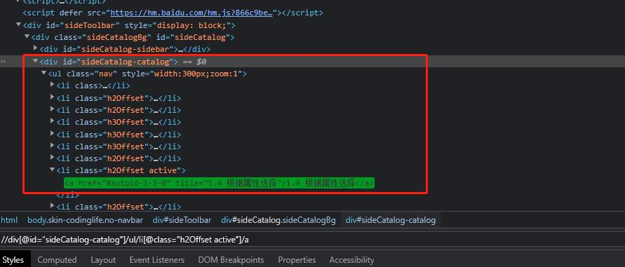
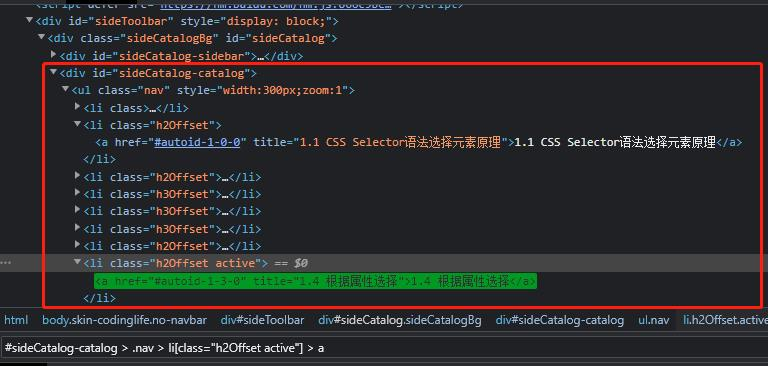

# Selenium 及 WebDriver 相关问题

## 什么是 Selenium？

Selenium是一个Web浏览器自动化测试工具集，主要由三种工具组成：Selenium IDE、Selenium WebDriver、Selenium Grid。

- Selenium IDE 是浏览器插件，支持用户录制、编辑与回放自动化脚本。
- Selenium WebDriver 定义了用于控制 Web 浏览器行为的接口，我们可以借助 WebDriver 提供的接口，使用 Python, Java, JavaScript 等语言来编写 Web 自动化测试脚本。
- Seleniun Grid 可以分布式执行测试脚本，实现测试脚本在多个平台上并行。

## 什么是 WebDriver？

WebDriver 定义了用于控制 Web 浏览器行为的接口，我们可以借助 WebDriver 提供的接口，使用 Python, Java, JavaScript 等语言来编写 Web 自动化测试脚本。

## WebDriver 驱动浏览器的流程是什么？

1. 自动化程序调用 WebDriver 类实例化对象提供的方法
2. 自动化程序通过调用方法来发送命令给浏览器的驱动程序
3. 浏览器驱动程序接收到命令后 ,驱动浏览器去执行命令
4. 浏览器执行命令,将执行结果返回给浏览器驱动程序
5. 浏览器驱动程序获取命令执行的结果，返回给自动化程序
6. 自动化程序对返回结果进行处理

## WebDriver 可以驱动哪些浏览器？

- Chrome
- Firefox
- InternetExplorer
- Safari

## 如何使用 WebDriver 打开浏览器？

使用 `driver = webdriver.Chrome()` 语句创建 WebDriver 实例对象，打开 Chrome 浏览器。

```python
driver = webdriver.Chrome()
```

## 如何使用 WebDriver 打开网页？后退网页？前进网页？刷新网页？最大化网页？

使用 `driver.get()` 方法打开网页。

```python
driver.get("https://selenium.dev")
```

使用 `driver.back()` 方法后退。

```python
driver.back()
```

使用 `driver.forward()` 方法前进。

```python
driver.forward()
```

使用 `driver.refresh()` 方法刷新网页。

```python
driver.refresh()
```

使用 `driver.maximize_window()` 方法最大化网页。

```python
driver.maximize_window()
```

## 如何处理 JavaScript 的三种弹框(alerts, confirmations, prompts)？

使用 WebDriver 实例对象提供的 `.switch_to.alert()` 方法可以处理 JavaScript 提供的三种弹框。

### alerts警告框

警告框显示警告或其他信息，用于通知用户，下方只有一个【确认】按钮。

```python
# 切换到弹窗，并传递给变量 alert。
alert = driver.switch_to.alert()

# 在变量中存储弹框文本
text = alert.text

# 点击确定按钮
alert.accept()
```

### confirmations确认框

确认框询问用户是否继续某种操作等功能，下方有【确认】和【取消】两种按钮。

```python
# 切换到弹窗，并传递给变量 alert。
alert = driver.switch_to.alert()

# 在变量中存储弹框文本
text = alert.text

# 点击取消按钮
alert.dismiss()
```

### prompts提示框

提示框需要输入一些信息，比如用户密码等，下方会有【确认】和【取消】按扭

```python
# 切换到弹窗，并传递给变量 alert。
alert = driver.switch_to.alert()

# 向弹窗输入数据
alert.send_keys("Selenium")

# 点击确定按钮
alert.accept()
```


## 如何在 iframe 中定位元素？

iframe 是内嵌的网页元素，即一个html文件被嵌入到另一个html文件中。

若需要操作的元素在 iframe 中，则在操作该元素之前，需要先切换到元素所属的 iframe 中。如果不切换直接操作该元素，将抛出 NoSuchElementException 的异常。

切换至 iframe 中。

```python
# 将 iframe 传递给 WebElement 对象
ifrm = driver.find_element(By.CSS_SELECTOR, "#modal > iframe")

# 切换到 iframe
driver.switch_to.frame(ifrm)
```

对 iframe 内的元素操作完毕后，若需对 iframe 外的元素进行操作，需要退出 iframe。

退出 iframe。

```python
#退出iframe
driver.switch_to.default_content()
```

## 假设原本有一个标签页，点击标签页中的某链接打开一个新的标签页，如何切换至新标签页？

### 方法一：

调用 `driver.current_window_handle` 获取当前标签页句柄，调用 `driver.window_handles` 获取所有标签页以及窗口的句柄，循环检查浏览器所有标签页以及窗口句柄，当循环到非当前标签页时，调用 `driver.switch_to.window(window_handle)` 方法切换至新标签页的句柄。

```python
for window_handle in driver.window_handles:
        if window_handle != driver.current_window_handle:
            driver.switch_to.window(window_handle)
            break
```

### 方法二：

调用 `driver.window_handles` 并将其赋值给 `windows` 列表以获取所有标签页以及窗口的句柄，`windows` 列表中，将按照标签页以及窗口的打开的先后顺序，从0开始排序。调用`driver.switch_to.window(windows[-1])` 方法切换至新标签页的句柄。

```python
windows = driver.window_handles

driver.switch_to.window(windows[-1])
```

## 如何打开一个新的标签页？如何打开一个新的窗口？

调用 `driver.switch_to.new_window('tab')` 方法，可以打开一个新的标签页。

调用 `driver.switch_to.new_window('window')` 方法，可以打开一个新的窗口。

## 如何使用 WebDriver 关闭当前标签页或窗口？

使用 `driver.close()` 方法关闭当前标签页或窗口。但要注意，当前标签页或窗口若不是最后一个标签页或窗口，需要在关闭后切换回之前使用的窗口。

```python
# 获取所有的标签以及窗口的句柄
windows = driver.window_handles

# 关闭当前标签或窗口
driver.close()

# 切换回旧的标签或窗口
driver.switch_to.window(windows[0])
```

## 如何退出 WebDriver 会话？(如何关闭浏览器？)

调用 `driver.quit()` 会关闭与该 WebDriver 会话关联的所有标签页和窗口，即关闭浏览器进程。

若在自动化脚本运行结束后不调用 `driver.quit()`，计算机上将会运行额外的后台进程和端口，浪费资源。

为了避免程序异常时，没有结束 WebDriver会话，可以使用 Python 的上下文管理器 `with webdriver.Chrome() as driver:`, 它将在 with 中的内容执行结束后自动运行 `driver.quit()`。

## driver.close()与driver.quit()有什么区别？

`driver.close()` 操作的对象是当前的标签页或窗口；`driver.quit()` 操作的对象是 WebDriver 会话。

- 浏览器同时打开多个标签页时，`driver.close()` 仅关闭当前正在操作的标签页或窗口，`driver.quit()` 会关闭与该 WebDriver 会话关联的所有标签页和窗口，即关闭浏览器进程。

## 如何使用 WebDriver 调用 JavaScript 脚本？

使用 `driver.execute_script()` 方法执行 JavaScript 代码段。

```python
driver.execute_script('return document.title;')
```


## WebDriver 有哪些不同的等待类型？

有三种：强制等待、隐式等待、显式等待。

强制等待：就是无条件等待

- Python 中，使用 `time.sleep()` 可实现强制等待，传入的参数为等待时间，单位是毫秒。
- 优点：使用简单方便；
- 缺点：
  - 若脚本中只使用强制等待，则几乎每个 `find_element()` 方法之后都需要设置一个强制等待。
  - 不能准确把握等待时间，若等待时间设置过短，上一步操作未完成就进入下一步，导致报错，若等待时间设置过长，会浪费时间，降低效率。

隐式等待：使用 `find_element()` 定位元素，当发现元素没有找到的时候，激活隐式等待，开始周期性重新寻找该元素，直到该元素找到，然后继续执行后续代码，若超出指定最大等待时长仍没有找到，则抛出异常 `NoSuchElementException`。隐式等待作用于全局元素，设置隐式等待后,页面所有的元素都会被绑定隐式等待机制。

- Python 中，使用 `implicitly_wait()` 可实现隐式等待，传入参数为等待时间，默认为秒。
- 特点：隐式等待作用于全局元素，因此只要设置一次即可。
- 用法：`driver.implicitly_wait(10)`

显式等待：原理与隐式等待相同。只针对某个元素进行等待，可针对需要定位的元素设置显性等待。

- Python 中，使用 `WebDriverWait()` 设置显式等待时间，传入两个参数，一个参数是 WebDriver 的实例化对象，另一个参数是等待时间，单位为秒。使用 `until()` 方法设置 `expected_conditions` 与需要进行显式等待的元素。常用的 `expected_conditions` 有 `visibility_of_element_located` 判断某个元素是否可见、 `invisibility_of_element_located` 判断某个元素是否不可见。
- 特点：可以设置 `ExpectedConditions`，对元素进行判断。
- 用法：`WebDriverWait(driver, 10).until(expected_conditions.visibility_of_element_located((By.XPATH, '//a[text()="新闻"]')))`

## WebDriver 中常见的异常有哪些？

- NoSuchElementException：找不到页面元素异常
- ElementNotInteractableException：元素展现出来，但是不可操作异常
- NoSushFrameException：切换iframe时找不到指定的iframe异常
- TimeOutException：超时异常

## WebDriver 定位元素的方法有哪些？

WebDriver 中有8种不同的定位方式：

- 全能方式：xpath、css_selector
- 与id有关：id
- 与name有关的有三种：name、class_name、tag_name
- 与link相关的有两种：link_text、partial_link_text


其中，name, class_name, id 这三种定位方式，均要求元素有相应的属性才能使用，不够灵活。

link_text, partial_link_text 这两种定位方式，只能用来定位文本链接，不够灵活。其中，link_text 是对文本的精确匹配，而partial_link_text是对文本的模糊匹配。

tag_name 是通过元素的标签名来定位，由于元素的标签名经常重复，很难通过标签名去区分元素，因此很少使用 tag_name。


```python
# xpath
driver.find_element(By.XPATH, '//input[@id="kw"]').send_keys('xpath')

# css_selector
driver.find_element(By.CSS_SELECTOR, '#kw').send_keys('css_selector')

# id
driver.find_element(By.ID, 'kw').send_keys('id')

# name
driver.find_element(By.NAME, 'wd').send_keys('name')

# class_name
driver.find_element(By.CLASS_NAME, 's_ipt').send_keys('class_name')

# tag_name
driver.find_elements(By.TAG_NAME, 'input')[7].send_keys('tag_name')

# link_text
driver.find_element(By.LINK_TEXT, '新闻').click()

# partial_link_text
driver.find_element(By.PARTIAL_LINK_TEXT, '换').click()
```

## 怎么使用 xpath 定位元素？

基本语法：

- 根据绝对路径与 tag 名定位：从根节点开始的，到某个节点，每层都依次写下来，每层之间用/分隔的表达式，就是某元素的绝对路径：`/tag 名`

```python
driver.find_element(By.XPATH, '/html/body/div')
```

- 根据相对路径与 tag 名定位：`//tag 名`

```python
driver.find_element(By.XPATH, '//div/p')
```

- 根据tag 名与tag 名对应的属性值综合定位：根据属性来选择元素是通过这种格式来的：`//tag 名[@属性名="属性值"]`。注意：属性名注意前面有个@，属性值一定要用引号， 可以是单引号，也可以是双引号。

```python
driver.find_element(By.XPATH, '//p[@class="capital huge-city"]')
```

- 根据属性名包含的字符串进行模糊定位：`//tag 名[contains(@属性名, "关键信息")]`。例如：要选择style属性值包含color字符串的页面元素，可以这样：`//*[contains(@style,"color")]`。其中，`*`是通配符，代表任一 tag 名。

- 选择子元素：选择元素1的子元素元素2的子元素元素3，最终选择的是元素3：`//元素1/元素2/元素3`

- 同名元素选其一：例如 xpath 语句定位到了若干个元素，想选第二个元素，语法为：`//div/p[2]`

- 根据同一个 tag 名的多条属性进行定位：属性之间用and连接，如`//tag 名[@属性名1="属性值1" and @属性名2="属性值2"]`

- 特别的，若需获取元素内的文本，xpath格式为`//tag 名[text()="文本"]`


验证方法：

- 假设使用Chrome浏览器，在需要定位的元素处点击鼠标右键，选择检查，调出浏览器开发者工具，点击 Elements 标签，按Ctrl+F，在调起的搜索框中写上编写好的 xpath 语句，看一下是否可以唯一定位到所需定位的元素上，如果可以唯一定位，则编写的 xpath 验证通过。

综合示例：




```python
driver.find_element(By.XPATH, '//div[@id="sideCatalog-catalog"]/ul/li[@class="h2Offset active"]/a')
```

## 怎么使用 css_selector 定位元素？

基本语法：

- 根据 tag 名选择元素：直接写上tag名即可：`tag名`

```python
driver.find_element(By.CSS_SELECTOR, 'div')
```

- 根据 id 属性选择元素：在id号前面加上一个井号：`#id值`

```python
driver.find_element(By.CSS_SELECTOR, '#searchtext')
```

- 根据 class 属性选择元素：在 class 值 前面加上一个点：`.class值`

```python
driver.find_element(By.CSS_SELECTOR, '.nav')
```

- 根据其他属性选择元素：用一个方括号框起来元素即可，class、id属性也可这样定位：`[属性名="属性值"]`

```python
driver.find_element(By.CSS_SELECTOR, '[type="hidden"]')
```

- 根据 tag 及 tag 中多个属性综合定位：`tag名[属性名="属性值"][属性名="属性值"]`

```python
driver.find_element(By.CSS_SELECTOR, 'li[type="hidden"][class="foo"]')
```

- 选择子元素：选择元素1里面的子元素元素2里面的子元素元素3里面的子元素元素4，最终选择的元素是元素4：`元素1 > 元素2 > 元素3 > 元素4`

```python
driver.find_element(By.CSS_SELECTOR, '#sideToolbar > div[class="sideCatalog"] > .h2Offset')
```

验证方法：

- 同 xpath，可在浏览器开发者工具栏中验证。

综合示例：



```python
driver.find_element(By.CSS_SELECTOR, '#sideCatalog-catalog > .nav > li[class="h2Offset active"] > a')
```

## css_selector 和 xpath 有什么不同？

css_selector 性能更好。 

xpath 更强大，但使用 xpath 定位元素时，会遍历整个页面，性能较差。

# WebElement 相关问题

## 什么是 WebElement？

WebElement 是网页中的各种元素的接口。

需要先通过 WebDriver 的实例对象提供的方法定位到元素，然后借助 WebElement 对网页中的各种元素进行操作，比如点击、输入内容、清除内容、提交内容、获取内容。

## 如何创建 WebElement 实例对象？WebElement 实例对象有哪些方法？(获取元素内容、清空元素内容、向元素输入内容、点击元素)

使用 `.find_element()` 方法创建 WebElement 实例对象
```python
button = driver.find_element(By.XPATH, '//input[@type="submit"]')

search_input = driver.find_element(By.XPATH, '//input[@name="wd"]')
```

使用 `button.text` 属性获取元素内容
```python
button.text
```


使用 `search_input.clear()` 方法清空元素内容
```python
search_input.clear()
```

使用 `search_input.send_keys()` 方法向元素输入内容
```python
search_input.send_keys("selenium")
```

使用 `button.click()` 方法点击元素
```python
button.click()
```


# 实际使用场景问题

## 如何验证元素是否存在？(如何实现测试用例中的检查点？)

可以通过 `assertEquals` 断言方法，判断实际元素与预期元素是否一致。

还可以通过显式等待方法，使用 `expected_conditions.visibility_of_element_located()` 来判断元素是否存在。
## 如何上传文件？

首先定位到上传文件的元素，查看其是否是 input 标签元素。

若是 input 标签元素，可以使用 sendKeys 方法发送文件的路径，这样就实现了文件上传的功能。

如果是非 input 标签的元素，可以借助第三方库 pywin32 库，识别对话框句柄，然后进行上传文件的操作。

## 如何下载文件？

首先定位到下载文件的元素，然后使用 `click()` 方法点击，即可下载文件。文件下载的路径是浏览器默认路径。

## 如何修改默认下载路径？

以 Chrome 浏览器为例，通过给 ChromeOptions() 的实例化对象传入指定下载路径，然后将 ChromeOptions() 的实例化对象传递给 WebDriver 的实例化对象，这样就可以将 Chrome 的默认下载路径修改为指定下载路径。

```python
def set_chrome_pref():
    chromeOptions = webdriver.ChromeOptions()
    prefs = {"download.default_directory":"D:\\"}
    chromeOptions.add_experimental_option("prefs", prefs)
    driver = webdriver.Chrome(chrome_options=chromeOptions)
```

## 如何实现键盘事件？

Selenium 提供了对键盘、鼠标以及滑轮进行操作的 API，借助这些 API，可以实现对键盘、鼠标、滑轮操作的模拟。

具体写代码时，首先需要将 WebDriver() 的实例化对象传递给 ActionChains() 来实例化 ActionChains()。

借助 ActionChains() 的实例化对象提供的 key_down(), key_up(), send_keys() 方法，来实现键盘事件。

其中 key_down(), key_up() 方法需要传入的参数是 Keys 类提供的，Keys 类里面定义了空格键、Shift键、上下左右方向键等特殊按键，send_keys() 方法需要传入的参数是字符串。

输入完键盘操作后，需要使用 perform() 方法才能执行键盘操作。

```python
from selenium import webdriver
from selenium.webdriver import ActionChains
from selenium.webdriver.common.keys import Keys 

driver = webdriver.Chrome()
ActionChains(driver).key_down(Keys.SHIFT).perform()
```

## 如何实现鼠标事件？

Selenium 提供了对键盘、鼠标以及滑轮进行操作的 API，借助这些 API，可以实现对键盘、鼠标、滑轮操作的模拟。

具体写代码时，首先需要将 WebDriver() 的实例化对象传递给 ActionChains() 来实例化 ActionChains()。

借助 ActionChains() 的实例化对象提供的 click_and_hold(), click(), context_click(), double_click(), move_to_element() drag_and_drop() 等方法，来实现鼠标事件。

输入完鼠标操作后，需要使用 perform() 方法才能执行鼠标操作。

```python
from selenium import webdriver
from selenium.webdriver import ActionChains

driver = webdriver.Chrome()
search_button = driver.find_element(By.XPATH, '//input[@id="kw"]')
ActionChains(driver).move_to_element(search_button).click().perform()
```

## 如何实现鼠标悬浮操作？

Selenium 提供了对键盘、鼠标以及滑轮进行操作的 API，借助这些 API，可以实现对键盘、鼠标、滑轮操作的模拟。

具体写代码时，首先需要将 WebDriver() 的实例化对象传递给 ActionChains() 来实例化 ActionChains()。

借助 ActionChains() 的实例化对象提供的 move_to_element() 方法，来实现鼠标悬浮操作。

输入完鼠标操作后，需要使用 perform() 方法才能执行鼠标操作。

```python
from selenium import webdriver
from selenium.webdriver import ActionChains

driver = webdriver.Chrome()
search_button = driver.find_element(By.XPATH, '//input[@id="button"]')
ActionChains(driver).move_to_element(search_button).perform()
```

## 如何滑动页面？

Selenium 提供了对键盘、鼠标以及滑轮进行操作的 API，借助这些 API，可以实现对键盘、鼠标、滑轮操作的模拟。

具体写代码时，首先需要将 WebDriver() 的实例化对象传递给 ActionChains() 来实例化 ActionChains()。

借助 ActionChains() 的实例化对象提供的 scroll_to_element() 方法，并传入 WebElement 的实例化对象，可以实现滑动页面的操作。

输入完滑轮操作后，需要使用 perform() 方法才能执行滑轮操作。

```python
from selenium import webdriver
from selenium.webdriver import ActionChains

driver = webdriver.Chrome()
search_button = driver.find_element(By.XPATH, '//input[@id="button"]')
ActionChains(driver).scroll_to_element(search_button).perform()
```