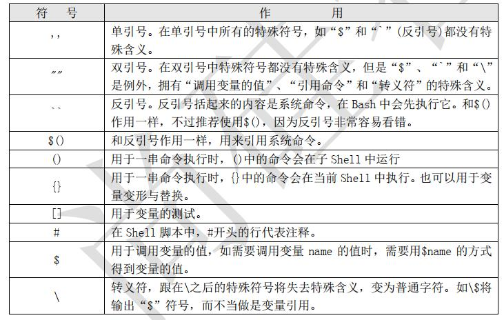

## 什么是 shell？

一个 shell 脚本是一个文本文件，包含一个或多个命令。

有时需要使用多个命令来完成一项任务，这时就可以添加这些所有命令在一个文本文件( shell 脚本)中来完成这些任务。

## 在 shell 脚本中，如何写入注释？

使用 `#` 开头来写注释。

## `#!bin/bash` 是什么意思？

`#!bin/bash` 一般出现在 shell 脚本文件的第一行，用来指定 shell 脚本解释器路径，即声明解析当前文件要使用的解释器。

## 如何执行 shell 脚本？

有两种方式可以执行 shell 脚本。

- 第一种方式是通过 `bash` 调用并执行 shell 脚本。如： `bash hello.sh`

- 第二种方式是先赋予 shell 脚本执行权限，然后直接运行。如：首先赋予 `hello.sh` 脚本可执行权限 `chmod 755 hello.sh`，然后通过绝对路径方式直接执行脚本 `./hello.sh`

## shell 脚本中常用符号的含义

## 在 shell 脚本中如何比较两个变量？

`-eq` 用来判断两个变量是否相等；

`-ne` 用来判断两个变量是否不相等；

`-gt` 用来判断前一个变量是否大于后一个变量；

`-ge` 用来判断前一个变量是否大于等于后一个变量；

`-lt` 用来判断前一个变量是否小于后一个变量；

`-le` 用来判断前一个变量是否小于等于后一个变量；

