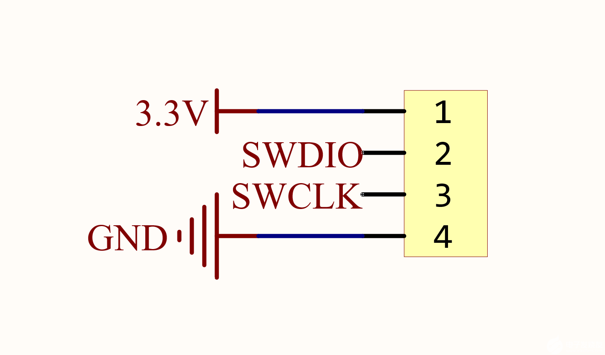
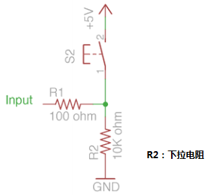
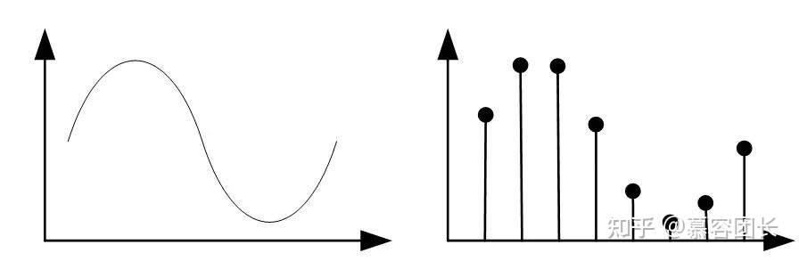
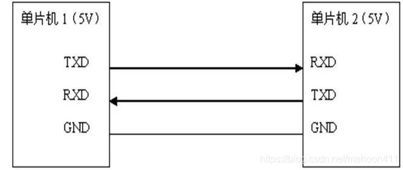
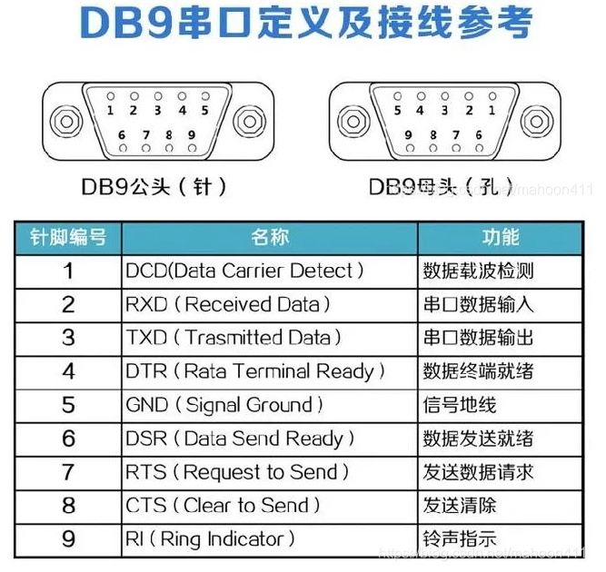

# STM32 基础知识

## STM32F1和F4的区别？

内核不同：F1是Cortex-M3内核，F4是Cortex-M4内核；
主频不同：F1主频72MHz，F4主频168MHz；
浮点运算：F1无浮点运算单位，F4有；
功能性能：F4外设比F1丰富且功能更强大，比如GPIO翻转速率、上下拉电阻配置、ADC精度等；
内存大小：F1内部SRAM最大64K，F4有192K(112+64+16)。

## STM32 启动过程

通过Boot引脚设定,寻找初始地址
初始化栈指针 __initial_sp
指向复位程序 Reset_Hander
设置异常中断 HardFault_Handler
设置系统时钟 SystemInit
调用C库函数 _main

## STM32F401RCT6 最小系统


单片机最小系统可以分为五部分，即电源电路、复位电路、时钟电路、启动电路、下载电路。

### 电源电路

STM32单片机一般都是3.3V供电，而生活中一般常见的都是5V电源（电脑的USB口，手机充电器，移动电源...），所以一般使用AMS1117-3.3V 稳压电源芯片将5V降压为3.3V，该芯片的封装一般为SOT223。稳压电路在图中没有画出来，图中VCC=3.3V。

放置的100nF电容的数量，正好和VDD、VSS引脚的数量相同。因此，在PCB设计时，需要把这些电容放置得距离芯片引脚足够近，这些电容也被称为旁路电容。

我们都知道，电容很重要的一个作用就是滤波，因此在供电电路中，经常需要放置电容来滤除杂波，使得高电平的电压值更加稳定。因此，旁路电容的作用就是滤波。如果这些旁路电容距离单片机的VSS、VDD引脚太远，就有可能导致滤波后的电平在传输过程中又产生了杂波，使得单片机的输入输出电压参考出现了不准确的问题。

同样的道理，AVCC和AGND之间的电容则需要放置在AVDD和AVSS之间，那么这就需要说到模拟信号和数字信号之间电路分割的问题了。

为了防止串扰，我们在设计PCB的时候常常会将模拟信号的电路和数字信号的电路分开，并在接地处仅仅使用一根铜导线连接。这里也是一样，理论上AVCC和VCC的电平是一样的，但是只能分开供电，因为模拟信号是具有连续性的，连在一起会干扰到数字信号的电平参考。

### 复位电路

复位就是重启。STM32 复位引脚是低电平复位，正常工作状态，复位引脚是高电平。

单片机的置位和复位，其目的都是为了把电路初始化到一个确定状态。复位时在单片机内部单片机是将存储设备和一些寄存器装入生产厂商预设的一个值。

一般来说，单片机复位电路的作用是把一个状态机初始化到一个空的状态。

在复位引脚NRST上外接电容和上拉电阻。

上电时，CPU 处于复位状态，此时电容充电，NRST 引脚电位持续拉低，当电容充满电后，NRST 电位变为高电平，此时 CPU 退出复位模式，进入正常运行状态。当按钮被按下时，电容被短路清空电量，按钮松开后重新充电，触发复位。

根据官方设计指南，电容选取 100nF 即可，以保证 NRST 低电平持续的时间满足 CPU 复位的最小脉宽要求，能正常触发复位。

如果不需要手动复位功能，也可以略去按键。

### 时钟电路

设计单片机的时钟电路就必须先了解单片机时钟信号的发生机制。

HSI：高速内部时钟，是内部的 RC 振荡器

HSE：高速外部时钟，可接石英 / 陶瓷谐振器，或者接外部时钟源

LSI：低速内部时钟，RC 振荡器

LSE：低速外部时钟

PLL：锁相环倍频输出


STM32可以使用三种不同的时钟源来驱动系统时钟 (SYSCLK)，即HSI振荡器时钟、HSE振荡器时钟和主PLL时钟。对于每个时钟源来说，在未使用时都可单独打开或者关闭，以降低功耗。
在这个时钟树里面，我们可以看到下图红框里的四个引脚，对应的就是我们时钟电路的引脚。可以看到，在OSC32_IN和OSC32_OUT两个引脚内部，标注的是LSEOSC 32.768kHz，在OSC_OUT和OSC_IN内部，标注的是4-26MHz HSE OSC。


OSC32引脚连接的晶振刚好是32.768kHz，OSC引脚连接的晶振是8MHz，正好介于4-26MHz之间。这里就要说到单片机的HSE时钟和LSE时钟了

#### HSE时钟

HSE为高速外部时钟信号（High-speed external clock），该信号有两个时钟源

1. 外部用户时钟
外部用户时钟是通过外部输入占空比约为 50% 的外部时钟信号（方波、 正弦波或三角波）来驱动 OSC_IN 引脚，同时OSC_OUT引脚保持高阻态。该方法适用于有外部时钟源，或者有其他信号发生器能够提供信号的情况。

2. 外部晶振/陶瓷谐振器
这也是我们设计电路时常常采用的方法，它的特点是精度高。


外部晶振的频率范围为4MHz~26MHz，本系统采用8MHz石英晶体作为系统的外部时钟源，该高速外部时钟可以直接作为系统时钟或者PLL输入。

在无源晶振应用方案中，两个外接电容能够微调晶振产生的时钟频率。而并联1MΩ电阻可以帮助晶振起振。因此，当发生程序启动慢或不运行时，可以给晶振并联1MΩ的电阻。这个1MΩ电阻可以增加电路中的负性阻抗，缩短了晶振起振时间，达到了晶振起振更容易之目的。

假设电路中无任何的扰动信号，那么晶振就不可能起振。因为一般的电路都有扰动信号，所以许多反相门电路中都不加这个电阻，但有个别的反相门电路不加这个电阻就不能起振，因为扰动信号强度不够。同时，并联1MΩ电阻还能够增加振荡电路的稳定性，有时候也给晶振同时串联一个100Ω的电阻，用以减少晶振的频率偏移程度。

这里需要注意的时，给晶振并联电阻不能太小，串联电阻不能太大。否则，在温度较低的情况下不易起振。

#### LSE时钟

LSE 晶振是 32.768 kHz 低速外部 (Low-speed external clock) 晶振或陶瓷谐振器，可作为实时时钟外设 (RTC) 的 时钟源来提供时钟/日历或其它定时功能，具有功耗低且精度高的优点。
与HSE时钟类似，可以利用方波、三角波等信号驱动OUC32_IN引脚来实现外部时钟源。同样，也可以使用32.768 kHz晶振起振来实现时钟信号的发生，其电路设计方法和HSE类似。

### 启动电路

STM32有两个BOOT引脚，分别是BOOT0和BOOT1，这两个引脚的高低电平，决定了单片机的启动方式和运行方式。


第一种（BOOT1=X，BOOT0=0）启动方式是最常用的用户FLASH启动。默认启动方式。本系统直接采用第一种。

第二种（BOOT1=0，BOOT0=1）启动方式是系统存储器启动方式。STM32中自带的BootLoader（ 就是通常说的ISP程序）就是在这种启动方式中，如果出现程序硬件错误的话可以切换BOOT0=1到该模式下重新烧写Flash即可恢复正常。BootLoader所在区域的内容在芯片出厂后没有人能够修改或擦除，即它是一个ROM区。

第三种（BOOT1=1，BOOT0=1）启动方式是STM32内嵌的SRAM启动。该模式用于调试。

一般将 BOOT0 引脚下拉(串接 10K 电阻再接地)，BOOT1 任意 即可。

如果需要模式切换，也可以参照以下的设计


### 下载电路

本系统没有画出下载电路。

STM32的下载方式有如下几种：

1. 串口下载
使用串口下载需要单片机内有相应的程序的支持，而系统存储器中就放了这么一段程序，由ST 在生产线上写入，用于通过可用的串行接口对闪存存储器进行重新编程。
在系统存储器启动模式下下载，因为在厂家提供的BootLoader中，提供了串口下载程序的固件，可以通过这个BootLoader将程序下载到系统的Flash中。程序烧录在FLASH。
注意：使用此种方式需要BOOT0=1，即需要有外部电路支持才可以实现串口下载。

2. JLINK或者STLINK下载
程序开发的过程中，需要下载bin/hex文件，以及在线仿真调试，可采用SWD或者JTAG的方式。SWD 模式比 JTAG 在高速模式下面更加可靠，且只需4引脚，实际开发中一般都采用SWD方式。其中的时钟线CLK是用于Jlink和芯片的时钟同步，一般频率设置为4MHz，可根据实际情况调整频率。



## 时钟系统


STM32 有5个时钟源:HSI、HSE、LSI、LSE、PLL。
1. HSI是高速内部时钟，RC振荡器，频率为8MHz，精度不高。
2. HSE是高速外部时钟，可接石英/陶瓷谐振器，或者接外部时钟源，频率范围为4MHz~16MHz。
3. LSI是低速内部时钟，RC振荡器，频率为40kHz，提供低功耗时钟。
4. LSE是低速外部时钟，接频率为32.768kHz的石英晶体。
5. PLL为锁相环倍频输出，其时钟输入源可选择为HSI/2、HSE或者HSE/2。倍频可选择为2~16倍，但是其输出频率最大不得超过72MHz。

系统时钟SYSCLK可来源于三个时钟源：
1. HSI振荡器时钟
2. HSE振荡器时钟
3. PLL时钟

STM32可以选择一个时钟信号输出到MCO脚(PA8)上，可以选择为PLL输出的2分频、HSI、HSE、或者系统时钟。

任何一个外设在使用之前，必须首先使能其相应的时钟。

## J-Link仿真器选择JTAG模式和SWD模式的区别

下载调试器是将PC(例如通过USB协议)发送的命令转换为MCU(负责MCU内部外围设备)理解的语言(例如SWD或JTAG协议)的设备，加载代码并精确控制执行。

J-Link是SEGGER公司为支持仿真ARM内核芯片推出的JTAG/SWD仿真器。配合IAR EWAR，ADS，KEIL，WINARM，RealView等集成开发环境支持所有ARM7/ARM9/ARM11,Cortex M0/M1/M3/M4, Cortex A5/A8/A9等内核芯片的仿真，与IAR,Keil等编译环境无缝连接，操作方便、连接方便、简单易学，是学习开发ARM最好最实用的开发工具。

ARM芯片有两种调试模式，一种是JTAG，一种是SWD，二者在管脚上有复用。


SWD协议的优势：

1. SWD模式比JTAG在高速模式下面更加可靠。在大数据量的情况下面JTAG下载程序会失败，但是SWD发生的几率会小很多。基本使用JTAG仿真模式的情况下是可以直接使用SWD模式的，只要你的仿真器支持。所以推荐大家使用这个模式。
2. 在大家GPIO刚好缺一个的时候，可以使用SWD仿真，这种模式支持更少的引脚。
3. 在大家板子的体积有限的时候推荐使用SWD模式，它需要的引脚少，当然需要的PCB空间就小。比如你可以选择一个很小的2.54间距的5芯端子做仿真接口。
4. SWD具有特殊功能，例如通过I/O线打印调试信息。

JTAG协议的优势：

1. JTAG不仅支持ARM芯片，在ARM之外的芯片也受到支持，例如MSP430。
2. JTAG具有更多用途，用于编程、调试和生产测试。
3. JTAG是一个独立的团体，他们会随着协议的发展而发展。

什么时候选择SWD而不是JTAG

1. 如果原理图/电路板设计足够简单，可以在没有JTAG功能的情况下进行测试。
2. 调试性能比生产测试更重要，设备专注于服务研究而不是生产
3. MCU在尺寸方面有限制，SWD可以更节省空间。
4. 硬件设计太复杂，MCU没有多余的2个引脚。

## 单片机跑飞/死机有哪些可能原因

- 意外中断
是否打开了某个中断，但是没有响应和清除中端标志，导致程序一直进入中断，造成死机假象

- 中断变量处理不妥
若定义某些会在中断中修改的全局变量，这时要注意两个问题：首先为了防止编译器优化中断变量，要在这些变量定义时前加volatile，其次在主循环
中读取中断变量前应该首先关闭全局中断，防止读到一半被中断给修改了，读完之后再打开全局中断;否则出现造成数据乱套。

- 地址溢出
常见错误为指针操作错误。我要着重说的是数组下标使用循环函数中循环变量，如果循环变量没控制好则会出现数组下标越界，意外修改系统的寄存器造成死机，这种情况下如果死机说明运气好，否则后面不知道发生什么头疼的事。

- 无条件的死循环
比如使用while(x);等待电平变化，正常情况下x都会变成0，就怕万一，因此最好加上时间限制;

- 看门狗没有关闭
有的单片机即使没使用看门狗开机时也有可能意外自动开启了最小周期的看门狗，导致软件不断复位，造成死机，这个要看芯片手册，最好在程序复位后首先应该显式清除看门狗再关闭看门狗;

- 堆栈溢出
最难查找的问题，对于容量小的单片机，尽量减少函数调用层级，减少局部变量，从而减少压栈的时候所需的空间。


# 上拉电阻与下拉电阻


## 为什么需要上拉电阻和下拉电阻

在数字逻辑电路中，一个信号不是0，就是1。正是因为这样，数字电路的设计才简单，可靠。

通常，用电压5v（或者接近5V）代表 on 开状态，代表高电平，对应状态 1。用电压0v （或者接近0v）代表off关状态，代表低电平，对应状态0。

有些开发板是基于3.3V的，因此使用3.3V作为高电平。

那么试想如果一个线路中的电压处于不确定的状态（例如一个引脚不和任何其它回路连通时），那我们就说它的电压是浮动的，他会随着时间不断变化、跳动，而且很容易受到外界环境的影响。处于这种不确定状态的电路会被随机解释为高或者低电平。 这种现象也叫电子噪声。

然而程序必须是严格准确的，所以电路的设计一定要避免线路电压处于浮动状态。

我们可以使用上拉电阻或者下拉电阻将电路的电压在任何时候都保持在确定的状态下，这就是上拉电阻和下拉电阻的作用。

## 什么是上拉电阻

作用：将一个未知的电平拉高到稳定的高电平状态。或者说，上拉是将不确定信号通过一个电阻钳位在高电平，电阻同时限流作用。


当S2没按下时（不确定时），Input通过2个电阻和+5V连接（注意电路中并没构成回路，因此不会有压降，所以Input端依然是高电平），为高电平。当S2按下时，+5V，R2，S2,GND形成回路，R2 电阻大，产生压降大，因此后面的Input就是低电平。

因此，可以通过Input端的电平来判断S2是否按下。

相比下拉电阻，上拉电阻在数字电路中使用的更多。

## 什么是下拉电阻

作用：将一个未知的电平拉低到稳定的低电平状态。或者说，下拉是将不确定信号通过一个电阻钳位在低电平。



上图中，我们要判定input这个引脚，是高电平还是低电平。

当按钮S2没按下时（不确定时），Input通过2个电阻接到GND，是稳定的低电平 。 当S2按下时，+5V ,S2 , R2 ,GND这条路导通，而Input接在R2的前面，因此会得到高电平。

因此，我们可以通过Input端是高电平还是低电平来判断S2是否按下。

如果没有下拉电阻R2，那么S2没按下前，Input没有和任何东西相连，它的电平处于浮动状态，且很容易受环境影响，带来电子噪声


## 上拉电阻的使用场景

### TTL驱动CMOS

标准TTL电平的VOHmax(高电平输出最大值)为2.4 V，而CMOS的VIHmin（高电平输入最小值）为3.5V，当TTL驱动CMOS时，TTL输出高电平时，CMOS可能无法有效识别为高电平，所以需要在TTL的输出上加一个上拉电阻，将TTL的输出高电平提高到5V，使CMOS有效识别。

TTL低电平驱动CMOS时，TTL的VOLmin（低电平输出最小值）为0.5V，小于CMOS的VILmin（低电平输入最大值）的1.5V，所以TTL低电平可以正常被CMOS识别。

Ru越小，上拉能力越大，但是会增大TTL端的饱和压降，导致TTL输出的低电平很高。Ru太大，会延缓TTL输出的上升沿。

### OC和OD门

采用OC和OD门结构的，都需要添加上拉电阻，下图I2C是OD结构，SDA和SCL信号上都需要加上拉电阻，不加上拉电阻，OC和OD是无法输出高电平的。


### 低电平中断检测

对于低电平中断触发电路来说，一般在MCU的检测端会加一个上拉电阻，当INT低电平到来时，MCU_INT_DET会变为低电平，触发中断。

R1太大，MCU_INT_DET的上升沿越慢，R1太小，有可能造成灌电流过大，导致MCU管脚烧坏。


### 固定电平

如LDO电路，高电平使能时，一般会在使能脚CE加上拉电阻到VIN，达到上电LDO就有输出的效果。

对于R1，一般芯片的SPEC会给出，最常见的是10K和100K，那你说47K行不行，当然也行，要看LDO CE管脚的灌电流能力，也就是5V加在R1上的电流需要小于CE管脚最大灌电流，如果太大，CE脚可能会烧毁。


或者，对于低有效的复位控制信号（RST#），希望上电后复位后处于无效状态，则应使用上拉电阻（不确定工作状态时给高电平）。


## 下拉电阻的使用场景

### 固定电平

如NMOS的控制电路中，一般G极加一个下拉电阻，固定低电平，MOS管的GS阻抗很大，容易遭到静电的干扰，导致GS之间产生较高电压，使MOS管开关状态改变。

对于R2，MOS管在关闭状态，流过R2的耗流为0。MOS管导通状态，流过R2的电流为I = VCTRL/R2，如果想减小耗流，尽可能提高R2的阻值，一般取值200K，1M等。


或者，对于高有效的使能控制信号（EN），如果希望电路系统在上电后应处于无效状态，则会使用下拉电阻（不确定工作状态时给低电平）；假设这个使能信号是用来控制电机的，如果悬空的话，此信号线可能在上电后（或者运行中）受到其他噪声干扰而误触发为高电平，从而导致电机出现不期望的转动，这肯定是所不希望的，此时可以增加一个下拉电阻

### 作为放电电阻

有的LDO电路中，也会加R4下拉电阻，叫假负载，LDO关闭时，用于快速泄放C6上的电压，这和电路的使用场景有相关。加R4的坏处是，在正常工作时，会增加I = 3.3/R4的耗流，再说一句，现在也有带自放电功能的LDO，带自放电和不带自放电，有利有弊。

对于R4，阻值越小，放电越快，但是正常工作时，增加的耗流会越大。


# ADC

##  ADC 的过程

ADC主要用于对模拟信号进行数字采集，以进行数据处理。

具体步骤为：

1. 采样和保持
如果把模拟信号比作无限采样点的数字信号，那么就需要根据奈奎斯特采样定理采取其中一些有限点才能进行数字化传输。

奈奎斯特采样定理：简单来说就是采样频率必须大于信号频率的2倍，fs≥2fn。这样才能重新恢复信号。如果不，会因为频谱混叠而无法复原。
保持的意思简单理解就是让采样后的数值保存到下一步转换。

2. 量化和编码
所谓的量化是把采样后的N多个点数值按照一定标准和步骤转化为数字式的0和1，这个过程根据方式的不同可以分为很多种ADC类型，比如有逐次逼近型、双积分型、并联比较型。


## ADC 的性能参数：量程(参考电压)、转换位数、分辨率、精度、转换速度、采样率、信噪比

### 量程(参考电压)

指 ADC 所能输入模拟信号的类型和电压范围，信号类型包括单极性(Vref)和双极性(Vref+, Vref-)。

### 转换位数

量化过程中的量化位数，AD转换后的输出结果用n位二进制数表示。

一般ADC都说注明是8bit，16bit或者是24bit。一般是12位。

例如10位ADC的输出值就是0到1023

### 分辨率

ADC能够分辨的模拟信号最小变化量。

公式：分辨率=量程/(2\^转换位数)

分辨率是衡量ADC精度一个非常重要的指标。比如采集的电压范围是0-5V，那么8bit的ADC的最小刻度就是5/2\^8=0.0195V,16bit的ADC的最小刻度是5/2\^16=0.000195V.从这两个数值来看，我们就知道16bit的ADC可以采集到更小的电压。 

所以这里的分辨率表征的ADC的最小刻度的指标。

同时分辨率也只能算是间接衡量ADC采样准确的变量。直接衡量ADC采集准确性的是精度。

### 转换速度

是指完成一次从模拟转换到数字的AD转换所需要的时间的倒数。

- 积分型AD的转换时间是毫秒级属低速AD，逐次比较型AD是微秒级属中速AD，全并行/串并行型AD可达到纳秒级高速AD。
- 采样时间则是另外一个概念，是指两次转换的间隔，以保证转换的正确完成。

### 采样率

采样率是指芯片每秒采集信号的个数。SPS (sample per second，每秒采样次数)

- 比如1ksps,表示1s内这个ADC可以采集1K个点。采样率越高，采集的点数越多，那么对信号的还原度就越高。

- 转换速度越快，采样时间越短，采样率就可以设置的越高。

### 精度（转换误差）

精度是在ADC最小刻度基础上叠加各种误差的参数。是可以直接衡量ADC采样精准的指标。

通常ADC的精度=N*LSB+Vc_sample+Vshift+Vnoise+Vref+…

- N一般在ADC的数据手册中体现，表征ADC的集散误差。
- Vc_sample是ADC内部的采样电容引起的误差。
- Vshift一般是外围电路带来的偏置，
- Vnoise是综合前端的驱动电路和ADC得出的噪声电压。
- Vref一般是由参考电压的散差引起的误差。

所以从这里可以看出来。虽然一些ADC的分辨率很高，但是需要精度高，还需要做好各个方面的工作，尽量降低系统误差。从而提高精度。

### 量化误差

用数字量近似表示模拟量，采用四舍五入原则，此过程产生的误差为量化误差。

### SNR 信噪比

信噪比是ADC的交流(动态)特性之一。其余比较关键的动态特性还有SINAD、THD、SFDR。
如果信号的带宽固定，采样频率越高，效果就相当于在一个更宽的频率内扩展量化噪声，如果信号带宽变窄，在此带宽内的噪声也减少，信噪比也会有所提高。

通常在ADC采样之前加一个带通或低通滤波器，限制信号带宽，改善信噪比。

## ADC 逐次逼近型量化

一般单片机里面ADC模块使用的是逐次逼近型转换，也就是通过这种方法原理把模拟量转换为数字量。


上图是一个8位逐次逼近型ADC的框图，“输入的模拟量”是输入电压信号，“START”用来控制ADC启动转换，“CLOCK”是ADC模块的输入时钟，“EOC”是ADC转换结束信号，“OE”是ADC转换结果输出允许信号，“VREF”是参考电压。

随着时钟信号的输入，启动信号的开始，控制模块会逐次控制逐次比较寄存器产生不同的数据，数据产生后会送给D/A转换器，D/A转换器会依据参考电压，把这个数字量转化为模拟量送给比较器，比较器比较D/A转换器送出来的模拟量和输入模拟量的大小，产生的结果给控制单元电路，控制单元电路根据上一次的结果再次控制产生不同的数据，让D/A变成模拟量，再去比较，以此这样循环，每次比较，比较器会得出一个结果高或者低，根据这个结果决定当前产生的数字量是大了还是小了，一次一次的比较，找到那个和输入模拟量最接近的数字量，最后把这个数字量控制送到输出缓冲器，并且控制送出EOC输出转换完成信号，这就是一个大致的逐次逼近工作原理。

## ADC 参考电压作用

在逐次逼近型 ADC 中，D/A转换器会依据参考电压，把生成的数字量变为模拟量，在转换的时候必须需要有一个参考电压，这个电压就是AD模块的参考电压。

如果参考电压都不稳定的话，转出来的模拟量也不会稳定，那么和输入模拟量比较的时候，比较的结果也就可能会发生偏差，造成错误的比较结果。

所以 ADC 的参考电压是非常重要的，参考电压精确度不容忽略，要尽可能地使参考电压稳定，不受干扰。

## 如何保证 ADC 中参考电压的稳定性？

1.在参考电压引脚附近就近放置电容（一大一小，大的储能，小的滤波）；

2.可以在参考电源前端串一个小电感再加电容。


## ADC 数据采样的计算过程

例：已知温度传感器在0到100度之间为线性输出，参考电压为5V，采用8位的AD转换器，0度时，测得的电压为1.8V，100度时，测得的电压为4.3V。
求：(1)系统的分辨率；(2)采集到数据10010001，表示多大电压？温度是多少？

解：
(1)分辨率=参考电压/(2\^转换位数)=5/(2\^8)=0.0195V。
系统分辨率为0.0195V。
求温度y和电压x的关系表达式：k=(100-0)/(4.3-1.8)=40。
所以温度和电压的表达式：y=40(x-1.8)。
所以系统能分辨的最小温度为：0.0195*40=0.78度。

(2)10010001B=91H=145D。
所以数据10010001代表的电压为0.0195*145=2.83V。
所以温度为：40*(2.83-1.8)=41.2度。


# GPIO

## GPIO 基本结构及配置种类

STM32F103ZET6一共有7组IO口，即GPIOA,GPIOB,GPIOC到GPIOG。每组IO口有16个IO，所以一共有112个IO。STM32的大部分引脚除了当GPIO使用外，还可以复用为外设功能引脚（比如串口）。


GPIO的配置种类有8种。

（1）GPIO_Mode_AIN 模拟输入
（2）GPIO_Mode_IN_FLOATING 浮空输入
（3）GPIO_Mode_IPD 下拉输入
（4）GPIO_Mode_IPU 上拉输入
（5）GPIO_Mode_Out_OD 开漏输出
（6）GPIO_Mode_Out_PP 推挽输出
（7）GPIO_Mode_AF_OD 复用开漏输出
（8）GPIO_Mode_AF_PP 复用推挽输出

常用的有推挽输出、开漏输出、上拉输入。

## 推挽输出(带上拉或者下拉)

推挽输出:具有较强的电流输出能力，可以驱动控制类电路。可以输出强高,低电平,连接数字器件; 推挽结构一般是指两个三极管分别受两互补信号的控制,总是在一个三极管导通的时候另一个截止。高低电平由IC的电源低定。


推挽电路是两个参数相同的三极管或MOSFET,以推挽方式存在于电路中,各负责正负半周的波形放大任务,电路工作时，两只对称的功率开关管每次只有一个导通，所以导通损耗小、效率高。输出既可以向负载灌电流，也可以从负载抽取电流。推拉式输出级既提高电路的负载能力，又提高开关速度。

## 开漏输出(带上拉或者下拉)

开漏输出:属于弱电流输出，经常用于逻辑电平的通信电路。只可以输出强低电平，高电平得靠外部电阻拉高。输出端相当于三极管的集电极。要得到高电平状态需要上拉电阻才行。适合于做电流型的驱动，其吸收电流的能力相对强(一般20mA以内)。


## 浮空输入

浮空输入：浮空（floating）就是逻辑器件的输入引脚即不接高电平，也不接低电平。由于逻辑器件的内部结构，当它输入引脚悬空时，相当于该引脚接了高电平。一般实际运用时，引脚不建议悬空，易受干扰。 通俗讲就是让管脚什么都不接，浮空着。


## 上拉输入

上拉输入：上拉就是把电位拉高，比如拉到Vcc。上拉就是将不确定的信号通过一个电阻嵌位在高电平！电阻同时起限流作用！强弱只是上拉电阻的阻值不同，没有什么严格区分。


## 下拉输入

下拉输入：就是把电压拉低，拉到GND。与上拉原理相似。


## 模拟输入

模拟输入：模拟输入是指传统方式的输入。数字输入是输入PCM数字信号，即0，1的二进制数字信号，通过数模转换，转换成模拟信号，经前级放大进入功率放大器，功率放大器还是模拟的。


## 复用开漏输出(带上拉或者下拉)、复用推挽输出(带上拉或者下拉)

复用开漏输出、复用推挽输出：可以理解为GPIO口被用作第二功能时的配置情况（即并非作为通用IO口使用）。端口必须配置成复用功能输出模式(推挽或开漏)。

复用开漏输出如下图所示：


复用推挽输出如下图所示：


## 如何根据具体情况配置GPIO

- 作为普通GPIO输入：根据需要配置该引脚为浮空输入、带弱上拉输入或带弱下拉输入，同时不要使能该引脚对应的所有复用功能模块。

- 作为普通GPIO输出：根据需要配置该引脚为推挽输出或开漏输出，同时不要使能该引脚对应的所有复用功能模块。

- 作为普通模拟输入：配置该引脚为模拟输入模式，同时不要使能该引脚对应的所有复用功能模块。

- 作为内置外设的输入：根据需要配置该引脚为浮空输入、带弱上拉输入或带弱下拉输入，同时使能该引脚对应的某个复用功能模块。

- 作为内置外设的输出：根据需要配置该引脚为复用推挽输出或复用开漏输出，同时使能该引脚对应的所有复用功能模块。

# 单片机通信

## 串行和并行

串行通讯：同一时刻，只能传输一个bit位的信号，只需要一根信号线。

并行通讯：同一时刻，可以传输多个bit位的信号，有多少个信号位就需要多少根信号线。

并行通讯的效率高，但是对信号线路要求也很高，一般应用于快速设备之间采用并行通信，譬如CPU 与存储设备、存储器与存储器、主机与打印机等都采用并行通讯。

串行通讯效率较低，但是对信号线路要求低，抗干扰能力强，同时成本也相对较低，一般用于与计算机与外部设备，或者长距离的数据传输。一般串行通信的应用场合更多，比如：UART、 USART、I2C、 SPI、 CAN等这些都属于串行通信。

## 同步通信和异步通信

同步通信：发送方发出数据后，等接收方发回响应以后才发下一个数据包的通讯方式。在同步通讯中，收发设备双方会使用一根信号线表示时钟信号，在时钟信号的驱动下双方进行协调，同步数据。通讯中通常双方会统一规定在时钟信号的上升沿或下降沿对数据线进行采样。  

异步通信：发送方发出数据后，不等接收方发回响应，接着发送下个数据包的通讯方式。在异步通讯中不使用时钟信号进行数据同步，它们直接在数据信号中穿插一些同步用的信号位，或者把主体数据进行打包，以数据帧的格式传输数据，某些通讯中还需要双方约定数据的传输速率，以便更好地同步 。


在同步通讯中，数据信号所传输的内容绝大部分就是有效数据，而异步通讯中会包含有帧的各种标识符，所以同步通讯的效率更高，但是同步通讯双方的时钟允许误差较小，而异步通讯双方的时钟允许误差较大。  

像I2C、 SPI这种具有同步时钟的就是同步通信；像UART、 CAN这种没有同步时钟的就是异步通信。

## 单工、半双工、全双工

单工通信：单工即数据传输只在一个方向上传输，方向是固定的，不能实现双向通信（A发送数据给B，而B不能发送数据给A），如：收音机广播，你只能听到广播站发出的广播（数据），而你不能反向给广播站发送广播。

半双工通信：传输方向可以切换，允许数据在两个方向上传输。但是某个时刻，只允许数据在一个方向上传输，可以基本双向通信。

全双工通信：允许数据同时在两个方向传输。发送和接收完全独立，在发送的同时可以接收信号，或者在接收的同时可以发送。它要求发送和接收设备都要有独立的发送和接收能力。


RS485、I2C属于半双工通信；RS232、SPI、UART、USART属于全双工通信。

## 通讯速率（波特率与比特率）

衡量通讯性能的一个非常重要的参数就是通讯速率，通常以比特率(Bitrate)来表示，即每秒钟传输的二进制位数，单位为比特每秒(bit/s)。

容易与比特率混淆的概念是“波特率”(Baudrate)，它表示每秒钟传输了多少个码元。而码元是通讯信号调制的概念，通讯中常用时间间隔相同的符号来表示一个二进制数字，这样的信号称为码元。如常见的通讯传输中，用0V表示数字0，5V 表示数字1，那么一个码元可以表示两种状0和1，所以一个码元等于一个二进制比特位，此时波特率的大小与比特率一致；如果在通讯传输中，有0V、2V、4V 以及 6V 分别表示二进制数 00、01、10、11，那么每个码元可以表示四种状态，即两个二进制比特位，所以码元数是二进制比特位数的一半，这个时候的波特率为比特率的一半。

因为很多常见的通讯中一个码元都是表示两种状态，人们常常直接以波特率来表示比特率。


## 串口通信

### UART(串口)

UART(Universal Asynchronous Receiver/Transmitter，通用异步收发器)指的是一种物理接口形式(硬件)。

UART是串行异步通信接口，它包括RS232、RS499、RS423、RS422和RS485等接口规范和 标准规范，即UART是串行异步通信口的总称。



UART是异步，全双工串口总线。它比同步串口复杂很多。有两根线，一根TXD用于发送，一根RXD用于接收。

UART的串行数据传输不需要使用时钟信号来同步传输，而是依赖于发送设备和接收设备之间预定义的配置。

对于发送设备和接收设备来说，两者的串行通信配置应该设置为完全相同。


- 起始位：表示数据传输的开始，电平逻辑为“0” 。

- 数据位：可能值有5、6、7、8、9，表示传输这几个bit 位数据。一般取值为8，因为一个ASCII 字符值为8 位。

- 奇偶校验位：用于接收方对接收到的数据进行校验，校验“1” 的位数为偶数(偶校验) 或奇数(奇校验)，以此来校验数据传送的正确性，使用时不需要此位也可以。

- 停止位：表示一帧数据的结束。电平逻辑为“1”。

如果用通用IO口模拟UART总线，则需一个输入口，一个输出口。

总之，串口是一个泛称，TTL、RS232、RS422、RS485是串行通信接口标准，也就是不同电平标准，他们都遵循上述或者与上述类似的通信时序协议，它们被通称为串口。

#### USART

USART(Universal Synchronous/Asynchronous Receiver/Transmitter，通用同步/异步收发器)。

USART一般分为三大部分：时钟发生器、数据发送器和接收器。

USART 与 UART 的区别：

UART  |	USART
|--|--|
全称是Universal Asynchronous Receiver/Transmitter。|全称是Universal Synchronous Asynchronous Receiver/Transmitter。
没有与数据相关的输入时钟信号，因此接收器需要在开始接收之前知道发送器的波特率。|其中接收器不需要知道发送器的波特率。它来源于主控提供的时钟信号和数据线。
其中只需要数据线。|其中需要数据线和时钟线。
数据是按字符或逐字节传输的。|同步数据以块的形式传输。
UART 在微控制器内部生成其数据时钟，并通过使用起始位转换将该时钟与数据流同步。|在这种模式下，发送外设将生成一个时钟，接收外设可以从数据流中恢复，而无需提前知道波特率。
由于与 USART 相比，UART 中的起始位和停止位数据传输速率的开销较低。|使用外部时钟使 USART 的数据速率远高于标准 UART 的数据速率。
UART 很简单，仅提供其基本格式的几个选项，例如停止位的数量以及偶数或奇数奇偶校验。|USART 更复杂，可以生成与许多不同标准协议相对应的形式的数据，例如 IrDA、LIN、智能卡、RS-485 接口的驱动程序启用和 Modbus，仅举几例。
它不能像 USART 那样工作。|USART 可以像 UART 一样工作。

### TTL 电平

嵌入式里面说的串口，一般是指UART口。4个pin（Vcc,GND,RX,TX），用TTL电平。

PC中的COM口即串行通讯端口，简称串口。9个Pin，用RS232电平。

串口、COM口是指的物理接口形式(硬件)。而TTL、RS-232、RS-485是指的电平标准(电信号)。

### RS232 电平

传输线有两根，地线一根。电平是负逻辑：

-3V ~ -15V逻辑“1”，+3V ~ +15V逻辑“0”。

RS-232串口通信传输距离15米左右。可做到双向传输，全双工通讯，传输速率低20kbps 。

下图是DB9公头和母头的定义，一般用的最多的是RXD、TXD、GND三个信号。



### RS485 电平

RS-485采用平衡发送和差分接收，因此具有抑制共模干扰的能力。

采用两线半双工传输，最大速率10Mb/s，电平逻辑是两线的电平差来决定的，提高抗干扰能力，传输距离长(几十米到上千米)。

+2V ~ +6V逻辑“1”，-2 ~ -6V逻辑“0”。

### USB 电平

### 常用的串口逻辑电平有哪些


### 集成了USB转TTL模块的单片机与PC的USB口通信

直接用USB线连接即可，只是单片机上的USB接口形式有时会不同，根据A-USB、B-USB、micro-USB、mini-USB分别选择合适的接线。


### 未集成电平转换模块的单片机与PC的USB口通信

该模块一端接入PC机的USB接口，另一端有TXD、RXD、GND、5V、3.3V五个引脚，分别与单片机的RXD、TXD、GND、5V引脚相连，对于采用3.3V供电的单片机则把5V改为3.3V即可。该模块核心就是一块CH340芯片进行USB与TTL电平的转换。


### 未集成电平转换模块的单片机与PC的DB9通信

外购RS232转TTL模块，该模块一端是DB9与PC机DB9连接，一端是RXD、TXD、VCC、GND与单片机相应引脚连接。其核心是一块max232电平转换芯片，将RS-232电平转换为TTL电平。


## I2C

I2C总线是一种同步、半双工双向的两线式串口总线。它由两条总线组成：串行时钟线SCL和串行数据线SDA。

- SCL线——负责产生同步时钟脉冲。

- SDA线——负责在设备间传输串行数据。

该总线可以将多个I2C设备连接到该系统上。连接到I2C总线上的设备既可以用作主设备，也可以用作从设备。


- 主设备负责控制通信，通过对数据传输进行初始化，来发送数据并产生所需的同步时钟脉冲。

- 从设备则是等待来自主设备的命令，并响应命令接收。

主设备和从设备都可以作为发送设备或接收设备。无论主设备是作为发送设备还是接收设备，同步时钟信号都只能由主设备产生。

如果用通用IO口模拟I2C总线，并实现双向传输，则需一个输入输出口(SDA)，另外还需一个输出口(SCL)。

### I2C 总线在传送数据过程中共有三种类型信号

（1）开始信号：SCL 为高电平时，SDA 由高电平向低电平跳变，开始传送数据。
（2）结束信号：SCL 为高电平时，SDA 由低电平向高电平跳变，结束传送数据。
（3）应答信号：接收数据的 IC 在接收到 8bit 数据后，向发送数据的 IC 发出特定的低电平脉冲，表示已收到数据。CPU 向受控单元发出一个信号后，等待受控单元发出一个应答信号，CPU 接收到应答信号后，根据实际情况作出是否继续传递信号的判断。若未收到应答信号，由判断为受控单元出现故障。

### I2C配置主机模式端口该怎么配置？

硬件模式：复用开漏输出、既不上拉也不下拉。（快速模式：400 Kbit/s）
软件模拟：推挽输出、配置上拉电阻。

## SPI

SPI(串行外设接口)。SPI总线是同步、全双工双向的4线式串行接口总线。它是由“单个主设备+多个从设备”构成的系统。


在系统中，只要任意时刻只有一个主设备是处于激活状态的，就可以存在多个SPI主设备。常运用于AD转换器、EEPROM、FLASH、实时时钟、数字信号处理器和数字信号解码器之间实现通信。

为了实现通信，SPI共有4条信号线，分别是：

- MOSI（Master Out Slave In，主设备出、从设备入）：由主设备向从设备传输数据的信号线，也称为从设备输入（Slave Input/Slave Data In，SI/SDI）。

- MISO（Master In Slave Out，主设备入、从设备出）：由从设备向主设备传输数据的信号线，也称为从设备输出（Slave Output/Slave Data Out，SO/SDO）。

- SCLK（Serial Clock，串行时钟）：传输时钟信号的信号线。

- SS（Slave Select，从设备选择）：用于选择从设备的信号线，低电平有效。

SPI 的工作时序模式由CPOL（Clock Polarity，时钟极性）和CPHA（Clock Phase，时钟相位）之间的相位关系决定，CPOL 表示时钟信号的初始电平的状态，CPOL 为0 表示时钟信号初始状态为低电平，为1 表示时钟信号的初始电平是高电平。CPHA 表示在哪个时钟沿采样数据，CPHA 为0 表示在首个时钟变化沿采样数据，而CPHA 为1 则表示在第二个时钟变化沿采样数据。

## UART、I2C、SPI 对比


- I2C线更少，比UART、SPI更为强大，但是技术上也更加麻烦些，因为I2C需要有双向IO的支持，而且使用上拉电阻，抗干扰能力较弱，一般用于同一板卡上芯片之间的通信，较少用于远距离通信。

- SPI实现要简单一些，UART需要固定的波特率，就是说两位数据的间隔要相等，而SPI则无所谓，因为它是有时钟的协议。

- I2C的速度比SPI慢一点，协议比SPI复杂一点，但是连线也比标准的SPI要少。

- UART一帧可以传5/6/7/8位，I2C必须是8位。I2C和SPI都从最高位开始传。

- SPI用片选信号选择从机，I2C用地址选择从机。

- 通信速率:SPI > I2C > UART

- SPI：2数据线、1时钟线、1CS(设备片选线）/串行 同步 通信全双工
I2C：1数据线、1时钟线/串行 同步 通信半双工 传输距离比UART短
UART：2数据线、 1地线/串行 异步 通信全双工 传输距离比I2C长些

## CAN

CAN是控制器局域网络的简称，是一种能够实现分布式实时控制的串行通信网络。CAN总线的功能复杂且智能。主要用于汽车通信。

CAN总线网络主要挂在CAN_H和CAN_L，各个节点通过这两条线实现信号的串行差分传输，为了避免信号的反射和干扰，还需要在CAN_H和CAN_L之间接上120欧姆的终端电阻。


每一个设备既可做主设备也可做从设备。CAN总线的通信距离可达10千米（速率低于5Kbps），速度可达1Mbps（通信距离小于40M）。

总线采用"线与"的规则进行总线冲裁，1&0为0，所以称0为显性，1为隐性。

从电位上看，因为规定高电位为0，低电位为1，同时发出信号时实际呈现为高电位，从现象上看就像0覆盖了1，所以称0为显性，1为隐性。


## USB

USB(通信串行总线)。USB接口最少有四根线，其中有两根是数据线，而所有的USB数据传输都是通过这两根线完成。它的通信远比串口复杂的多。

两根数据线采用差分传输，即需要两根数据线配合才能传输一个bit，因此是半双工通信，同一时间只能发送或者接收。

USB 规定，如果电压电平不变，代表逻辑1；如果电压电平变化，则代表逻辑0。

# 定时器TIM

## 通用定时器基础知识

STM32的通用定时器是通过可编程预分频器（Prescaler）驱动的16位自动重装主计数器（Counter Period）构成。

首先，定时器时钟信号送入16位可编程预分频器（Prescaler），该预分频器系数为0到65535之间的任意数值。预分频器溢出后，会向16位的主计数器（Counter Period）发出一个脉冲信号。

预分频器本质上是一个加法计数器，预分频系数实际上就是加法计数器的溢出值。

## 预分频器系数和计数器系数配置实例

公式：定时时间 = (Prescaler + 1) × (Counter Period + 1) / 定时器时钟频率

对于32MHZ的频率，500ms中断一次，这两个参数设置如下：
```
TIM_Prescaler=31999;   //预分频值
TIM_Period=499;    //下一个更新事件装入活动的自动重装载寄存器周期的值

//预分频31999，用32000000/(31999+1)=1000Hz
//此时的周期就是1/1000=0.001s=1ms
//500ms=0.001s*500次
//500-1=499次
//即通过499次系统的运行，就是500ms
```