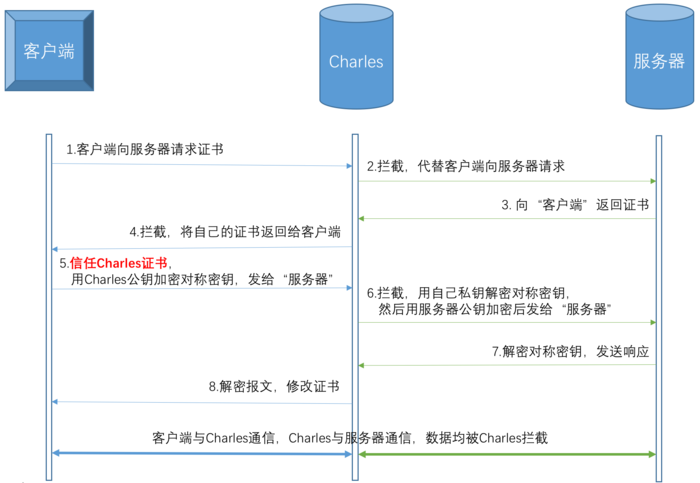

# Charles 常用知识

## 抓取 HTTP 请求报文的原理

客户端请求->经过 Charles 代理->到达服务端 

服务端返回->经过 Charles 代理->到达客户端

## 抓取 HTTPS 请求报文的原理

- 第一步，客户端向服务器发起 HTTPS 请求。

- 第二步，Charles 截获客户端发送给服务器的HTTPS请求，Charles 伪装成客户端向服务器发送请求进行握手。

- 第三步，服务器返回证书。

- 第四步，Charles 拦截到服务器的 CA 证书，用根证书（这里的根证书是 CA 认证中心给自己颁发的证书）公钥进行解密，验证服务器数据签名，获取到服务器 CA 证书公钥。然后 Charles 伪造自己的 CA 证书（这里的 CA 证书，也是根证书，只不过是 Charles 伪造的根证书），冒充服务器证书传递给客户端浏览器。

- 第五步，与普通过程中客户端的操作相同，客户端根据返回的数据进行证书校验、生成密码 Pre_master，用 Charles 伪造的证书公钥加密，并生成 HTTPS 通信用的对称密钥 enc_key。然后将对称密钥发送给服务器。

- 第六步，Charles 拦截客户端发送给服务器的对称密钥。Charles 将截获的密文用自己伪造证书的私钥解开，获得并计算得到 HTTPS 通信用的对称密钥 enc_key。Charles 将对称密钥用服务器证书公钥加密传递给服务器。

- 第七步，与普通过程中服务器端的操作相同，服务器用私钥解密密文，获得对称密钥后建立信任，然后再发送加密的握手消息给客户端。

- 第八步，Charles 拦截服务器发送的密文，用对称密钥解开，再用自己伪造证书的私钥加密传给客户端。

- 第九步，客户端拿到加密信息后，用公钥解开，验证 HASH。握手过程正式完成，客户端与服务器端就这样建立了”信任“。

在之后的正常加密通信过程中，Charles 作用如下：

- 服务器—>客户端：Charles 接收到服务器发送的密文，用对称密钥解开，获得服务器发送的明文。再次加密， 发送给客户端。

- 客户端—>服务端：客户端用对称密钥加密，被 Charles 截获后，解密获得明文。再次加密，发送给服务器端。由于 Charles 一直拥有通信用对称密钥 enc_key，所以在整个 HTTPS 通信过程中信息对其透明。