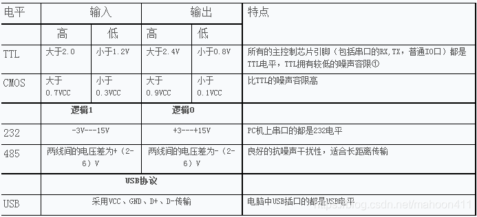

## 常用的逻辑电平有哪些？

TTL电平、CMOS电平、232电平、USB电平

## TTL 电平与 CMOS 电平可以直接互连吗？

TTL 和 CMOS 不可以直接互连，由于 TTL 是在0.3-3.6V之间，而 CMOS 是有在12V的，有在5V的。

如果需要互连的话：CMOS 输出接到 TTL 可以直接互连；TTL 接到 CMOS 需要在输出端口加一上拉电阻接到5V或者12V。

## CMOS 和 TTL 有什么区别？

TTL 电路是电流控制器件，而 CMOS 电路是电压控制器件。

TTL 电路的速度快，传输延迟时间短(5-10ns)，但是功耗大。CMOS 电路的速度慢，传输延迟时间长(25-50ns)，但功耗低。CMOS 电路本身的功耗与输入信号的脉冲频率有关，频率越高，芯片集越热，这是正常现象。

TTL 集成电路的主要型式为晶体管(BJT)-晶体管(BJT)逻辑门(transistor-transistor logic gate)，TTL 大部分都采用5V电源。输出高电平和输出低电平：Uoh≥2.4V，Uol≤0.4V；输入高电平和输入低电平：Uih≥2.0V，Uil≤0.8V。

CMOS 电路是电压控制器件，输入电阻极大，对于干扰信号十分敏感，因此不用的输入端不应开路，接到地或者电源上。CMOS 电路的优点是噪声容限较宽，静态功耗很小。输出高电平 Uoh 和输出低电平 Uol：Uoh≈VCC，Uol≈GND；输入高电平 Uoh 和输入低电平 Uol：Uih≥0.7VCC，Uil≤0.2VCC(VCC 为电源电压，GND 为地)。

在同样 5V 电源电压情况下，CMOS 电路可以直接驱动 TTL，因为 CMOS 的输出高电平大于 2.0V，输出低电平小于 0.8V；而 TTL 电路则不能直接驱动 CMOS 电路：1. TTL 的输出高电平为大于 2.4V，如果落在 2.4V～3.5V 之间，则 CMOS 电路就不能检测到高电平；2. 低电平小于 0.4V 满足要求；3. 所以在 TTL 电路驱动 CMOS 电路时需要加上拉电阻。

## BJT与MOSFET的区别

1. 三极管是电流型器件，MOSFET是电压型器件。

2. 三极管功耗大（极大的限制了三极管在集成电路中的应用），场效应管功耗小（集成电路中广泛应用）。

3. 场效应管栅极基本不取电流，而三极管的基极总要吸取一定的电流。因此场效应管的输入电阻要比三极管的输入电 阻要高。

4. 三极管导通电阻大，场效应管导通电阻小，只有几百毫欧，在现在的用电器件上，一般用场效应管用作开关，效率 还算比较高的。

5. 场效应管的噪声系数都很小的，在低噪声放大电路的输入级及要求信噪比高的电路中要选择场效应管。

6. 三极管是双极性的（内部导电方式：空穴和载流子），场效应管是单极性的（空穴or载流子）。

应用场合：三极管比较便宜，用起来比较方便，常用在数字电路中。MOS常用于高速高频电路、大电流场合，以及对基极和漏极控制电流比较敏感的场合，一般来说，成本场合，普通应用先采用三极管，不行的话再 使用MOS管。

## VCC、VDD、VSS 是什么意思？

一般来说，VCC=模拟电源,VDD=数字电源,VSS=数字地。

对于数字电路来说，VCC是电路的供电电压,VDD是芯片的工作电压(通常Vcc>Vdd)，VSS是接地点。例如，对于ARM单片机来说，其供电电压VCC一般为5V，一般经过稳压模块将其转换为单片机工作电压VDD = 3.3V

