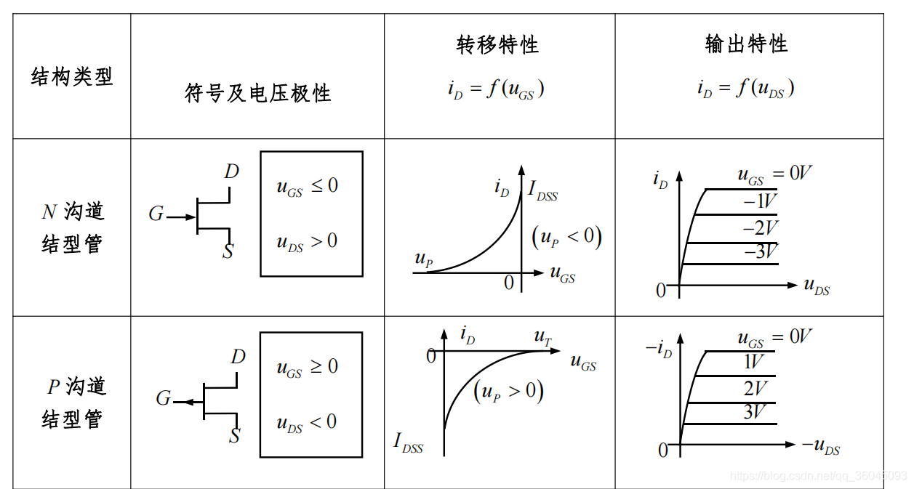
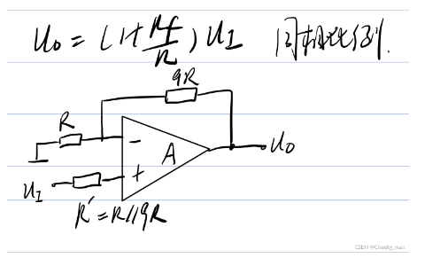

## 基尔霍夫定律的内容

基尔霍夫定律包括电流定律和电压定律

- 电流定律：在集总电路中，任何时刻，对任一节点，所有流出节点的支路电流的代数和恒等于零。

- 电压定律：在集总电路中，任何时刻，沿任一回路，所有支路电压的代数和恒等于零。

## 什么是有源器件？什么是无源器件？

需要电源的器件叫有源器件，不需要电源的器件就是无源器件。或者说，需要电源才能显示其特性的就是有源元件，如三极管。而不用电源就能显示其特性的就叫无源元件

有源器件一般用来信号放大、变换等，无源器件用来进行信号传输，或者通过方向性进行“信号放大”。

### 无源器件

如果电子元器件工作时，其内部没有任何形式的电源，则这种器件叫做无源器件。

无源器件有两个基本特点：1. 自身或消耗电能，或把电能转变为不同形式的其他能量。2. 只需输入信号，不需要外加电源就能正常工作。

常见的无源器件有：电阻、电感、电容、二极管、继电器、按键、开关、连接器、插座等。

### 有源器件

如果电子元器件工作时，其内部有电源存在，则这种器件叫做有源器件。

有源器件有两个基本特点：1. 自身也消耗电能。2. 除了输入信号外，还必须要有外加电源才可以正常工作。

常见的有源器件有：分立器件和集成电路。

分立器件包括：三极管(BJT)、场效应管(MOSFET)、晶闸管(可控硅)等。

集成电路包括：集成运算放大器、各类逻辑门、寄存器、单片机、DSP等。

## 电阻、电容、电感的作用

### 电阻

在电路中起阻流作用的元器件称为电阻器，简称电阻。

电阻器的主要用途是降压、分压或分流，在一些特殊电路中用作负载、反馈、耦合、隔离等。

电阻在电路图中的符号为字母R。电阻的标准单位为欧姆，记作R。常用的还有千欧KΩ，兆欧MΩ。1KΩ=1000Ω 1MΩ=1000KΩ

$$
R=\rho\frac{L}{S}
$$

$$
R=\frac{U}{I}
$$

$$
P=\frac{W}{t}=UI=\frac{U^2}{R}=I^2R
$$

$
\rho——————电阻率，单位：\Omega m
$

$
P——————功率，单位：W
$

$
W——————功，单位：J
$

### 电容

电容器也是电子线路中最常见的元器件之一，它是一种存储电能的元器件。电容器由两块同大同质的导体中间夹一层绝缘介质构成。当在其两端加上电压时，电容器上就会存储电荷。一旦没有电压，只要有闭合回路，它又会放出电能。

电容器在电路中阻止直流通过，而允许交流通过，交流的频率越高，通过的能力越强。因此，电容在电路中常用耦合，旁路滤波、反馈、定时及振荡等作用。

电容器的字母代号为C。电容量的单位为法拉（记作F），常用有μF（微法）、PF（即μμF、微微法）。1F=1000000μF 1μF=1000000PF

电容在电路中表现的特性是非线性的。对电流的阻抗称为容抗。容抗与电容量和信号的频率反比。

$$
Q=CU;Q为电量
$$

$$
I=\frac{dQ}{dt}=C\frac{dU}{dt}
$$

$$
X_C=\frac{1}{2\pi Cf}=\frac{1}{\omega C}
$$

$
Q——————电量，单位：C(库伦)
$

$
C——————电容量，单位：F(法拉)
$

$
X_C——————容抗，单位：\Omega
$

$
f——————频率，单位：Hz
$

$
\omega——————角频率，单位：rad/s
$

### 电感

电感与电容一样，也是一种储能元器件。电感器一般由线圈做成，当线圈两端加上交流电压时，在线圈中产生感应电动势，阻碍通过线圈的电流发生变化。电感是典型的电磁感应和电磁转换的元器件，最常见的应用是变压器。

电感在电子线路中的作用是：阻流、变压、耦合及与电容配合用作调谐、滤波、选频、分频等。

电感在电路中的代号为L。电感量的单位是亨利（记作H），常用的有毫亨（mH），微亨（μH）。1H=1000mH 1mH=1000μH

电感对电流的阻碍称作感抗。感抗与电感量和信号的频率成正比。它对直流电不起阻碍作用（不计线圈的直流电阻）。

$$
\psi=N\phi=NBS
$$

$$
\psi=LI
$$

$$
U=\frac{d\psi}{dt}=L\frac{dI}{dt}
$$

$$
X_L=2\pi Lf=\omega L
$$

$
\psi——————磁链(电流回路所链环的磁通量)，单位：Wb(韦伯)
$

$
N——————导线线圈匝数
$

$
\phi——————磁通量(闭合回路面积与垂直穿过它的磁感应强度的乘积)，单位：Wb(韦伯)
$

$
B——————磁感应强度，单位：T(特斯拉)
$

$
L——————电感量，单位：H(亨利)
$

$
X_L——————感抗，单位：\Omega
$

## 有功功率、无功功率、视在功率

### 有功功率

在交流电路中，凡是消耗在电阻元件上、功率不可逆转换的那部分功率（如转变为热能、光能或机械能）称为有功功率，简称“有功”， 用“P”表示，单位是瓦（W）或千瓦（KW）。它反映了交流电源在电阻元件上做功的能力大小，或单位时间内转变为其它能量形式的电能数值。

实际上它是交流电在一个周期内瞬时功率的平均值，故又称平均功率。它的大小等于瞬时功率最大值的1/2，就是等于电阻元件两端电压有效值与通过电阻元件中电流有效值的乘积。

### 无功功率

为了反映以下事实并加以表示，将电感或电容元件与交流电源往复交换的功率称之为无功功率。简称“无功”，用“Q”表示。单位是乏（Var）或千乏(KVar)。

在交流电路中，凡是具有电感性或电容性的元件，在通电后便会建立起电感线圈的磁场或电容器极板间的电场。因此，在交流电每个周期内的上半部分（瞬时功率为正值）时间内，它们将会从电源吸收能量用建立磁场或电场；而下半部分（瞬时功率为负值）的时间内，其建立的磁场或电场能量又返回电源。因此，在整个周期内这种功率的平均值等于零。就是说，电源的能量与磁场能量或电场能量在进行着可逆的能量转换，而并不消耗功率。

无功功率是交流电路中由于电抗性元件（指纯电感或纯电容）的存在，而进行可逆性转换的那部分电功率，它表达了交流电源能量与磁场或电场能量交换的最大速率。

实际工作中，凡是有线圈和铁芯的感性负载，它们在工作时建立磁场所消耗的功率即为无功功率。如果没有无功功率，电动机和变压器就不能建立工作磁场。

### 视在功率

交流电源所能提供的总功率，称之为视在功率或表现功率，在数值上是交流电路中电压与电流的乘积。视在功率用S表示。单位为伏安（VA）或千伏安（KVA）。它通常用来表示交流电源设备（如变压器）的容量大小。

视在功率即不等于有功功率，又不等于无功功率，但它既包括有功功率，又包括无功功率。能否使视在功率100KVA的变压器输出100KW的有功功率，主要取决于负载的功率因数。

### 功率三角形

视在功率（S）、有功功率（P）及无功功率（Q）之间的关系，可以用功率三角形来表示，如下图所示。它是一个直角三角形，两直角边分别为Q与P，斜边为S。S与P之间的夹角Ф为功率因数角，它反映了该交流电路中电压与电流之间的相位差（角）。

电压与电流之间的相位差(Φ)的余弦叫做功率因数，用符号cosΦ表示，在数值上，功率因数是有功功率和视在功率的比值，即cosΦ=P/S。

三相负荷中，任何时候这三种功率总是同时存在：功率因数cosΦ=P/S：sinΦ=Q/S。

### 三种情况

（1）当三相负载平衡时：对于三相对称负载来说，不论是Y形接法还是△形接法，其功率的计算均可按下式进行：

（2）当三相负载不平衡时：分别计算各相功率，再求和。

P=P1+P2+P3=U1*I1*cosφ1+U2*I2*cosφ2+U3*I3*cosφ3

（3）如果三相电路的负载不对称，则上述公式不能使用，这时必须用三个单相电路功率相加的方法计算三相总功率。

“功率三角形”是表示视在功率S、有功功率P和无功功率Q三者在数值上的关系，其中φ是u(t)与i(t)的相位差, 也称功率因数角。

由功率三角形可得 ：P=Scosφ，Q=Ssinφ=Ptgφ

对于三相电路： P=√3 UIcosφ，Q=√3 UIsinφ， S=√3 UI=√（P2+Q2）

对于用电器来说，VA*功率系数=W

在电阻类器件上，VA=W它的功率系数是1

在电动机上，功率系数是0.7-0.9不到1

在发电机上，W指的应该是主动机的功率，比如说汽油机或柴油机的输出功率，VA应该指的它的带负载能力。带负载能力就是代表器件的输出电流的大小。

## BJT(晶体管)三种接法的比较

（1）共射电路既能放大电流又能放大电压，输入电阻居三种电路之中，输出电阻较大，频带较窄。常作为低频电压放大电路的单元电路。

（2）共集电路只能放大电流不能放大电压，是三种接法中输入电阻最大、输出电阻最小的电路，并具有电压跟随的特点。常用于电压放大电路的输入级和输出级，在功率放大电路中也常采用射极输出的形式。

（3）共基电路只能放大电压不能放大电流，具有电流跟随的特点;输入电阻小，电压放大倍数、输出电阻与共射电路相当，是三种接法中高频特性最好的电路。常作为宽频带放大电路。

## 各类 MOS(场效应管)

1. 电路符号：

   - 中间一条线：结性管；中间两条实线：耗尽型MOS管；中间有虚线：增强型MOS管
   - 箭头朝外：P沟道；箭头朝内：N沟道

2. 转移特性曲线（看U_GS和i_D）：

   - i_D > 0：N沟道；否则：P沟道
   - 只在二或四象限：结型；
   - 只在一或三象限：增强型；
   - 跨越一和二象限或三和四象限：耗尽型；

3. 输出特性曲线（也是看U_GS和i_D）：

   - U_GS<0时：i_D > 0：N沟道、输入特性过二象限：结型；
   - U_GS>0时：i_D < 0：P沟道、输入特性过四象限：结型；
   - U_GS>0时：i_D > 0：N沟道、输入特性过一象限：增强型；
   - U_GS<0或U_GS>0时：i_D > 0：N沟道、输入特性跨一和二象限：耗尽型；

## 开关电源与线性电源在原理上的区别
开关电源的基本原理是输入端直接将交流电整流变成直流电，再在高频震荡电路的作用下，用开关管控制电流的通断，形成高频脉冲电流。 在电感（高频变压器）的帮助下，输出稳定的低压直流电。

线性电源的基本原理是市电经过一个工频变压器降压成低压交流电之后，通过整流和滤波形成直流电，最后通过稳压电路输出稳定的低压直流电。电路中调整元件工作在线性状态。

## 开关电源与线性电源的优缺点

开关电源优点：体积小、重量轻（体积和重量只有线性电源的20～ 30%）、效率高（一般为60～ 70%，而线性电源只有30～40%）、自身抗干扰性强、输出电压范围宽、模块化。

开关电源缺点：由于逆变电路中会产生高频电压，对周围设备有一定的干扰。需要良好的屏蔽及接地。交流电经过整流，可以得到直流电。但是，由于交流电压及负载电流的变化，整流后得到的直流电压通常会造成20%到40%的电压变化。为了得到稳定的直流电压，必须采用稳压电路来实现稳压。

线性电源优点：结构相对简单、输出纹波小、高频干扰小。结构简单给我们带来的最大好处是维修方便，维修一台线性电源的难度往往远远低于开关电源，线性电源的维修成功率也大大高于开关电源。纹波是叠加在直流稳定量上的交流分量。输出纹波越小也就是说输出直流电纯净度越高，这也正是直流电源品质的重要标志。过高纹波的直流电将影响收发信机的正常工作。目前高档线性电源纹波可以达到0.5mV的水平，一般产品可以做到5mVz水平线性电源没有工作在高频状态下的器件所以如果输入滤波做得好的话几乎没有高频干扰/高频噪声。

线性电源缺点：需要庞大而笨重的变压器，所需的滤波电容的体积和重量也相当大，而且电压反馈电路是工作在线性状态，调整管上有一定的电压降，在输出较大工作电流时，致使调整管的功耗太大，转换效率低，还要安装很大的散热片。这种电源不适合计算机等设备的需要，将逐步被开关电源所取代。

## 开关电源与线性电源在应用上的区别

线性电源功率器件工作在线性状态，也就是说他一用起来功率器件就是一直在工作，所以也就导致他的工作效率低，一般在50%～60%，而且体积大，笨重，效率低、发热量也大。

但是线性电源有开关电源没有的优点∶纹波小，调整率好，对外干扰小。适合用与模拟电路，各类放大器等。

开关电源体积小、电流大、效率高，但是纹波大、干扰大。随着电子技术的不断发展，开关电源的设计也越来越科学，开关电源的缺点将慢慢被消除，所以开关电源将是以后应用的主流趋势，逐渐代替线性电源。

## 运算放大器比例运算电路

### 反相比例运算电路

### T 形网络反相比例运算电路

### 同相比例放大电路

## 运算放大器加减运算电路

### 反相求和运算电路

### 同相求和运算电路

### 加减运算电路

利用叠加定理分成反相求和运算电路和同相求和运算电路；

## 运算放大器积分运算电路

Rf的作用：防止低频信号增益过大，在电容上并联一个电阻加以限制。

## 运算放大器微分运算电路

## 用运放组成十倍放大器

