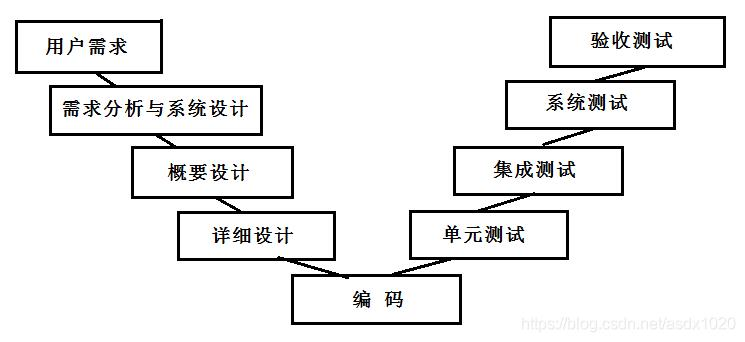
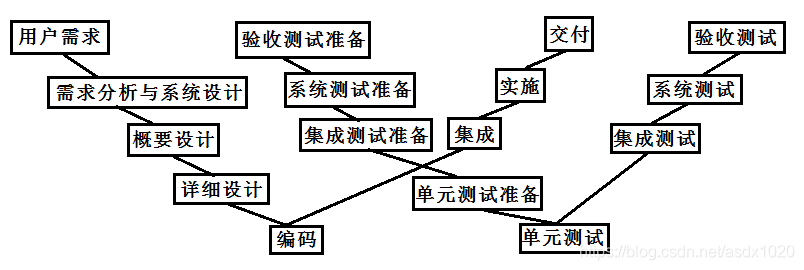
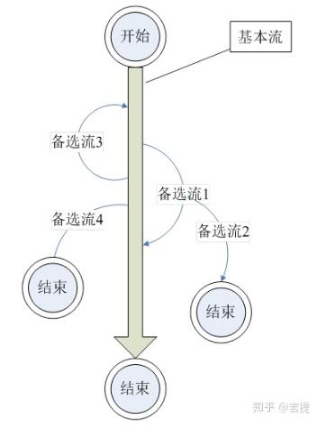
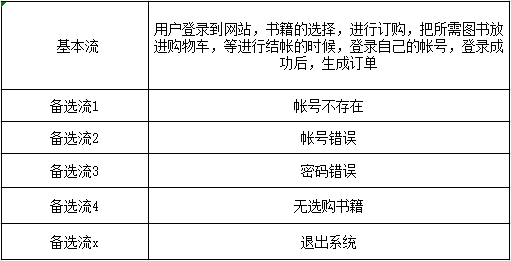
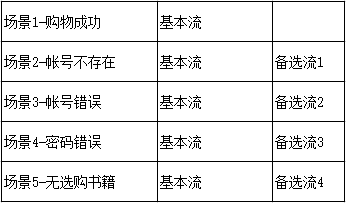
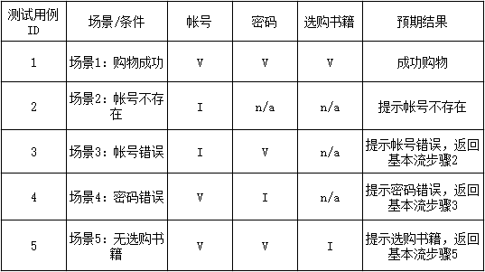
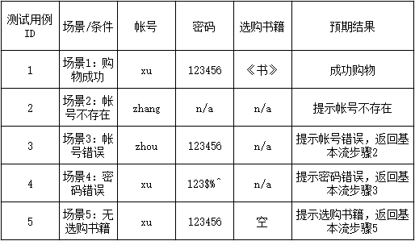
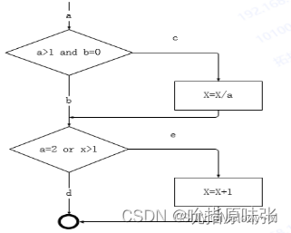
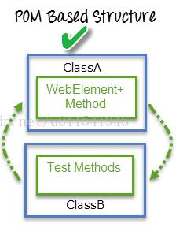
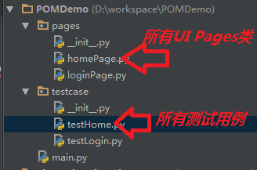

# 测试基础知识
## 什么是软件测试，软件测试的目的是什么？
软件测试就是在受控制的条件下对系统或应用程序进行操作并评价操作结果的过程。(受控制的条件应包括正常条件)

软件测试的目的是按照软件需求，找出软件中存在的错误，发现软件的缺陷，帮助改进软件，保证软件产品质量。

## 为什么选择测试

我认为无论在哪个行业，产品的质量是第一位的，测试工程师的主要工作就是发现程序中的错误，撰写测试报告，进而保证产品质量。因此测试工程师这一岗位一定是不可或缺的。在我经过实习后，我更加意识到，测试是保证产品质量的重要的一道关口。

## 你认为测试需要哪些品质

1. 我认为做测试需要有专业的技能，比如测试用例的覆盖面越广，软件的质量就越高。通过接口测试保证服务端的质量。还可以通过其它的测试方法来保证软件质量，比如性能测试，安全测试等。

2. 需要良好的沟通能力。因为测试人员需要频繁的和开发、产品进行沟通，推动产品上线，所以比较好的沟通和协调能力，会让项目的进展更快速和有效。

3. 需要不断学习的心态，开发的技术一直在变化，作为测试不能掉链子。需要持续学习，用技术提高测试的效率，比如提高自己的自动化测试水平，保证软件的之前功能不受现在的开发影响，还有要提高代码能力，提高测试的生产力。

4. 要想做好测试的工作，非常需要耐心和细心两个品质，并且需要发散的思维去对测试对象进行“破坏”。

5. 除此之外，我认为一个合格的测试，还需要足够的严格，足够强势。因为测试也叫 QA,即质量保证。所以，针对被测产品，测试必须按照预先定义的明确且严格的标准，对产品的质量进行严格把关，做好最后一道关卡的作用。


## 如何评判测试的工作成果？

我认为，应该从两方面去评估测试的工作成果。

一方面是测试用例的覆盖率，另一方面是缺陷的覆盖率。

对于测试用例的覆盖率来说，测试工程师写的测试用例对于业务的覆盖率越高越好。

对于缺陷的覆盖率来说，上线之后发现的 bug 越少越好，也就是说测试工程师在产品上线之前就把潜在的 bug 给提出来了。

## 测试工程师和测试开发工程师有什么区别？

我认为测试工程师主要工作内容是检查软件有没有Bug，是否具有稳定性，并写出相应的测试计划、测试规范、测试用例、测试数据、测试报告。在一个项目中担当类似“质量管理”的角色，及时纠错及时更正，确保产品的正常运作。

测试开发工程师是在具备测试经验、熟练使用测试工具并有一定开发能力的前提下，可以自主开发平台，或对现有开源工具进行二次开发，最终目的是提升产品测试效率、降低测试成本、使测试价值最大化。

因此，我认为这两者都需要具备扎实的测试能力，但测试开发工程师还需要额外具备开发能力。

## 软件测试的流程
- 测试需求分析阶段：阅读需求，理解需求，分析需求点，参与需求评审会议
- 测试计划阶段：参考软件需求编写测试计划，内容包括测试范围（来自需求文档），进度安排，人力物力的分配，整体测试策略的制定。
- 测试设计阶段：参考需求文档编写测试用例，用例编写完成之后会进行评审。
- 测试执行阶段：搭建测试环境，执行测试，bug管理直到测试结束
- 测试评估阶段：出测试报告，确认是否可以上线

## 常见的测试模型
V模型



W模型



## 测试方法分类
### 按测试阶段划分
- 单元测试：单元测试属于白盒测试，单元测试是最微小规模的测试，是对软件中的单元模块进行测试，测试的是某个功能或代码块。
- 集成测试：集成测试属于灰盒测试，集成测试又称为组装测试，就是在单元测试的基础上，对单元模块之间的接口进行测试。
- 系统测试：系统测试属于黑盒测试，主要测试系统是否符合需求，包括对功能、性能，以及软件所运行的软硬件环境进行测试。
- 验收测试：验收测试是基于客户或最终用户的规格书的最终测试，或基于用户一段时间的使用后，看软件是否满足客户要求。一般从功能、用户界面、性能、业务关联性进行测试。
- 回归测试：回归测试是指在发生修改之后重新测试，目的是验证新增的功能是否引入新的问题，旧的缺陷是否修复成功。理论上，软件产生新版本，都需要进行回归测试，验证以前发现和修复的错误是否在新软件版本上再次出现。

### 验收测试中的测试方法
- α测试：在软件发布前，由内部开发机构人员来模拟潜在用户开展的测试，则称为α测试。
- β测试：β测试是在软件公司外部展开的测试，可以由非专业的测试人员执行的测试，例如由具有代表性的用户群来进行测试。


### 按是否查看程序内部结构划分
- 白盒测试：对软件内部的逻辑结构进行详细检查，对程序的所有逻辑进行测试。
- 黑盒测试：把测试对象看成一个黑盒子，不需要考虑程序内部的逻辑结构，只需要依照程序的需求规格说明书，检查程序功能是否能够实现即可。黑盒测试又分为功能测试和性能测试。功能测试检查实际软件的功能是否符合用户的需求。包括逻辑功能测试、界面测试、易用性测试和兼容性测试。性能测试主要有时间性能和空间性能两种。其中，时间性能主要指软件的一个具体事务的响应时间，而空间性能主要指软件运行时所消耗的系统资源。
- 灰盒测试：是介于白盒测试和黑盒测试之间的一种测试，不仅关注输出输入情况，也关注程序内部的逻辑。

### 功能测试中的测试方法
- 冒烟测试：对软件基本功能的测试
- 兼容性测试：兼容测试主要是检查软件在不同的平台上是否可以正常的运行，即是通常说的软件的可移植性。兼容性测试属于非功能性测试，我们拿到一个产品时，应优先保证功能性测试的验证，再去兼顾其它非功能性测试。


### 性能测试中的测试方法
- 负载测试：负载测试是通过改变系统负载方式、逐渐增加负载等来发现系统中所存在的性能问题。负载测试是一种测试方法，可以为性能测试、压力测试所采用。

- 压力测试：压力测试通常是在高负载情况下来对系统的稳定性进行测试，更有效地发现系统稳定性的隐患和系统在负载峰值的条件下功能隐患等。


### 按是否运行程序划分
- 静态测试：静态测试指测试不运行的部分，只是静态地检查程序代码、界面或文档可能存在的错误的过程。例如测试产品说明书，对此进行检查和审阅.。
- 动态测试：动态测试是指通过运行软件来检验软件的动态行为和运行结果的正确性。具体操作就是输入相应的测试数据，检查输出结果和预期结果是否相符的过程。

### 按测试执行方式划分
- 手动测试：人工执行测试
- 自动化测试：软件测试自动化，目的是节省人力、时间或硬件资源，提高测试效率

## 灰度测试和A/B测试是什么？它们之间有什么区别？    
灰度测试
- 灰度测试：**在某项应用正式发布前**，选择特定人群试用，逐步扩大其试用者数量，以便及时发现和纠正其中的问题。(做灰度测试需要选择适合的用户，需要基于随机原则)   
例如：某应用升级了视频资源的播放格式，但不知道新版本是否有问题。那么该应用可以通过配置下发，控制一部分用户的应用去播放新格式的视频。然后通过监控来观测播放成功率和卡顿率等，一旦有问题会立即回滚(新版本回滚至旧版本)。  


- A/B测试：AB测试是为某个应用制作两个（A/B）或多个（A/B/n）版本，在同一时间维度，分别让组成成分相同（相似）的访客群组（目标人群）随机地访问这些版本，收集各群组的用户体验数据和业务数据，最后分析、评估出最好版本，正式采用。    
例如：某应用换皮肤，可以把两种待选皮肤都投入市场，看哪种皮肤的按钮用户点击量大，用户停留时长高。  

区别：
- 灰度测试本质上是上线前的测试，收集用户的反馈。A/B测试本质上是上线后的测试，收集用户的反馈。
- AB的两种功能都是可用的，投放的用户群体无差别，让用户选择更受欢迎的功能。目标不明确，后期可能是A上线，也可能是B上线。灰度版本未必是可用的，或者说没有严重bug的，投放的客户群体可能被选择和约束（例如只投放安卓低端机），由监控确定是否有问题，目标明确，只要灰度版本没问题，就会继续放量上线，直到全量。

## 黑盒测试中测试用例的设计方法有哪些
有基于需求的设计方法、等价类划分、边界值分析、因果图、判定表、场景图。
### 基于需求的设计方法：
- 定义：依据客户需求设计测试用例，但是在设计的过程中一定要辩证的看待需求（即：需求不一定都是正确的）
### 等价类划分法
- 定义：依据需求将输入划分为若干等价类，从等价类中选定一个测试用例，如果该测试用例通过，则表明整个等价类通过测试。
- 适用场景：对于等价类这个方法，一般适用于有无限多种输入，我们不可能完成穷举测试，等价类可以使我们用较少的测试用例尽可能多的将功能覆盖。
- 一般划分为：有效等价类、无效等价类。有效等价类：有意义的输入构成的集合，对于需求规格说明书是合法的；无效等价类：不满足需求的集合。
### 边界值分析法
- 定义：边界值法是对输入数据的边界测试，一般来说边界值法是对等价类划分后的补充。

- 举例：
对于设定密码的测试，要求密码必须为6-15位
分析过程：有效等价类为>=6 && <=15 无效等价类为：<6 || >15
设定边界值：5、6、10、15、16
>- 解释：
>- 6和15作为有效等价类中的内容，又是边界值，可以判定有效等价类的内容是否满足要求
>- 但是6和15又很特殊，它不仅代表了有效等价类，还代表了边界值，所以我们选定一个普通的有效等价类作为一个测试用例，如：10
>- 5和16作为无效等价类中的内容，又是边界值（比4或者17更具有代表性），可以判定无效等价类的内容


### 因果图
- 定义：因果图是从需求中找出因（输入条件）和果（输出或程序改变的状态），通过因果图转化为判定表。

- 使用因果图法设计测试用例的步骤：
  1. 确定软件规格(需求)中的原因和结果
  2. 确定原因和结果之间的逻辑关系
  3. 确定因果图中的各个约束(constraints)
  4. 画出因果图并转换为判定表
  5. 根据判定表设计测试用例

### 判定表

- 定义：判定表是分析和表达多逻辑条件下执行不同操作的情况的工具，能够将复杂的问题按照各种可能的情况全部列举出来。
- 判定表由四部分组成：
  - 条件桩：可能出现这个问题的所有条件
  - 条件项：条件桩的取值
  - 动作桩：这个问题的所有输出结果
  - 动作项：条件项的各个取值情况下的输出结果。

|条件桩|条件项|
|--|--|
|动作桩|动作项|

- 使用判定表法设计测试用例的步骤：
  1. 列出所有的条件桩和动作桩，填入条件项，填入动作项，得到初始判定表
  2. 简化判定表，合并相似规则。
     - 若表中有两条以上规则具有相同的动作，并且在条件项之间存在极为相似的关系，便可以合并。
     - 合并后的条件项用符号“-”表示，说明执行的动作与该条件的取值无关，称为无关条件。 
  3. 设计测试用例
- 举例：
要求对功率大于50马力的机器或维修纪录不全且已运行10年以上的机器，应给予优先维修处理，请利用判定表法设计测试用例。

1. 列出所有条件桩、动作桩。填入条件项、动作项，得到初始判定表。
  <table>
	<tr>
	    <td rowspan="3">条件桩</td>
	    <td>功率大于50马力吗？</td>
	    <td>1</td>  
        <td>1</td> 
        <td>1</td> 
        <td>1</td> 
        <td>0</td> 
        <td>0</td> 
        <td>0</td> 
        <td>0</td> 
	</tr >
	<tr >
	    <td>维修记录不全？</td>
	    <td>1</td>  
        <td>1</td> 
        <td>0</td> 
        <td>0</td> 
        <td>1</td> 
        <td>1</td> 
        <td>0</td> 
        <td>0</td> 
	</tr>
	<tr>
	    <td>运行超过10年吗？</td>
	    <td>1</td>  
        <td>0</td> 
        <td>1</td> 
        <td>0</td> 
        <td>1</td> 
        <td>0</td> 
        <td>1</td> 
        <td>0</td> 
	</tr>
	<tr>
	    <td rowspan="2">动作桩</td>
	    <td>进行优先维修</td>
	    <td>X</td>  
        <td>X</td> 
        <td>X</td> 
        <td>X</td> 
        <td>X</td> 
        <td></td> 
        <td></td> 
        <td></td> 
	</tr>
	<tr>
	    <td>不进行优先维修</td>
	    <td></td>  
        <td></td> 
        <td></td> 
        <td></td> 
        <td></td> 
        <td>X</td> 
        <td>X</td> 
        <td>X</td> 
	</tr>
</table>
 
  2. 简化判定表。

<table>
	<tr>
	    <td rowspan="3">条件桩</td>
	    <td>功率大于50马力吗？</td>
	    <td>1</td>  
        <td>0</td> 
        <td>0</td> 
        <td>0</td> 
	</tr >
	<tr >
	    <td>维修记录不全？</td>
	    <td>-</td>  
        <td>1</td> 
        <td>1</td> 
        <td>0</td> 
	</tr>
	<tr>
	    <td>运行超过10年吗？</td>
        <td>-</td> 
        <td>1</td> 
        <td>0</td> 
        <td>-</td>
	</tr>
	<tr>
	    <td rowspan="2">动作桩</td>
	    <td>进行优先维修</td>
	    <td>X</td>  
        <td>X</td> 
        <td></td> 
        <td></td> 
	</tr>
	<tr>
	    <td>不进行优先维修</td>
	    <td></td>  
        <td></td> 
        <td>X</td> 
        <td>X</td> 
	</tr>
</table>

3. 得出测试用例

| 用例序号 | 输入 | 预期输出 |
|--|--|--|
| 1 | 无论维修记录是否齐全，是否运行超过10年，只要功率大于50马力的情况 | 进行优先维修|
| 2 | 功率没有大于50马力，但维修记录不全且已运行超过10年的情况 | 进行优先维修 |
| 3 | 当功率没有大于50马力和维修记录不全时，但运行没有超过10年的情况 | 不进行优先维修
| 4 | 无论运行是否超过10年，当功率没有大于50马力和维修记录不全的情况 | 不进行优先维修 |


### 场景图

- 定义：场景图法是一种通过使用“场景”对软件系统的功能点或业务流程进行描述，即针对需求模拟出不同的场景进行所有功能点及业务流程的覆盖，从而提高测试效率并达到良好效果的方法。

- 场景图业务流由两部分组成：基本流 + 备选流
  - 基本流：程序的无任何差错的路径，即程序从开始直接执行到结束的流程。通常情况下，一个业务仅存在一个基本流，且基本流仅有一个起点和一个终点。但有些业务也会有多个基本流。
  - 备选流：表示通过业务流程时输入错误（或者操作错误）导致流程存在反复或出现错误结果。



- 基本流和备选流的若干原则：
  - 基本流只有一个起点，一个终点；
  - 基本流是主流，备选流是支流；
  - 备选流可以始于基本流，也可以始于其它备选流；
  - 备选流的终点，可以是一个流程的出口，也可以是回到基本流，还可以是汇入其它的备选流；
  - 备选流汇合时，谁汇合到谁，取决于流量大小也即该流程出现的可能性大小，小的汇入大的；
  - 如果在流程图中出现了两个不相上下的基本流，一般需要把它们分别当做一个业务看待。

- 场景图法设计测试用例的步骤：
  - 分析需求，确定业务流程（基本流、备选流）；
  - 依据基本流、备选流，生成不同的场景；
  - 针对生成的各场景，设计相应的测试用例。
  - 测试用例一经认可，就可以确定实际数据值并且设定数据。

- 举例：
针对网上购物流程进行测试用例设计。

1. 分析需求，确定业务流程，列写基本流、备选流。
整个订购过程为：用户登录到网站后，进行书籍的选择，当选好自己心仪的书籍后进行订购，这时把所需图书放进购物车，等进行结帐的时候，用户需要登录自己注册的帐号，登录成功后，进行结帐并生成订单，整个购物过程结束。


2. 依据基本流、备选流，生成不同场景。


3. 设计测试用例。


4. 确定测试用例中的实际数据值。


## 黑盒测试用例设计时，选定某种方法的依据是什么？
- 等价类划分法和边界值分析方法都是着重考虑输入条件。如果程序输入之间没有什么联系，采用等价类划分和边界值分析是一种比较有效的方法。
- 因果图法和判定表法着重测试规格说明中的输入与输出间的依赖关系。如果输入之间有关系，例如，约束关系、组合关系，这种关系用等价类划分和边界值分析是很难描述的，测试效果难以保障，因此必须考虑使用一种适合于描述对于多种条件的组合，产生多个相应动作的测试方法，那么可以采用因果图法和判定表法。


## 白盒测试中测试用例的设计方法有哪些？
有逻辑覆盖法和基本路径法，其中逻辑覆盖法分为：语句覆盖、判定覆盖、条件覆盖、判定-条件覆盖、条件组合覆盖与路径覆盖。
- 语句覆盖：在测试时，首先设计若干个测试用例，然后运行被测程序，使程序中的每个可执行语句至少执行一次。
>优点：可以很直观地从源代码得到测试用例，无须细分每个条件的判定结果。
缺点：语句覆盖是最弱的覆盖，仅仅针对程序逻辑中显式存在的语句，但对于隐藏的条件和可能到达的隐式逻辑分支，是无法测试的。
- 判定覆盖法：在测试时，首先设计若干个测试用例，然后运行被测程序，使得程序中的每个条件的真分支和假分支至少被执行一次，即条件判定的真假值均被满足。
>优点：判定覆盖具有比语句覆盖更强的测试能力。同样判定覆盖也具有和语句覆盖一样的简单性。
缺点：大部分条件语句是由多个子条件组合而成。若仅仅判断整个条件的最终结果，而忽略每个子条件的取值情况，必然会遗漏部分测试路径。
- 条件覆盖法：在测试时，首先设计若干个测试用例，然后运行被测程序，要使每个条件语句中每个子条件的可能取值至少满足一次(子条件的判定结果无需进行排列组合)。
>优点：条件覆盖相比于判定覆盖，增加了测试路径。
缺点：条件覆盖并不能保证判定覆盖。条件覆盖只能保证每个条件的子条件至少有一次为真，而不考虑条件判定结果。
- 判定条件覆盖法：在测试时，首先设计若干个测试用例，然后运行被测程序，使得条件中每个子条件的所有可能至少出现一次，并且每个条件的判定结果至少出现一次。
>优点：判定条件覆盖法满足判定覆盖准则和条件覆盖准则，弥补了二者的不足。
缺点：未考虑子条件的组合情况。
- 条件组合覆盖法：在测试时，首先设计若干个测试用例，然后运行被测程序，使得每个条件中每个子条件的所有组合都至少被执行一次。
>优点：满足条件组合覆盖的测试用例一定满足判定覆盖、条件覆盖和判定条件覆盖。
缺点：线性地增加了测试用例的数量。
- 路径覆盖法：在测试时，首先设计若干个测试用例，然后运行被测程序，要求覆盖程序中所有可能的路径。
>优点：覆盖程度最高，因为其覆盖程序中所有可能的路径。
缺点：对于比较简单的小程序来说，实现路径覆盖是可能的，但是如果程序中出现了多个判断和多个循环，可能的路径数目将会急剧增长，以致实现路径覆盖是几乎不可能。

总结：

- 覆盖程度：路径覆盖>条件组合覆盖>判定条件覆盖>条件覆盖>判定覆盖>语句覆盖
- 用例复杂程度：路径覆盖>条件组合覆盖>判定条件覆盖>条件覆盖>判定覆盖>语句覆盖

举例：

```python
a, b, x = list(map(int,(input('输入a，b，x的值，以空格为分割').strip().split())))

if (a > 1 and b == 0):
    x = x / a
if (a == 2 or x > 1):
    x += 1
```

上述程序的程序流程图为：



上图中：c, e 分支包含可执行语句。

- 语句覆盖：

  - 需要执行的可执行语句共有四条，因此覆盖路径a-c-e即可覆盖这四条可执行语句。
  - 设计测试用例如下：
    - a=2, b=0, x=4   覆盖路径：a-c-e  

- 判定覆盖：

  - 需要覆盖条件的判定结果的路径：(a-c-e、a-b-d) 或 (a-b-e、a-c-d)
  - 设计测试用例如下：
    - a=2, b=0, x=4   覆盖路径：a-c-e  
    - a=0, b=0, x=1   覆盖路径：a-b-d

- 条件覆盖：

  - 需要满足条件语句中的子条件：
    - 条件1的子条件取值(a>1, a<=1, b=0, b!=0) 
    - 条件2的子条件取值(a=2, a!=2, x>1, x<=1)
  - 设计测试用例如下：
    - a=2, b=0, x=4   覆盖子条件(a>1, a=2, b=0, x>1)
    - a=1, b=1, x=1   覆盖子条件(a<=1, b!=0, x<=1) 

- 判定条件覆盖：
  - 需要满足：
    - 需要覆盖条件的判定结果的路径：(a-c-e：TT、a-b-d：FF) 或 (a-b-e：FT、a-c-d：TF)
    - 需要满足条件语句中的子条件：
      - 条件1的子条件取值(a>1, a<=1, b=0, b!=0) 
      - 条件2的子条件取值(a=2, a!=2, x>1, x<=1)
  - 设计测试用例如下：
    - a=2, b=0, x=4   覆盖路径a-c-e，覆盖子条件(a>1, a=2, b=0, x>1)
    - a=1, b=1, x=1   覆盖路径a-b-d，覆盖子条件(a<=1, b!=0, x<=1)

- 条件组合覆盖：

  - 需要满足的条件组合为：
    1. a>1, b=0
    2. a>1, b!=0
    3. a<=1, b=0
    4. a<=1, b!=0
    5. a=2, x>1
    6. a=2, x<=1
    7. a!=2, x>1
    8. a!=2, x<=1

  - 设计测试用例如下：
     - a=2, b=0, x=4 覆盖组合1，5
     - a=2, b=1, x=1 覆盖组合2，6
     - a=1, b=0, x=3 覆盖组合3，7
     - a=1, b=2, x=1 覆盖组合4，8

- 路径覆盖：

  - 需要覆盖的路径为：a-c-e、 a-b-d、 a-b-e、 a-c-d
  - 设计测试用例如下：
    - a=2, b=0, x=4 覆盖路径：a-c-e
    - a=1, b=0, x=1 覆盖路径：a-b-d
    - a=2, b=1, x=1 覆盖路径：a-b-e
    - a=3, b=0, x=4 覆盖路径：a-c-d


## 从哪几个维度设计测试用例？
功能，性能，界面，安全，兼容性，网络，专项测试

- 性能：测试对象在不同负载下的稳定性。

- 界面：界面设计是否人性化。

- 专项测试：某个测试对象独有的特性。例如手机客户端涉及：app 的卸载与安装，电量，信号强度等

## 什么算一个好的测试用例？

1、用例覆盖率最大化：好的测试用例是完整的用例集合，能够完全覆盖测试需求

2、测试数据的全面性：保证所有可能的边界值和边界条件涵盖在内，且正确识别

3、测试数据的准确性：等价类划分准确，每个等价类范围的数据，测试效果一致


## 一条bug记录应该包括哪些内容？
bug编号；  
bug优先级；  
bug出现的环境(如测试环境、生产环境)；  
bug产生的模块；  
bug详细现象描述，如使用截图、录像等进行描述；  
bug详细复现步骤。  

## 如果你发现一个bug，怎么判断是前端问题还是后端问题？
通过抓包工具(比如fiddler、charles、开发者工具)抓取接口数据，如果接口数据没有问题，则bug属于前端问题，如果接口数据有问题，可能是后端问题。

## 如果你发现了一个bug，怎么推动开发去修改？
我认为优先级高的bug，需要及时推动开发去修改。  
因此，首先定下bug的优先级，这个bug是否属于需要立即修改的bug，即这个bug是否会延误产品的上线时间。  
如果bug优先级高，和开发人员沟通，强调bug的优先级。然后协助开发查找定位bug，帮忙减轻开发人员的负担。  
但是优先级相对低的bug，也需要及时推动开发去修复。

## 有没有遇到过发现bug，但开发认为不是bug的情况，你是怎么解决的？
有遇到过。  
首先参考产品需求文档，尝试再次复现，确定是否是bug。  
若确认是bug，检查自己提交的bug记录，是不是自己描述的不准确。  
跟开发人员对照产品需求文档进行沟通。  
若仍存在争议，需要产品经理介入，一起讨论。

## 什么是C/S模式？优缺点是什么？
C/S模式即客户端-服务器模式。  
PC端上，除浏览器外和服务器有交互的软件都是C/S模式，例如QQ、杀毒软件、网络游戏客户端等。  
手机端上，如QQ、微信等和服务器有交互的软件都是C/S模式。  
C/S模式的优点是可以相对灵活地实现各种预期的功能和效果。  
C/S模式的缺点是大部分功能新增、界面调整、逻辑变更都需要更新客户端来实现。

## 什么是B/S模式？优缺点是什么？
B/S模式即浏览器-服务器模式。  
PC端上，浏览器和访问的网站即为B/S模式，例如Chrome、各类网站等。  
手机端上，手机上的浏览器、手机访问的网站即为B/S模式，例如UC浏览器、Chrome浏览器、各类网站等。  
B/S模式的优点是可以灵活实现功能变更、界面布局调整、逻辑变更、内容动态变更等。  
B/S模式的缺点是，受限于浏览器的能力，许多特殊效果无法通过浏览器实现。  

## 常用的性能测试工具有哪些？

JMeter：

- JMeter是一款开源免费的压测产品，最初被设计用于Web应用功能测试使用，如今JMeter被国内企业用于性能测试。对于WEB服务器（支持浏览器访问），不建议使用Jmeter,因为jmeter的线程组都是线性执行的，与浏览器相差很大，测试结果不具有参考性。对于纯接口的部分场景（对接口调用顺序无严格要求）测试可以使用，但是要注意使用技巧，才能达到理想结果。

LoadRunner：

- 是一款C/S架构的商业版性能测试工具，在国内存在的时间较早，在国内在使用较广泛，知名度较高。由于loadRunner起步早，支持的协议很多，很多不常用的协议都支持，如电子邮件相关协议都支持，但对一些视频协议支持的不太好。价格上比较昂贵，一般小企业无力承担。

Locust：

- Locust 完全基本 Python 编程语言，采用 Pure Python 描述测试脚本，并且 HTTP 请求完全基于 Requests 库。除了 HTTP/HTTPS 协议，Locust 也可以测试其它协议的系统，只需要采用Python调用对应的库进行请求描述即可。但是需要手工编写脚本，有一定的难度


## 性能测试主要关注指标有哪些？

系统性能指标

- **响应时间(RT)**：指的是客户发出请求到得到系统响应的整个过程的时间。也就是用户从客户端发起一个请求开始，到客户端接收到从服务器端返回的响应结束，整个过程所耗费的时间。

- **系统处理能力**：指系统在利用系统硬件平台和软件平台进行信息处理的能力。一般情况下，系统处理能力又用以下几个指标来度量：
  - **HPS(Hits Per Second)** ：每秒点击次数，单位是次/秒。
  - **TPS(Transaction per Second)**：系统每秒处理交易次数，单位是笔/秒。
  - **QPS(Query per Second)**：系统每秒处理查询次数，单位是次/秒。

- **吞吐量(TPS)**：Transaction Per Second, 每秒事务数。吞吐量是指系统在单位时间内处理请求的数量。对于并发系统，通常需要用吞吐量作为性能指标。

- **并发用户数**：并发用户数指在同一时刻内，登录系统并进行业务操作的用户数量。

- **错误率(FR)**：指系统在负载情况下，失败交易的概率。错误率＝(失败交易数/交易总数)*100%。

资源性能指标

- **CPU利用率**：CPU利用率，包括用户态(user)、系统态(sys)、等待态(wait)、空闲态(idle)。

- **内存**：现在的操作系统为了最大利用内存，在内存中存放了缓存，因此内存利用率100%并不代表内存有瓶颈，衡量系统内存是否有瓶颈主要靠SWAP（与虚拟内存交换）交换空间利用率，一般情况下，SWAP交换空间利用率要低于70%，太多的交换将会引起系统性能低下。

- **磁盘吐吞量(Disk Throughput)**：指在无磁盘故障的情况下单位时间内通过磁盘的数据量。磁盘指标主要有每秒读写多少兆，磁盘繁忙率，磁盘队列数，平均服务时间，平均等待时间，空间利用率。其中磁盘繁忙率是直接反映磁盘是否有瓶颈的的重要依据，一般情况下，磁盘繁忙率要低于70%。

- **网络吐吞量(Network Throughput)**：指在无网络故障的情况下单位时间内通过的网络的数据数量。单位为Byte/s。网络吞吐量指标用于衡量系统对于网络设备或链路传输能力的需求。当网络吞吐量指标接近网络设备或链路最大传输能力时，则需要考虑升级网络设备。网络吞吐量指标主要有每秒有多少兆流量进出，一般情况下不能超过设备或链路最大传输能力的70%。

稳定性指标

- **最短稳定时间**：系统按照最大容量的80%或标准压力（系统的预期日常压力）情况下运行，能够稳定运行的最短时间。

## 工作中常用英文缩写
|简称|全称|翻译|备注
|--|--|--|--|
B2B | Business to Business | 企业对企业的电子商务 
B2C | Business to Customer | 企业对个人的电子商务
C2C | Customer to Customer | 个人对个人的电子商务
|SPU|Standard Product Unit|标准产品单元|描述了一种产品的宏观概念，例如：年会员礼品卡。|
|SKU|Stock Keeping Unit|库存量单元|物理上不可分割的最小存货单元，几种SKU可能具备同一个SPU，例如：年会员礼品卡×1；年会员礼品卡×5；年会员礼品卡×100，这三个SKU都具备同一个SPU，即"年会员礼品卡"。|   
|DAU|Daily Active User|日活跃用户数量|日活跃用户数量通常统计一日（统计日）之内，登录或使用了某个产品的用户数（去除重复登录的用户）。受统计方式限制，互联网行业使用的日均活跃用户数指在统计周期(周/月)内，该App的每日活跃用户数的平均值。|
|MAU|Monthly Active User|月活跃用户数量|受统计方式限制，互联网行业使用的月活跃用户数一般指在统计周期(周/月)内，启动过该App的用户数。活跃用户数按照用户设备维度进行去重统计，即在统计周期(周/月)内至少启动过一次该App的设备数。|
PV | Page View | 页面浏览量 | 通常用来衡量一个网站的主要指标
ROI | Return On Invertment | 投资回报率 | 花出去的多少钱转换为了企业的价值
BRD | Business Requirement Document | 商业需求文档
MRD | Market Requirement Document | 市场需求文档
PRD | Product Requirement Document | 产品需求文档
BI 系统|Business Intelligence System|数据分析系统|BI分析系统是一种自动化的数据管理系统。通过多维分析和仪表盘的结合，可以快速获取数据，让决策者知道哪些项目有问题。


# 测试用例设计
## 如何测试App
- 功能：根据产品的需求文档，针对性地进行测试；
- 性能：App最大支持的用户并发数量。
- 界面：App 界面是否直观，风格是否符合大众审美
- 安全：对app的登录界面进行测试，查看敏感信息是否加密。
- 兼容：测试不同操作系统（android、ios等，每个还包含多个版本）、不同厂家手机（华为、小米和苹果等）、不同屏幕尺寸的兼容性；新功能在App的旧版本上进行测试。
- 网络：断网或弱网或切换网络环境进行测试。
- 专项测试：异常场景测试(前后台切换、来电、短信、关机、重启)、App的安装与卸载测试。


## 如何测试Web
- 功能：根据产品的需求文档，针对性地进行测试；
- 性能：Web响应时间测试；某个时刻同时访问Web系统的最大用户数量测试
- 界面：Web导航是否直观，风格是否符合大众审美
- 安全：查看用户登录的功能是否安全
- 兼容：测试不同操作系统（比如windows、MAC和linux等，每个还包含多个版本）、不同浏览器（比如IE、chrome和firefox等）、不同分辨率的兼容性

## App测试和Web测试的区别

- 架构：Web 项目 ，一般都是B/S架构，基于浏览器的。App则是C/S的，必须要有客户端 。那么在系统测试测试的时候就会产生区别。
首先从系统架构来看的话，Web测试只要更新了服务器端， 浏览器端就会同步会更新。而且可以保证每一个用户的浏览器端完全一致。但是App端是不能够保证完全一致的，除非用户更新客户端 。如果是App下修改了服务端，意味着客户端用户所使用的核心版本都需要进行回归测试一遍。
- 性能：Web页面关注响应时间。App还需要关心流量、电量、CPU、GPU、Memory等。
- 兼容性：Web是基于浏览器的，而浏览器的兼容一般选择不同的浏览器内核进行测试（IE、chrome、Firefox）。App的测试则必须依赖手机或者是平板，需要考虑分辨率，屏幕尺寸，设备系统的兼容性。
- 专项测试：相比较Web测试，App多了一些专项测试。比如异常场景测试(中断、来电、短信、关机、重启)、弱网测试(弱网、网络切换)、安装、卸载测试。

## App测试和小程序测试的区别
- 下载渠道及安装卸载不同
小程序： 主要通过扫二维码、用户分享推荐、搜索小程序等获取；并且不需下载安装，清除时直接删除小程序
APP: 需要去应用市场下载；并且安装后才能使用，清除时需卸载

- 开发周期及发布审核不同
小程序：一个版本可兼容不同的手机平台，小程序的开发周期约2周；发布审核时周期较短
APP： 支持的android和ios平台需分别开发，周期较长大约3个月；且在各大应用商店发布的审核周期也较长

- 登录权限不同
小程序：一般授权微信登录，无需注册
APP：需要注册登录系统，权限方面需要考虑是否可以访问手机通讯录、相册、相机等权限

- 兼容性测试不同：
小程序：基于不同的公众平台，比如微信，主要兼容不同的微信版本
APP：考虑不同机型的兼容，不仅要看分辨率，屏幕尺寸，还要看操作系统

## 如何测试一个登录窗口
- 功能：1. 什么都不输入，点击登录，查看提示信息；2. 输入正确的用户名及密码，点击登录，查看提示信息；3. 输入错误的用户名或错误的密码，点击登录，查看提示信息；4. 若登录成功，查看是否能跳转到正确的界面；5. 输入过短或过长的用户名，查看提示信息；6. 输入过短或过长的密码，查看提示信息；7. 用户名或密码输入不允许输入的字符，点击登录，查看提示信息；8. 输入密码时，切换大小写，查看是否有大小写提示信息。9. 记住用户名的功能
- 性能：模拟大量用户同时登录，检查一定压力下能否正常登录跳转
- 界面：用户名输入框与密码输入框布局是否合理，按钮大小是否合理。
- 安全：用户名和密码的输入框，应该屏蔽SQL注入攻击，禁止输入脚本(防止XSS攻击)；密码输入次数是否有上限，达到上限次数后，是否有冷却期；同一用户是否可以在多台计算机上登录
- 兼容：1. 若登录界面是web端，则测试此登录窗口在不同的浏览器中能否正常工作；2. 若登录界面是客户端，则测试此客户端在不同操作系统中能否正常使用；3. 若登录界面是移动端app，则测试此app能否在不同系统(Android, iOS)的设备中使用。

## 如何测试搜索框
- 功能：搜索内容为空，查看提示信息；搜索内容为空格，查看提示信息；输入超长字符串，查看提示信息，验证系统是否会截取允许最大长度来进行搜索；输入合法长度字符串后，加空格验证搜索结果；是否支持回车搜索；输入敏感词汇后，是否提示用户无权限搜索；是否有搜索历史
- 性能：搜索页面的打开速度是否满足设计要求
- 界面：搜索框UI以及按钮布局是否合理美观
- 安全：应该屏蔽SQL注入；应该禁止输入脚本；禁止搜索敏感内容
- 兼容：1. 若搜索框是web端，则测试此登录窗口在不同的浏览器中能否正常工作；2. 若搜索框是客户端，则测试此客户端在不同操作系统中能否正常使用；3. 若搜索框是移动端app，则测试此app能否在不同系统的设备中使用。

## 手机扫描二维码如何测试
二维码基础知识：二维码本身就是一个URL，只是通过QR码的形式把URL和用户身份信息转换成二进制的0和1，二维码中黑色的色素块代表1，白色的色素块代表0，我们通过相机扫码，就获取了二维码中的URL

- 功能：扫描成功是否有提示；扫描失败是否有提示；只扫描一半二维码是否能够扫描成功；打开扫描功能一段时间后没有扫描任何二维码，是否有提示用户或自动退出扫描功能；是否支持相册获取二维码；当扫描不是二维码时提示是否正确；同时扫描多个二维码
- 性能：扫描二维码后的响应时间；
- 界面：界面的按钮与文字说明是否清晰正确；界面设计风格是否符合大众审美
- 安全：扫码是否会泄露用户敏感信息
- 兼容：使用不同操作系统的手机扫码；使用不同品牌的手机扫码
- 网络：断网扫码；弱网扫码
- 专项：扫描二维码过程中的中断测试(前后台切换、来电、短信、关机等)

## 微信发送图片/视频如何测试

- 功能：单个图片，不以原图发出，图片是否清楚；单个图片，以原图发出，接受图片是否原图；一次最多可以发多少张图片；一次发出图片超出是否限制，是否发出正常提示:；发送视频后，接收视频是否影响画面是否清楚声音是否正常；图片和视频是否可以一起发送；未勾选图片或者视频是否会发出；图片尺寸超大是否可以正常发送；图片尺寸超级小是否可以正常发送；不同格式的图片如: jpg、 png、 jpeg等格式是否可以发出；视频大小超大是否可以正常发送；不同格式的格式视频如: MP4、 WMV、AVI、 MOV、3GP等格式是否可以发出。

- 性能：多人同时发送图片或者视频，是否正常；发送出去之后，流量是否正常；发送出去耗时多久。

- 界面：发送图片以及选择图片发送是否符合设计文档和需求文档；是否存在错误别字；发送界面是否美观。

- 兼容：不同操作平台是否可以接收图片或者视频；不同操作系统是否可以接收图片或者视频；不同微信版本是否可以接收图片或者视频。

- 网络：弱网下，发送图片是否正常；在发送图片切换移动网络，WiFi是否失败。


## 如何测试杯子
- 功能：杯子漏不漏水；用户喝水方不方便；
- 性能：检查杯子从不同高度落下后的损坏程度；将杯子装满水，24小时后检查泄露情况；
- 界面：杯子外观是否符合大众审美
- 安全：检查杯子自身细菌是否超标，是否会对用户健康造成影响；杯子是否有防滑措施
- 兼容：检查杯子在不同温度下的使用情况；杯子是否可以装多种液体。


# 自动化测试知识

## 自动化测试的目的(自动化测试的优点)
1. 提高测试效率
2. 降低人力物力成本
3. 完成人工难以实现的测试，比如模拟数百万级别用户访问的性能测试
4. 更有效率的执行回归测试

## 自动化测试的缺点
1. 适用范围较窄，一般只在回归测试中使用。
2. 编写自动化测试脚本的时间远大于功能测试用例
3. 无法对界面的美观程度进行测试

## 开展自动化测试的主要流程一般是？

1. 定义自动化测试覆盖范围
2. 制定自动化测试计划
3. 搭建自动化测试环境
4. 脚本开发
5. 执行测试脚本
6. 测试脚本维护

## 你了解哪些常见的自动化测试框架
- Selenium：做Web端的自动化测试
- Appium：做移动端App的自动化测试
- Jmeter：做接口自动化测试，做性能测试

## 你了解哪些常见的单元测试框架
- TestNG：Java用
- Unittest：Python用
- Pytest：Python用

## 什么功能适合自动化测试？
- 功能改动小的。如果功能改动频繁，测试人员就需要根据改动的需求频繁修改测试脚本，甚至需要修改底层的自动化测试框架。
- 需要经常做回归测试的功能。一般在项目迭代版本时，需要经过一遍全流程的回归测试，这样会占用大量的人力物力，若将回归测试交由自动化脚本进行测试，将节省大量的人力物力。
- 重复、机械性的功能
- 需要频繁测试的功能

## 什么功能不适合自动化测试？

- 项目周期短，测试用例不会重复多次执行
- 被测项目不稳定，变化频繁

## 自动化测试可以达到100%的覆盖率吗？

比较难以达到。

1. 有一些用例场景不适合做自动化，例如验证功能的易用性和友好性。
2. 某些边缘的测试用例很少被重复执行，不适合做自动化。

## 什么是测试用例？什么是测试脚本?两者的关系是什么？
- 测试用例是为实施测试而向被测试系统提供的输入数据、操作或各种环境设置以及期望结果的一个特定的集合。
- 测试脚本是为了进行自动化测试而编写的脚本。
- 测试脚本的编写必须对应相应的测试用例。

## 对 Web 页面进行自动化测试时，如果页面元素经常发生变化，如何做？

使用 POM 开发自动化测试脚本。


## 什么是POM(Page Object Model)？

POM全称是 Page Object Model，是一种设计模式，一种思想。

具体实现的方式是，把**页面元素、对元素的操作**和**测试脚本**分离出来至**页面类**和**脚本类**两个类文件中。





**页面类**编写对页面元素操作的方法，**脚本类**调用页面类定义的方法来编写测试脚本。

如果前端页面发生变化，测试的逻辑不变，只需更改**页面类**中的方法即可，不需要更改**脚本类**中的测试脚本。
## 使用 POM 的好处是什么？

1. 实现业务代码和测试脚本分离，降低了自动化测试脚本的维护成本。
2. 页面类的代码可以复用，减少了测试脚本代码量。
3. 层次清晰，可多人同时进行自动化脚本开发，例如每个人写不同的页面类，不会相互影响。