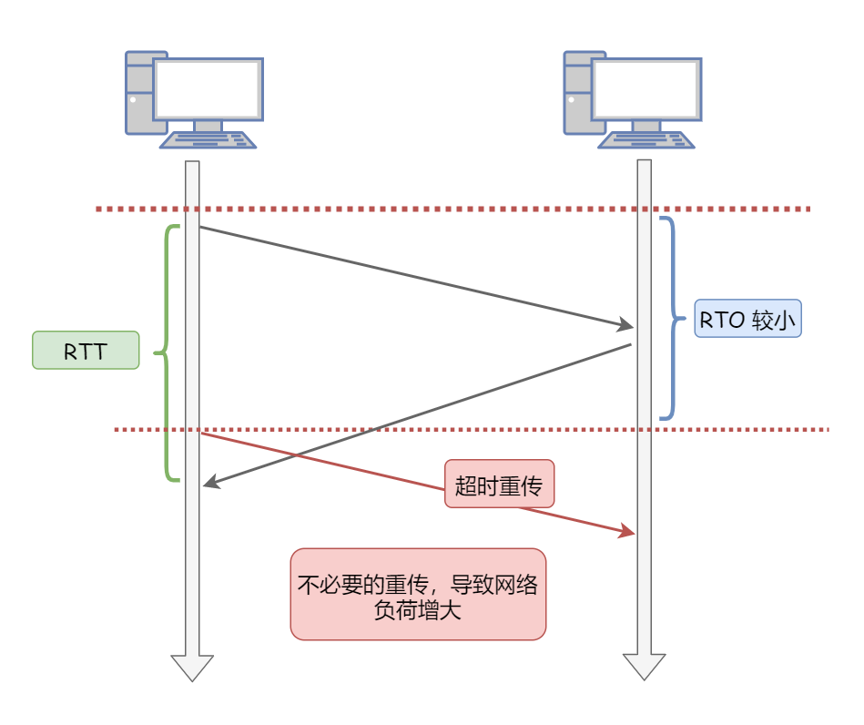

# 概括

## TCP/IP的五层模型分别是什么?请从底层向上层说出来，各自的功能是什么？
- 第一层：物理层：解决使用何种信号来传输比特的问题。如网线，网卡标准。 

- 第二层：数据链路层：解决分组在一个网络(或一段链路)上传输的问题。如网卡MAC地址。

- 第三层：网络层：解决分组在多个网络上传输(路由)的问题。主要包括IP协议。

- 第四层：传输层：解决进程之间基于网络的通信问题。传输层的协议主要有传输控制协议TCP和用户数据协议UDP。

- 第五层：应用层：为应用程序提供交互服务。应用层协议主要有DNS、HTTP协议、FTP协议等。


## OSI七层模型与TCP/IP的四层模型及五层模型的对应关系是什么？

<table>
	<tr>
	    <th>OSI七层模型</th>
	    <th>TCP/IP四层模型</th>
	    <th>TCP/IP五层模型</th>  
	</tr >
	<tr >
	    <td>应用层</td>
	    <td rowspan="3">应用层</td>
	    <td rowspan="3">应用层</td>
	</tr>
	<tr>
	    <td>表示层</td>
	</tr>
	<tr>
	    <td>会话层</td>
	</tr>
	<tr>
	    <td>传输层</td>
	    <td>传输层</td>
       <td>传输层</td>
	</tr>
	<tr>
       <td>网络层</td>
	    <td>网络层</td>
       <td>网络层</td>
	</tr>
	<tr>
	    <td>数据链路层</td>
	    <td rowspan="2">网络接口层</td>
       <td>数据链路层</td>
	</tr>
	<tr>
	    <td>物理层</td>
	    <td>物理层</td>
	</tr>
</table>


## 请由下往上说出OSI七层模型、TCP/IP四层模型以及各层代表协议
<table>
	<tr>
	    <th>OSI七层模型</th>
	    <th>TCP/IP五层模型</th>
	    <th>代表协议</th>  
	</tr >
	<tr >
	    <td>应用层</td>
	    <td rowspan="3">应用层</td>
	    <td rowspan="3">HTTP(超文本传输协议)<br>DNS(域名系统)<br>DHCP(动态主机配置协议)<br>FTP(文件传输协议)<br>Telnet(远程登录协议)<br>SSH(安全外壳协议，用于远程登录)<br>SMTP(电子邮件协议)</td>
	</tr>
	<tr>
	    <td>表示层</td>
	</tr>
	<tr>
	    <td>会话层</td>
	</tr>
	<tr>
	    <td>传输层</td>
	    <td>传输层</td>
       <td>TCP(传输控制协议)<br>UDP(用户数据报协议)</td>
	</tr>
	<tr>
       <td>网络层</td>
	    <td>网络层</td>
       <td>IP(网际协议)<br>ICMP(Internet控制报文协议)<br>ARP(地址解析协议)<br>RARP(反向地址解析协议)<br>BGP(边界网关协议)<br>RIP(路由信息协议)</td>
	</tr>
	<tr>
	    <td>数据链路层</td>
	    <td rowspan="2">网络接口层</td>
       <td >PPP</td>
	</tr>
	<tr>
	    <td>物理层</td>
       <td>IEEE 802.1A</td>
	</tr>
</table>

## 在浏览器地址栏输入一个URL后回车，背后会进行哪些技术步骤？

1. **浏览器解析URL**。浏览器通过解析URL，得到URL中的参数，将域名(目标服务器名称)和需要请求的资源分离开，从而了解到需要请求的是哪个服务器，请求的是服务器上的什么资源。  


2. **浏览器封装HTTP请求报文**。浏览器将解析URL得到的消息，封装成一个HTTP请求报文  


3. **DNS域名解析获取IP地址**。将解析URL得到的目标服务器名称通过DNS进行解析，得到目标服务器的IP地址。


4. **建立TCP连接**。到这一步时，已经获取到了目标服务器的IP地址，就可以开始发送封装好了的HTTP请求报文了。既然要发送请求，就需要TCP协议通过三次握手为浏览器和服务器之间建立可靠的连接。


5. **浏览器通过TCP建立的连接，发送HTTP请求报文至网络层**。TCP三次握手完成后，浏览器与目标服务器之间就建立了一个可靠的通道，这时浏览器就可以发送自己的HTTP请求了。TCP在执行连接、收发数据、断开等各阶段操作时，都是通过IP协议进行传输的，IP协议将这些阶段的数据添加IP首部封装成IP数据报再进行传输。首先传送至网络层。

6. **网络层利用ARP协议，根据IP地址获取目标服务器的MAC地址，将报文发送给链路层，服务端将在链路层收到数据**。

7. **服务器响应请求**。服务端在链路层收到数据后，往上层发送，一直到应用层接收到浏览器发送来的HTTP请求报文，接着处理该HTTP请求报文并返回HTTP响应报文。

8. **浏览器根据响应报文内容显示界面**。浏览器接收到服务器返回的HTTP响应报文后，解析渲染并显示界面。


>参考：[经典面试题：在浏览器地址栏输入一个 URL 后回车，背后发生了什么](https://cloud.tencent.com/developer/article/1793846)


# 数据链路层

## 数据链路层有哪些常见协议？

| 协议 | 名称                 | 作用                                                         |
| ---- | -------------------- | --|
PPP	|点对点协议	|主要是用来通过拨号或专线方式建立点对点连接发送数据，使其成为各种主机、网桥和路由器之间简单连接的一种共通的解决方案

# 网络层

## 网络层有哪些常见协议？

| 协议 | 名称                 | 作用                                                         |
| ---- | -------------------- | ------------------------------------------------------------ |
| IP<br>（Internet Protocol）   | 网际协议             | IP协议不但定义了数据传输时的基本单元和格式，还定义了数据报的递交方法和路由选择 |
| ARP<br>（Address Resolution Protocol）  | 地址解析协议     | 根据IP地址获取物理地址(MAC地址)                                       |
| RARP<br>（Reverse ARP） | 反向地址转换协议 | 根据物理地址(MAC地址)获取IP地址  
| ICMP<br>（Internet Control Message Protocol） | 网际控制报文协议 | ICMP就是一个“错误侦测与回报机制”，其目的就是让我们能够检测网路的连线状况﹐也能确保连线的准确性，是ping和traceroute的工作协议。ICMP使用IP的基本支持，就像它是一个更高级别的协议，但是，ICMP实际上是IP的一个组成部分，必须由每个IP模块实现。 |
| IGMP<br>（Internet Group Management Protocol） | 网际组管理协议   | 用于实现组播、广播等通信  
| RIP  | 路由信息协议         | 使用“跳数”(即metric)来衡量到达目标地址的路由距离             |
             
                                       


## ping命令基于哪一层协议？原理是什么？

ping命令是基于网络层的命令，是基于ICMP协议工作的，主要用来测试两台主机之间的连通性。

Ping 的原理是通过向目的主机发送 ICMP Echo 请求报文，目的主机收到之后会发送 Echo 回答报文。Ping 会根据时间和成功响应的次数估算出数据包往返时间以及丢包率。

# 传输层
## 传输层有哪些常见协议？
| 协议 | 名称             | 作用                                                         |
| ---- | ---------------- | ------------------------------------------------------------ |
| TCP<br>（Transmission Control Protocol）  | 传输控制协议     | 是一种面向连接的、可靠的、基于字节流的传输层通信协议。连接到不同但互连的计算机通信网络的主计算机中的成对进程之间依靠TCP提供可靠的通信服务。     |
| UDP<br>（User Datagram Protocol） | 用户数据报协议 | 发送IP数据包。UDP 为应用程序提供了一种无需建立连接就可以发送封装的 IP 数据包的方法。        

## 什么是 TCP 协议？

TCP 是**面向连接的、可靠的、基于字节流**的传输控制协议。

- **面向连接**：一定是「一对一」才能连接，不能像 UDP 协议可以一个主机同时向多个主机发送消息，也就是一对多是无法做到的；

- **可靠的**：无论的网络链路中出现了怎样的链路变化，TCP 都可以保证一个报文一定能够到达接收端；

- **字节流**：消息是「没有边界」的，所以无论我们消息有多大都可以进行传输。并且消息是「有序的」，当「前一个」消息没有收到的时候，即使它先收到了后面的字节，那么也不能扔给应用层去处理，同时对「重复」的报文会自动丢弃。
## 为什么需要 TCP 协议？

`IP` 层是「不可靠」的，它不保证网络包的交付、不保证网络包的按序交付、也不保证网络包中的数据的完整性。

如果需要保障网络数据包的可靠性，那么就需要由上层（传输层）的 `TCP` 协议来负责。

因为 TCP 是一个工作在**传输层**的**可靠**数据传输的服务，它能确保接收端接收的网络包是**无损坏、无间隔、非冗余和按序的。**

## 如何唯一确定一个 TCP 连接？

TCP 四元组可以唯一的确定一个连接，四元组包括如下：

- 源地址
- 源端口
- 目的地址
- 目的端口

## 什么是 UDP 协议？

UDP 是**无连接的、不可靠的、面向数据报的**的用户数据报协议。


## TCP 和 UDP 的区别是什么？(TCP 和 UDP 的特点是什么？)
1. 连接

   - TCP 是面向连接的传输层协议，传输数据前先要建立连接。
   - UDP 是无连接的，发送数据前不需要建立连接，即刻传输数据。

2. 可靠性

   - TCP 是可靠交付数据的，数据可以无差错、不丢失、不重复、按需到达。
   - UDP 是尽最大努力交付，不保证可靠交付数据。

3. 传输方式

   - TCP 面向字节流，保证顺序和可靠。
   - UDP 面向报文，是一个包一个包的发送，是有边界的，但可能会丢包和乱序。


4. 拥塞控制、流量控制

   - TCP 有拥塞控制和流量控制机制，保证数据传输的安全性。
   - UDP 则没有，即使网络非常拥堵了，也不会影响 UDP 的发送速率。(对实时应用很有用，如实时视频会议)

5. 服务对象

   - TCP 是一对一的点到点服务，即一条连接只有两个端点。
   - UDP 支持一对一、一对多、多对多的交互通信。

6.  首部开销

    - TCP 首部长度较长，会有一定的开销，首部在没有使用「选项」字段时是 `20` 个字节，如果使用了「选项」字段则会变长的。
    - UDP 首部只有 8 个字节，并且是固定不变的，开销较小。


## TCP 和 UDP 的使用场景可以列举一下吗？

由于 TCP 是面向连接，能保证数据的可靠性交付，因此经常用于：

- HTTP / HTTPS；
- `FTP` 文件传输；
- 发送和接收邮件；
- 远程登录；

由于 UDP 面向无连接，它可以随时发送数据，再加上UDP本身的处理既简单又高效，因此经常用于：

- 包总量较少的通信，如 `DNS` ；
- 视频、音频等多媒体通信，如视频聊天、语音聊天、直播等；

## 讲一下UDP报文的首部格式？


首部字段只有 8 个字节，包括源端口、目的端口、长度、检验和。

- 目的端口：告诉 UDP 协议应该把报文发给哪个进程。
- 包长度：该字段保存了 UDP 首部的长度跟数据的长度之和。
- 校验和：校验和是为了提供可靠的 UDP 首部和数据而设计，防止收到在网络传输中受损的 UDP包。

12 字节的伪首部是为了计算检验和临时添加的。

## 讲一下TCP报文的首部格式？


**源端口和目的端口**：各占 2 个字节，分别写入源端口和目的端口。IP 地址 + 端口号就可以确定一个进程地址

**序号(seq)**：用于对字节流进行编号，就是报文段第一个数据字节的编号。例如报文段的序号为 301，表示第一个数据字节的编号为 301，如果携带的数据长度为 100 字节，那么下一个报文段的序号应为 401。
> 在建立连接时由发送端主机生成的随机数作为序号初始值（也称为**初始序号 Init Sequense Number, ISN**），通过连接请求报文传给接收端主机。**用来解决网络包乱序问题。**

**确认号(ack)**：期望收到对方下一个报文段的第一个数据字节的序号。例如 B 正确收到 A 发送来的一个报文段，序号为 301，携带的数据长度为 100 字节，因此 B 期望下一个报文段的序号为 401，B 发送给 A 的确认报文段中确认号就为 401。
> 若确认号为 N，则表明：到序号 N-1 为止的所有数据都已正确收到。**用来解决丢包的问题。**。

**控制位**(保留位右边的 6 bit)(下面列出的四个位比较重要)：

- 确认ACK：该位为 `1` 时，确认号字段ack变为有效。TCP 规定除了最初建立连接时连接请求报文之外该位必须设置为 `1` 。
- 复位RST：该位为 `1` 时，表示 TCP 连接中出现异常，必须强制断开连接，然后再重新建立传输连接。
- 同步SYN：该位为 `1` 时，表示希望建立连接。并在其序号字段进行序号初始值的设定。
- 终止FIN：该位为 `1` 时，表示此报文段要发送的数据已经发送完毕，希望断开连接。

**窗口**：指接收方的接收缓冲区的剩余大小，发送端可以根据这个接收端的处理能力来发送数据，不会导致接收端处理不过来。

## TCP三次握手的过程是什么？(TCP建立连接的过程是什么？)


**刚开始客户端处于 `CLOSED` 的状态，而服务端处于 `LISTEN` 状态**：

> `CLOSED `：没有任何连接状态
>
> `LISTEN `：侦听来自远方 TCP 端口的连接请求

**1）第一次握手**：客户端向服务端发送连接请求报文，SYN = 1，ACK = 0。并指明客户端的初始序号seq = x，表示本报文段所发送的数据的第一个字节的序号。此时客户端处于 `SYN_SENT` 状态。

> `SYN-SENT` ：在发送连接请求后等待匹配的连接请求

**2）第二次握手**：服务器收到客户端的连接请求报文，如果同意连接，会发送连接确认报文，SYN = 1，ACK = 1，确认号ack=x+1。并且指定自己的初始序号seq = y。此时服务器处于 `SYN_REVD` 的状态。

> `SYN-RECEIVED`：在收到和发送一个连接请求后等待对连接请求的确认

**3）第三次握手**：客户端收到服务器端的连接确认报文之后，会发送一个 ACK 报文，SYN = 0，ACK = 1，确认号ack = y + 1。并指明此时客户端的序号为seq = x + 1，此时客户端处于 `Establised` 状态。

服务器收到 ACK 报文之后，也处于 `Establised 状态`，至此，双方建立起了 TCP 连接。

> `ESTABLISHED`：代表一个打开的连接，数据可以传送给用户

## TCP为什么需要三次握手？

三次握手的目的是建立可靠的通信信道，说到通讯，简单来说就是数据的发送与接收，而三次握手最主要的目的就是**双方确认自己与对方的发送与接收是正常的**。

只有经过三次握手才能确认双发的收发功能都正常，缺一不可：

- 第一次握手（客户端发送连接请求报文给服务器，服务器接收该报文）：客户端什么都不能确认；服务器确认了对方发送正常，自己接收正常

- 第二次握手（服务器响应连接确认报文给客户端，客户端接收该报文）：

  客户端确认了：自己发送、接收正常，对方发送、接收正常；

  服务器确认了：对方发送正常，自己接收正常

- 第三次握手（客户端发送 ACK 报文给服务器）：

  客户端确认了：自己发送、接收正常，对方发送、接收正常；

  服务器确认了：自己发送、接收正常，对方发送、接收正常


## TCP四次挥手的过程是什么？(TCP释放连接的过程是什么？)

TCP 连接的释放需要发送四个包（执行四个步骤），因此称为四次挥手，**客户端或服务端均可主动发起挥手动作**。


刚开始双方都处于`ESTABLISHED` 状态，假设是客户端先发起关闭请求。四次挥手的过程如下：

**1）第一次挥手**：客户端发送连接释放报文，FIN = 1，并指定一个初始序号 seq = u。客户端**停止再发送数据，主动关闭 TCP 连接**。此时客户端处于 `FIN_WAIT1` 状态，等待服务端的确认。

> `FIN-WAIT-1` - 等待远程TCP的连接中断请求，或先前的连接中断请求的确认；

**2）第二次挥手**：服务端收到连接释放报文之后，会发送 ACK 报文，ACK=1，确认号ack = u+1。并且指定自己的初始序号seq = v。此时服务端处于 `CLOSE_WAIT` 状态。

> `CLOSE-WAIT` - 等待从本地用户发来的连接中断请求；

**此时的 TCP 处于半关闭状态，客户端到服务端的连接释放**。客户端收到服务端的确认后，进入`FIN_WAIT2`（终止等待 2）状态，等待服务端发出的连接释放报文段。

> `FIN-WAIT-2` - 从远程TCP等待连接中断请求；

**3）第三次挥手**：如果服务端也想断开连接，和客户端的第一次挥手一样，发送 连接释放报文，FIN = 1,确认号ack = u+1。并指定一个初始序号seq = w。此时服务端处于 `LAST_ACK` 的状态，等待客户端的确认。

> `LAST-ACK` - 等待原来发向远程TCP的连接中断请求的确认；

**4）第四次挥手**：客户端收到连接释放报文后，发送一个 ACK 报文，ACK = 1，确认号ack = w+1。并指明此时客户端的序号为seq=u+1，此时客户端处于 **`TIME_WAIT` （时间等待）状态**。

> `TIME-WAIT` - 等待足够的时间以确保远程TCP接收到连接中断请求的确认；

## TCP为什么需要四次挥手？

由于 TCP 的**半关闭**（half-close）特性，TCP 提供了连接的一端在结束它的发送后还能接收来自另一端数据的能力。

任何一方都可以在数据传送结束后发出连接释放的通知，待对方确认后进入**半关闭状态**。当另一方也没有数据再发送的时候，则发出连接释放通知，对方确认后就**完全关闭**了TCP连接。

**通俗的来说，两次握手就可以释放一端到另一端的 TCP 连接，完全释放连接一共需要四次握手**。

举个例子：A 和 B 打电话，通话即将结束后，A 说 “我没啥要说的了”，B 回答 “我知道了”，于是 A 向 B 的连接释放了。但是 B 可能还会有要说的话，于是 B 可能又巴拉巴拉说了一通，最后 B 说“我说完了”，A 回答“知道了”，于是 B 向 A 的连接释放了，这样整个通话就结束了。

## 什么是MSL？

`MSL` 是 Maximum Segment Lifetime，**报文最大生存时间**，它是任何报文在网络上存在的最长时间，超过这个时间报文将被丢弃。

## 第四次挥手中，主动关闭方为什么要等待2MSL？

为了确保被动关闭方收到主动关闭方在第四次挥手中发送的ACK报文。

假设是客户端发起的关闭连接请求，第四次挥手时，客户端向服务端发送ACK报文作为应答。  **为了确保服务端收到客户端的ACK报文，客户端需要等待2MSL**。

如果服务端在一个MSL内没有收到客户端发来的 ACK 报文的话，会触发超时重发，服务端会重新发送 FIN 报文给客户端，FIN 报文会在第二个MSL内到达，客户端再次收到 FIN 报文之后，就知道之前的 ACK 报文丢失了，然后再次发送 ACK 报文给服务端。服务端收到 ACK 报文之后，就关闭连接了，处于 `CLOSED` 状态。

可以看到 **等待2MSL时长** 相当于**至少允许报文丢失一次**。

如果在 2MSL 时长内，因为客户端的 ACK 没有传输到服务端，客户端又接收到了服务端重发的 FIN 报文，那么 **2MSL 时间将重新计时**。

## TCP怎么保证可靠传输？

传输层使用 TCP 实现可靠传输，TCP 保证可靠传输的机制有如下几种：

- 数据校验：TCP报文头有校验和，用于校验报文是否损坏。
- 序号和确认应答机制：确保报文按需并且完整到达。
- 重传机制：接收方收到报文就会确认，发送方发送一段时间后没有收到确认就会重传。
- 流量控制：当接收方来不及处理发送方的数据，能通过滑动窗口，提示发送方降低发送的速率，防止报文丢失。
- 拥塞控制：当网络拥塞时，通过拥塞窗口，减少数据的发送，防止报文丢失。

## TCP的序号和确认应答机制可以讲一下吗？

**序号**是发送方发送的报文段第一个数据字节的编号。

**确认应答机制**就是接收方收到报文段后就会返回一个确认号，确认号是接收方期望收到发送方下一个报文段的第一个字节的序号。若确认号为 N ，表明到序号 N-1 为止的所有数据都已经正确收到。


## TCP的重传机制可以讲一下吗？

在网络上传输报文时，报文有可能会因为各种原因丢失。借助 TCP 的重传机制能够发现报文丢失并恢复报文。

**TCP的重传机制**是 TCP 最基本的错误恢复功能，常见的重传机制有：**超时重传**和**快速重传**。

- **超时重传**就是 TCP 发送方在发送报文的时候，设定一个超时重传时间，如果在规定的时间内没有收到接收方发来的 ACK 确认报文，发送方就会重传这个已发送的报文段。
- **快速重传（Fast Retransmit）机制**以数据驱动重传，每当接收方收到比期望序号大的失序报文段到达时，就向发送方发送一个冗余 ACK，指明下一个期待字节的序号。

## 详细说一下TCP重传机制中的超时重传？

**超时重传**就是 TCP 发送方在发送报文的时候，设定一个超时重传时间，如果在规定的时间内没有收到接收方发来的  ACK 确认报文，发送方就会重传这个已发送的报文段。一般来说，有两种情况下会触发超时重传：

第一种情况：发送方的报文段丢失。


第二种情况：接收方的 ACK 确认报文丢失。


超时重传时间一般用 **RTO**（Retransmission Timeout 超时重传时间） 表示， **RTO** 的值应该略大于 **RTT**（Round-Trip Time 报文往返时间）的值。

> RTT 就是**数据从网络一端传送到另一端所需的时间**，也就是报文段的往返时间。


如果超时重传的数据又超时了, TCP 的策略是**重传报文的 RTO 加倍**。

也就是说，**每次超时重传失败，都会将下一次重传的RTO设为先前值的两倍**。

超时触发重传存在的问题是，超时周期可能相对较长。因此，产生了以数据驱动重传的**快速重传机制**。

## 超时重传中RTO设置的值过大或过小会发生什么？

- **RTO 远大于 RTT**：网络的空闲时间增大，**降低了网络传输效率**


- **RTO 小于 RTT**：会产生不必要的重传，导致**网络负荷增大**



## 详细说一下TCP重传机制中的快速重传？

**快速重传（Fast Retransmit）机制以数据驱动重传**。每当接收方收到比期望序号大的失序报文段到达时，就向发送方发送一个**冗余 ACK**，指明下一个期待字节的序号。

举个例子：发送方已经发送 1、2、3、4、5报文段

- 接收方收到报文段 1，返回 1 的 ACK 确认报文（确认号为报文段 2 的第一个字节）
- 接收方收到报文段 3，仍然返回 1 的 ACK 确认报文（确认号为报文段 2 的第一个字节）
- 接收方收到报文段 4，仍然返回 1 的 ACK 确认报文（确认号为报文段 2 的第一个字节）
- 接收方收到报文段 5，仍然返回 1 的 ACK 确认报文（确认号为报文段 2 的第一个字节）
- **接收方收到 3 个对于报文段 1 的冗余 ACK，认为报文段 2 丢失，就会在定时器过期之前，于是重传报文段 2**
- 最后，接收方收到了报文段 2，此时因为报文段 3、4、5 都收到了，所以返回 5 的 ACK 确认报文（确认号为报文段 6 的第一个字节）


## 能讲一下滑动窗口吗？

滑动窗口(rwnd Receiver Window)用来暂时存放字节流。发送方和接收方各有一个窗口，接收方通过 TCP 报文段中的窗口字段告诉发送方自己的窗口大小，发送方根据这个值和其它信息设置自己的窗口大小。

### 发送方的滑动窗口：

下图是发送方的数据，根据处理的情况分成四个部分：

- 已发送并收到 ACK 确认应答的数据
- 已发送但未收到 ACK 确认应答的数据
- 未发送但总大小在接收方处理范围内的数据
- 未发送但总大小超过接收方处理范围的数据


当发送方把数据全部发送出去后，可用窗口的大小就为 0 了，表明可用窗口耗尽，在没收到 ACK 确认之前无法继续发送数据：


当收到之前发送的数据 `32~36` 字节的 ACK 确认应答后，如果发送窗口的大小没有变化，则**滑动窗口往右边移动 5 个字节，因为有 5 个字节的数据被确认应答**，接下来 `52~56` 字节又变成了可用窗口，那么后续也就可以发送 `52~56` 这 5 个字节的数据了：


### 接收方的滑动窗口：

接收方的滑动窗口可分为三个部分：

- 已成功接收并确认的数据
- 未收到数据但可以接收的数据
- 未收到数据且不可以接收的数据（超出接收方窗口大小）


同样的，接收方的滑动窗口在成功接收并确认的数据后，窗口右移。

## TCP的流量控制可以讲一下吗？

流量控制是为了控制发送方的报文发送速率，保证接收方来得及接收。

TCP 利用滑动窗口实现流量控制。接收方在确认报文的窗口字段中填入滑动窗口的大小，滑动窗口的大小意味着接收方还有多大的缓冲区可以用于接收数据。发送方可以通过滑动窗口的大小来确定应该发送多少字节的数据。当滑动窗口为 0 时，发送方一般不能再发送数据报


> 举例：接收端在发送 ACK 确认应答报文时，将自己的即时窗口大小填入，并跟随 ACK 报文一起发送出去。而发送方根据接收到的 ACK 报文中的窗口大小的值改变自己的发送速度。如果接收到窗口大小的值为 0，那么发送方将停止发送数据。并定期的向接收端发送窗口探测数据段，提醒接收端把窗口大小告诉发送端。


## TCP的拥塞控制可以讲一下吗？

拥塞的含义是：在某段时间，对网络中某一资源的需求超过了该资源所能提供的可用部分（**即 供不应求**)，网络的性能变差。

如果网络出现拥塞，TCP 报文可能会大量丢失，此时就会大量触发重传机制，从而导致网络拥塞程度更高，严重影响传输。

> 其实只要「发送方」没有在规定时间内接收到 ACK 应答报文，也就是**触发了重传机制，就会认为网络出现了拥塞。**

因此当出现拥塞时，应当控制发送方的速率。这一点和流量控制很像，但是**出发点不同**。

流量控制是为了让接收方能来得及接收，而拥塞控制是为了降低整个网络的拥塞程度，**防止过多的数据注入到网络中。**

为了调节发送方所要发送数据的量，定义了「**拥塞窗口 cwnd Congestion Window**」的概念。拥塞窗口是发送方维护的一个状态变量，它会根据**网络的拥塞程度动态变化**：

- 只要网络中出现了拥塞，cwnd就会减少
- 若网络中没有出现拥塞，cwnd就会增大

在引入拥塞窗口概念之前，发送窗口大小和接收窗口大小基本是相等的关系（取决于接收窗口大小）。引入拥塞窗口后，发送窗口的大小就等于拥塞窗口和接收窗口的最小值。

TCP 的拥塞控制采用了四种算法：

- 慢开始
- 拥塞避免
- 快重传
- 快恢复

## 详细讲解一下TCP拥塞控制用到的四种算法？

### 慢开始

**慢开始**的思路就是：TCP 在刚建立连接完成后，如果立即把大量数据字节注入到网络，那么很有可能引起网络阻塞。好的方法是先探测一下，一点一点的提高发送数据包的数量，即由小到大逐渐增大拥塞窗口数值。**cwnd 初始值为 1，每经过一个传播轮次，cwnd 加倍**（指数增长）。


当然不能一直执行慢启动，这里会设置一个**慢启动轮限 ssthresh** 状态变量：

- 当 `cwnd < ssthresh` 时，继续使用慢启动算法
- 当 `cwnd >= ssthresh` 时，开始使用「拥塞避免算法」

### 拥塞避免

拥塞避免算法的思路是让拥塞窗口 `cwnd` 缓慢增大，**即每经过一个往返时间 `cwnd` 加 1**。


注意，无论是慢开始阶段还是拥塞避免，只要出现了网络拥塞（**触发超时重传机制**），慢开始轮限 `sshresh` 和 拥塞窗口大小 `cwnd` 的值会发生变化（乘法减小）：

-  `ssthresh` 设为 `cwnd/2`
- `cwnd` 重置为 `1`

由于拥塞窗口大小重置为 1 了，所以就会重新开始执行慢启动算法。


### 快重传和快恢复

快速重传和快速恢复算法一般同时使用。

当触发快速重传机制，即接收方收到三个重复的 ACK 确认的时候，就会执行快重传算法（触发快速重传机制和超时重传机制的情况不同，TCP 认为触发快速重传的情况并不严重，因为大部分没丢，只丢了一小部分），快速重传做的事情有：

- `ssthresh` 设为 `cwnd/2`
- `cwnd` 重置为 `cwnd/2`
- 进入快速恢复算法

快速恢复的思想是“**数据包守恒**”原则，即同一个时刻在网络中的数据包数量是恒定的，只有当“老”数据包离开了网络后，才能向网络中发送一 个“新”的数据包，如果发送方收到一个重复的 ACK（新），那么根据 TCP 的 ACK 机制就表明有一个（旧）数据包离开了网络，于是 `cwnd` 加 1。如果能够严格按照该原则那么网络中很少会发生拥塞，事实上拥塞控制的目的也就在修正违反该原则的地方。

具体来说快速恢复的主要步骤是：

- 把 `cwnd` 设置为 `ssthresh` 的值加 3，然后重传丢失的报文段（加 3 的原因是因为收到 3 个重复的 ACK，表明有 3 个“老”的数据包离开了网络）
- 如果再收到重复的 ACK 时，拥塞窗口 `cwnd` 增加 1
- 如果收到新的数据包的 ACK 时，把 `cwnd` 设置为第一步中的 `ssthresh` 的值（`cwnd >= ssthresh`，于是再次进入<u>拥塞避免</u>状态）。原因是因为该 ACK 确认了新的数据，说明从重复 ACK 时的数据都已收到，该恢复过程已经结束，可以回到恢复之前的状态了


# 应用层

## 应用层有哪些常见协议？其端口号及应用的传输层协议是什么？
|应用层协议| 名称 | 端口号 | 传输层协议 | 备注 |
| :---: | :--: | :--: | :--: | :--: |
| DNS |  域名解析| 53 | UDP/TCP | 长度超过 512 字节时使用 TCP |
| HTTP | 超文本传输协议 | 80 | TCP | |
| HTTPS | 超文本传输安全协议 | 443 | - | HTTPS是在HTTP上建立SSL加密层，并对传输数据进行加密。也就是说HTTPS是基于应用层的|
| SSH | 安全外壳协议 | 22 | TCP | 可以通过加密和认证机制实现安全的访问和文件传输等业务| 
| DHCP | 动态主机配置协议 | 67/68 | UDP |DHCP服务器使用67端口，DHCP客户端使用68端口 |
| FTP | 文件传送协议 | 20/21 | TCP | 控制连接 21，数据连接 20 |
| TELNET | 远程终端协议 | 23 | TCP | |
| SMTP | 简单邮件传送协议<br>(邮件发送协议)) | 25 | TCP | |
| POP3 | 邮局协议<br>(邮件读取协议) | 110 | TCP | |
| IMAP | 因特网邮件访问协议<br>(邮件读取协议) | 143 | TCP | |
| SNMP | 简单网络管理协议 | 161/162 | UDP | |


## 什么是DNS？ 
DNS即Domain Name System，域名服务，可以将网址的域名和IP地址相互映射。DNS可以使人更方便地访问互联网，而不用去记住IP地址。  
将域名映射成 IP 地址称为正向解析，将 IP 地址映射成域名称为反向解析。  
## 为什么要使用DNS？
网址可以通过IP地址进行访问，但IP地址不方便记忆，因此人们设计出了域名，并通过DNS来将域名和IP地址相互映射。 

## 可以说一下域名的结构吗？
域名的结构为：**根域名**、**顶级域名**（top level domain，TLD）、**二级域名**、三级域名  


## 你知道哪些DNS服务器？
根域名服务器，顶级域名服务器，权限域名服务器，本地域名服务器。    
- 根域名服务器：根域名服务器**保存所有的顶级域名服务器的地址**
- 顶级域名服务器：顶级域名服务器用来**管理注册在该顶级域名下的所有二级域名**的，**记录这些二级域名的 IP 地址**。
- 权限域名服务器：权限域名服务器是用来管理注册在二级域名下的所有三/四级域名的IP的地址。
- 本地域名服务器：本地域名服务器是电脑解析时的**默认**域名服务器，即电脑中设置的首选 DNS 服务器和备选 DNS 服务器。常见的有电信、联通等的本地 DNS 服务。  
当一台主机发出 DNS 查询请求时，这个查询请求报文就发送给该主机的本地域名服务器。本地域名服务器管理本地域名的解析和映射，并且能够向上级域名服务器(根域名服务器、顶级域名服务器、权限域名服务器)进行查询。


## DNS查询方式有哪些？
递归查询和迭代查询。  
- 递归查询是指，如果 A 请求 B，那么 B 作为请求的接收者一定要给 A 想要的答案。    
  - 主机和本地域名服务器之间的查询属于递归查询，也就是说主机请求本地域名服务器，那么本地域名服务器作为请求的接收者一定要给主机想要的答案。  
- 迭代查询是指，如果接收者 B 没有请求者 A 所需要的准确内容，接收者 B 将告诉请求者 A，如何去获得这个内容，但是自己并不去发出请求。  
  - 域名服务器之间的查询使用迭代查询方式，以免根域名服务器的压力过大。

## 本地域名缓存了解吗？请简单说一下
在浏览器进行网址访问的时候，为了减小本地域名服务器的压力，会优先查询本地域名缓存，如果未命中，再查询本地域名服务器。  
本地域名缓存有两种方式：浏览器缓存和操作系统缓存。
- **浏览器缓存**：浏览器在获取网站域名的实际 IP 地址后会对其进行缓存，减少网络请求的损耗。每种浏览器都有一个固定的 DNS 缓存时间，如 Chrome 的过期时间是 1 分钟，在这个期限内不会重新请求 DNS 
- **操作系统缓存**：操作系统的缓存其实是用户自己配置的 hosts 文件。比如 Windows10 下的 hosts 文件存放在 C:\Windows\System32\drivers\etc\hosts


## DNS的解析过程(域名解析为IP地址)能说一下吗？
一段话：  
在浏览器中进行网址访问的时候，会优先查询浏览器缓存，如果未命中则继续查询操作系统缓存，若没有命中，再查询本地域名服务器，然后本地域名服务器会递归的查找域名记录，首先查找自己的DNS缓存，若没有命中，向根域名服务器、顶级域名服务器、权限域名服务器进行迭代查找。最终本地域名服务器得到域名对应的IP地址，将IP地址返回给浏览器。


详细过程：
1. 首先搜索「浏览器的 DNS 缓存」，缓存中维护一张域名与 IP 地址的对应表；
2. 若没有命中，则继续搜索「操作系统的 DNS 缓存」；
3. 若仍然没有命中，则操作系统将域名发送至「本地域名服务器」，本地域名服务器查询自己的 DNS 缓存，查找成功则返回结果（注意：主机和本地域名服务器之间的查询方式是「递归查询」）；
4. 若本地域名服务器的 DNS 缓存没有命中，则本地域名服务器向上级域名服务器进行查询，通过以下方式进行「迭代查询」（注意：本地域名服务器和其他域名服务器之间的查询方式是迭代查询，防止根域名服务器压力过大）：
   - 首先本地域名服务器向「根域名服务器」发起请求，根域名服务器是最高层次的，它并不会直接指明这个域名对应的 IP 地址，而是返回顶级域名服务器的地址，也就是说给本地域名服务器指明一条道路，让他去这里寻找答案
   - 本地域名服务器拿到这个「顶级域名服务器」的地址后，就向其发起请求，获取「权限域名服务器」的地址
   - 本地域名服务器根据权限域名服务器的地址向其发起请求，最终得到该域名对应的 IP 地址
5. 本地域名服务器将得到的 IP 地址返回给操作系统，同时自己将 IP 地址缓存起来
6. 操作系统将 IP 地址返回给浏览器，同时自己也将 IP 地址缓存起来
7. 至此，浏览器就得到了域名对应的 IP 地址，并将 IP 地址缓存起来  


>参考：[超详细 DNS 协议解析](https://github.com/Veal98/cs-wiki/blob/master/vuepress-doc/docs/10-10.%E8%AE%A1%E7%AE%97%E6%9C%BA%E7%BD%91%E7%BB%9C/30.%E5%BA%94%E7%94%A8%E5%B1%82/10.%E8%B6%85%E8%AF%A6%E7%BB%86%20DNS%20%E5%8D%8F%E8%AE%AE%E8%A7%A3%E6%9E%90.md)


## DNS协议基于TCP还是UDP？
DNS 可以使用 UDP 或者 TCP 进行传输，使用的端口号都为 53。  
大多数情况下 DNS 使用 UDP 进行传输，这就要求域名解析器和域名服务器都必须自己处理超时和重传从而保证可靠性。  
如果返回的响应超过512 字节，DNS会使用TCP进行传输，因为UDP 最大只支持 512 字节的数据。

## 什么是HTTP？
HTTP（HyperText Transfer Protocol），即超文本传输协议，所有的 WWW（万维网） 文件都必须遵守这个标准。HTTP 是用于客户端和服务器端之间的通信的协议。

## HTTP有哪些版本？它们之间的区别是什么？
HTTP版本|	功能|	特点
--|--|--
HTTP/0.9（1991）|1. 仅支持GET请求方式<br>2. 客户端仅能访问HTML格式的资源|那时的HTTP并没有作为正式标准被建立，因此被称为HTTP0.9
HTTP/1.0（1996）	|1. 新增支持HEAD、POST请求方式<br>2. 增加了响应状态码，标记可能的错误原因<br>3. 引入了协议版本号概念<br>4. 传输文本不再局限于HTML格式，根据Content-Type可以支持多种数据格式|工作方式是短连接
HTTP/1.1（1997）|1. 新增支持PUT、DELETE等新的请求方式<br>2. 增加了长连接功能，支持持久连接<br>3. 加入了管道机制（浏览器默认不开启）<br>4. 强制加入HOST请求头<br>5. 支持断点续传|是目前互联网上使用最广泛的协议，功能也非常完善
HTTP/2.0（2015）	|1. 废弃管道机制，使用多路复用机制（数据流进行串行传输）<br>2. 采用二进制分帧，不再是纯文本<br>3. 支持首部压缩（HPATCH）<br>4. 支持服务器推送<br>5. 增强了安全性，“事实上”要求加密通信|一个HOST只建立一个TCP连接，解决了HTTP线头阻塞，但依然存在TCP线头阻塞问题
## 你知道URI和URL的区别吗？
 URI是Uniform Resource Identifier ，**统一资源标识符**，URL是Uniform Resource Location，**统一资源定位符**。URI 用字符串标识某一处互联网资源，而 URL 标识资源的地点（互联网上所处的位置），URL 是 URI 的子集。

## 你知道HTTP的请求报文格式吗？
HTTP 请求报文由 3 大部分组成：
- 请求行：包括请求方法，访问资源的URL，使用的HTTP版本。位置在 HTTP 请求报文的第一行。
- 请求头：格式为"属性名: 属性值"，服务端将根据请求头获取客户端的信息，一般包括Host、Connection等。位置从第二行开始，到第一个空行结束。请求头和请求体之间存在一个空行
- 请求体：用户的请求数据，如用户名，密码等，通常以键值对的方式传递数据。位置在请求报文的最后一行。

举个请求报文的例子：


请求行开头的 `POST` 表示请求访问服务器的类型，称为方法（method）。随后的字符串 `/form/login` 指明了请求访问的资源对象。最后的 `HTTP/1.1` 即 HTTP 的版本号，用来提示客户端使用的 HTTP  协议功能。

综上来看，这段请求的意思就是：请求访问某台 HTTP 服务器上的 `/form/login` 页面资源，并附带参数 name = veal、age = 37。


## HTTP请求报文中的请求方法有什么作用？你知道哪些请求方法？
请求行中的请求方法的作用是：可以指定请求的资源按照期望产生某种行为，即**使用方法给服务器下命令**。

在HTTP/1.1中，包括`GET`、`POST`、`PUT`、`HEAD`、`DELETE`、`OPTIONS`。比较常见的是`GET`、`POST`、`PUT`请求。

- GET方法用来请求访问资源，指定的资源经服务器端解析后返回响应内容。


- POST方法用来向指定资源提交数据，请求数据被包含在请求体中。


- PUT方法用来传输文件，由于自身**不带验证机制，任何人都可以上传文件**，因此存在安全性问题，一般不使用该方法。


- HEAD方法类似于 GET 请求，只不过返回的响应中没有具体的内容，用于获取报头，确认URI的有效性以及资源更新的日期时间等。


- DELETE方法用来删除文件，不带验证机制，请求服务器删除指定的资源。


- OPTIONS方法用于**获取当前 URI 所支持的方法**。若请求成功，会在 HTTP 响应头中包含一个名为 “`Allow`” 的字段，值是所支持的方法，如 “GET, POST”。


## GET和POST的区别是什么？
- GET是获取数据，post是修改数据
- GET把请求的数据放在URL上，所以GET不太安全。而POST把数据放在HTTP请求报文的请求体内，相对安全。
- GET提交的数据大小有限制， 限制取决于浏览器， POST理论上没有限制。
- GET请求会被浏览器主动缓存，而POST不会，除非手动设置。
- GET是幂等性的，而POST不是幂等性的

>幂等性：对同一URL的多个GET请求应该返回同样的结果。例如：用户在APP上连续点击了多次提交订单，后台应该只产生一个订单；向购物APP发起支付请求，由于网络问题或系统BUG重发，购物APP应该只扣一次钱。

## 什么是幂等性？

幂等性是指多次请求的结果和请求一次的结果一样。

例如：对同一URL的多个GET请求应该返回同样的结果。

例如：a = 4 是幂等性的；a += 4 是非幂等性的。

例如：用户在APP上连续点击了多次提交订单，后台应该只产生一个订单；向购物APP发起支付请求，由于网络问题或系统BUG重发，购物APP应该只扣一次钱。

## HTTP中，幂等性的请求方法有哪些？

GET, PUT, HEAD, DELETE, OPTIONS

## HTTP中，哪些请求不会修改数据？哪些请求会修改数据？

不会修改数据的请求：GET, HEAD, OPTIONS.

会修改数据的请求：POST, PUT, DELETE.
## POST请求是绝对安全的吗？
不是绝对安全的。  
虽然POST请求将数据放在HTTP请求报文的请求体内，地址栏上见不到请求数据。但因为HTTP在网络上是明文传输的，只要通过抓包的手段，就能完整获取HTTP请求报文，进而得到POST请求发送的数据。  
要想安全传输，可以使用HTTPS协议。

## HTTP的请求头有什么作用？说出几种常见的HTTP请求头？
请求头用于补充请求的附加信息、客户端信息、对响应内容相关的优先级等内容。常见的请求头有：  

- User-Agent：产生请求的浏览器类型。

- **Host**：发出请求的资源所处的互联网主机名和端口号。该字段是 HTTP/1.1 规范中唯一一个必须被包含在请求头中的字段。

- **Connection**：表示客户端与服务连接类型；Keep-Alive 表示持久连接，close 已关闭

- **Content-Length**：请求体的长度

- **Cookie**：客户端的 Cookie 就是通过这个报文头属性传给服务端的。

- **Accept**：客户端可识别的响应内容类型列表。（对应的，HTTP 响应报文中也有这样一个类似的字段 `Content-Type`，用于表示服务端发送的数据类型，如果 `Accept` 指定的类型和服务端返回的类型不一致，就会报错）

- **Accept-Language**：客户端支持的语言

- **Accept-Encoding**：客户端接受的编码压缩格式。

- **Range**：对于只需获取部分资源的范围请求，包含首部字段 Range 即可告知服务器资源的指定范围

- **Referer**：表示这个请求是从哪个 URI 跳过来的。比如说通过百度来搜索淘宝网，那么在进入淘宝网的请求报文中，Referer 的值就是：www.baidu.com。如果是直接访问就不会有这个头。这个字段通常用于防盗链。

## 你知道HTTP的响应报文格式吗？
HTTP的响应报文由三部分组成：
- 响应行: 包括使用的HTTP协议版本，响应状态码，状态描述，位置在HTTP响应报文的第一行。
- 响应头: 格式为"属性名: 属性值"，响应头字段一般包括Connection、Content-Type等。位置从第二行开始，到第一个空行结束。响应头和响应体之间存在一个空行。
- 响应体: 服务器返回给客户端的内容。

举个响应报文的例子：


## 你知道哪些常见的HTTP状态码？
状态码由 3 位数字组成，第一个数字定义了响应的类别：  
| |类别	|原因短语|
--|--|--
1XX	|Informational（信息性状态码）|	接受的请求正在处理
2XX	|Success（成功状态码）|	请求正常处理完毕
3XX	|Redirection（重定向状态码）|	需要进行附加操作以完成请求
4XX	|Client Error（客户端错误状态码）|	服务器无法处理请求
5XX	|Server Error（服务器错误状态码）|	服务器处理请求出错

状态码详细介绍：

状态码 | 状态码英文名称描述 | 中文描述
--|--|--
200|OK|	客户端请求成功。一般用于GET与POST请求
204|No Content|	无内容。服务器成功处理，但未返回内容。一般用在只是客户端向服务器发送信息，而服务器不用向客户端返回什么信息的情况。不会刷新页面。
206|Partial Content|服务器已经完成了部分 GET 请求（客户端进行了范围请求）。响应报文中包含 Content-Range 指定范围的实体内容
301|Moved Permanently|永久重定向。请求的资源已被永久的移动到新URI，返回信息会包括新的URI，浏览器会自动定向到新URI。今后任何新的请求都应使用新的URI代替
302|Found|临时重定向。请求的资源临时被移动。客户端应继续使用原有URI。换句话说，已移动的资源对应的URI将来还有可能发生改变。
303|See Other|	临时重定向，应使用GET定向获取请求资源。303功能与302一样，区别只是303明确客户端应该使用GET访问
304|Not Modified|表示客户端发送附带条件的请求（GET方法请求报文中的IF…）时，条件不满足。返回304时，不包含任何响应主体。<br>(注：虽然304被划分在3XX，但和重定向没有关系)
307|Temporary Redirect|	临时重定向，和302有着相同含义。POST不会变成GET
400|Bad Request|客户端请求有语法错误，服务器无法理解。
401|Unauthorized|请求未经授权。该状态码表示发送的请求需要有通过HTTP认证（BASIC认证，DIGEST认证）的认证信息。
403|Forbidden|不允许访问资源。服务器理解请求客户端的请求，但是拒绝执行此请求
404|Not Found|请求资源不存在。可能是路径错误等原因造成的。
408	|Request Time-out|	服务器等待客户端发送的请求时间过长，超时
500|Internal Server Error|	服务器内部错误，无法完成请求。该状态码表明服务器端在执行请求时发生了错误。也有可能是web应用存在bug或某些临时故障。
501|  Not Implemented|服务器不支持当前请求所需要的某个功能。当服务器无法识别请求的方法，并且无法支持其对任何资源的请求。
503|Service Unavailable|服务器当前处于超负载或正在停机维护，暂时不能处理客户端的请求，一段时间后可能恢复正常

## HTTP的响应头有什么作用？说出几种常见的HTTP响应头？
响应头用于补充响应的附加信息、服务器信息，以及对客户端的附加要求等。常见的响应头有：  
 
 - Allow：服务器支持哪些请求方法。
 
 - Content-Encoding：文档的编码方法
 
 - Content-Length：文档内容长度
 
 - Content-Type：文档属于什么类型
 
 - Data：当前时间
 
 - Expires：文档的过期时间，过期后不再缓存该文档
 
 - Location：将客户端引导至新的URL去访问文档，通常与HTTP状态码302(临时重定向)配合使用。
 
 - Set-Cookie：用于从服务器向用户发送Cookie，然后浏览器会将数据设置给下次请求的Cookie请求头，返回服务器。

## 什么是HTTP的短连接？
短连接也被称为非持久连接。工作方式是：客户端和服务器每进行一次 HTTP 会话，就建立一次连接，任务结束就中断连接。由于 HTTP 是基于TCP协议的，所以连接的每一次建立或者断开都需要 TCP 三次握手或者 TCP 四次挥手的开销。
>举例：当客户端浏览器访问的某个 HTML 或其他类型的 Web 页中包含有其他的 Web 资源（如JavaScript 文件、图像文件、CSS文件等），每遇到这样一个 Web 资源，浏览器就会重新建立一个 HTTP 会话。

这种方式存在巨大的弊端。比如访问一个包含多张图片的 HTML 页面，每请求一张图片资源就会造成无谓的 TCP 连接的建立和断开，大大增加了通信量的开销

HTTP/1.0中默认使用短连接。

## 什么是HTTP的长连接？
长连接也被称为持久连接。工作方式是：当一个网页打开完成后，客户端和服务器之间用于传输 HTTP 数据的 TCP 连接不会关闭，客户端再次访问这个服务器时，会继续使用这一条已经建立的连接。使用长连接的 HTTP 协议，会在请求头加入这行代码：`Connection:keep-alive`。
>Keep-Alive 不会永久保持连接，它有一个保持时间，可以在不同的服务器软件（如 Apache）中设定这个时间。实现长连接需要客户端和服务端都支持长连接。

从 HTTP/1.1 起，默认使用长连接。

HTTP 协议的长连接和短连接，实质上是 TCP 协议的长连接和短连接。

## 讲一下HTTP的管道机制？
默认情况下，HTTP 请求是按顺序发出的，下一个请求只有在当前请求收到响应之后才会被发出。由于受到网络延迟和带宽的限制，在下一个请求被发送到服务器之前，可能需要等待很长时间。  
管道机制也被称为流水线机制。是HTTP/1.1引入的机制。管道机制的实现基于HTTP的持久连接机制。通过管道机制可以实现：在同一条持久连接上连续发出请求，而不用等待响应返回后再发送，这样就可以做到同时并行发送多个请求，而不需要一个接一个地等待响应。  


## HTTP的无状态的还是有状态的？
HTTP 协议是无状态协议。也就是说他不对之前发生过的请求和响应的状态进行管理，即无法根据之前的状态进行本次的请求处理。
- 优点：由于不必保存状态，减少了服务器的 CPU 及内存资源的消耗，也因此被广泛应用。	
- 缺点：HTTP无法记住用户的状态，每次页面的跳转都会导致用户需要再次重新登录。但可以通过引入Cookie来解决无状态导致的问题。

## 什么是Cookie？为什么要引入Cookie？
Cookie是浏览器保存在用户电脑上的一小段文本，通俗的来讲就是当一个用户通过HTTP访问到服务器时，服务器会将一些 Key/Value键值对返回给客户端浏览器，并给这些数据加上一些限制条件，在条件符合时这个用户下次访问这个服务器时，数据通过请求头又被完整地给带回服务器，服务器根据这些信息来判断不同的用户。

HTTP协议是无状态的协议，无法记住用户的状态，为了跟踪用户的整个会话，需要引入某种机制来识别具体的用户身份。Cookie就是这样的一种机制。 

>Cookie是有大小，数量限制的   

## 通过Cookie实现用户状态跟踪的具体过程能说一下嘛？
Cookie 会根据从服务器端发送的响应报文中的一个叫作 `Set-Cookie` 的首部字段信息，通知客户端保存 Cookie。当下次客户端再往服务器发送请求时，客户端会自动在请求报文中加入 Cookie 值发送出去。服务器端收到客户端发来的 Cookie 后，会去检查究竟是哪一个客户端发来的连接请求，然后对比服务器上的记录，最后得到之前的状态信息。

形象来说，在客户端第一次请求后，服务器会下发一个装有客户信息的身份证，后续客户端请求服务器的时候，带上身份证，服务器就能认得了。

下图展示了发生 Cookie 交互的情景：

1）**没有 Cookie 信息状态下的请求**：


对应的 HTTP 请求报文（没有 Cookie 信息的状态）

```
GET /reader/ HTTP/1.1
Host: baidu.com
* 首部字段没有 Cookie 的相关信息
```

对应的 HTTP 响应报文（服务端生成 Cookie 信息）

```
HTTP/1.1 200 OK
Date: Thu, 12 Jul 2020 15:12:20 GMT
Server: Apache
<Set-Cookie: sid=1342077140226; path=/; expires=Wed, 10-Oct-12 15:12:20 GMT>
Content-Type: text/plain; charset=UTF-8
```

2）**第 2 次以后的请求（存有 Cookie 信息状态）**


对应的 HTTP 请求报文（自动发送保存着的 Cookie 信息）

```
GET /image/ HTTP/1.1
Host: baidu.com
Cookie: sid=1342077140226
```

## Cookie有哪些类别？
有会话级别Cookie和持久级别Cookie。
- 会话级别Cookie：所谓会话级别Cookie，就是在浏览器关闭之后Cookie就会失效。

- 持久级别Cookie：保存在硬盘的Cookie，只要设置了过期时间就是硬盘级别Cookie。
## 什么是Session？为什么要引入Session？
Session是基于Cookie来工作的。当浏览器第一次访问服务器时，服务器创建Session并将SessionID通过Cookie带给浏览器保存在客户端，同时服务器根据业务逻辑保存相应的客户端信息保存在Session中；客户端再访问时上传Cookie，服务器得到Cookie后获取里面的SessionID，来维持状态。

Cookie是有大小限制和数量限制的，若客户端需要保存的信息过多，Cookie将无法保存，并且客户端向服务端的传输量增加，也会带来额外的性能开销。为了解决这个问题，引入了Session。

## Session的具体工作流程能说一下吗？
首先浏览器请求服务器访问Web站点时，服务器首先会检查这个客户端请求是否已经包含了一个Session标识，称为SessionID，如果已经包含了一个SessionID则说明以前已经为此客户端创建过Session，服务器就按照SessionID把这个Session检索出来使用。

如果客户端请求不包含SessionID，则服务器为此客户端创建一个Session，并且生成一个与此Session相关联的独一无二的SessionID存放到Cookie中。这个SessionID将在本次响应中返回到客户端保存。

在后续的交互过程中，浏览器端每次请求时，都会带着这个SessionID，服务器根据这个SessionID就可以找得到对应的Session。以此来达到共享数据的目的。


## Cookie和Session的相同点和不同点是什么？
相同点：
- Session和Cookie都是客户端与服务器之间保持状态的解决方案。
- Session通过Cookie工作，Cookie传输的SessionID让Session知道这个客户端到底是谁。

不同点：
- 存储位置不同。Cookie 存储在客户端；Session 存储在服务端。
- 存储的数据大小不同。单个 Cookie 保存的数据受浏览器的限制，很多是不能超过4K的；Session 可存储数据远高于 Cookie，对于 Session 来说存储受当前服务器的内存限制，但出于对服务器的性能考虑，Session 内不要存放过多的数据，并且需要设置 Session 删除机制。
- 存储的数据类型不同。两者虽然都是Key-Value的结构，但针对Value的类型是有差异的。Cookie的Value只能是字符串类型；Session的Value是Object类型，存储什么数据都可以,一般情况下我们可以在 Session 中保持一些常用变量信息，比如说 UserId 等。
- 有效期不同。Cookie 可设置为持久级别Cookie，比如我们经常使用的默认登录功能；Session 一般失效时间较短，客户端关闭或者 Session 超时都会失效。
- 隐私策略不同，Cookie 存储在客户端，比较容易遭到不法获取，早期有人将用户的登录名和密码存储在 Cookie 中导致信息被窃取；Session 存储在服务端，安全性相对 Cookie 要好一些。


## Cookie和Session应该如何选择？(Cookie和Session的应用场景是什么？)
- Cookie 只能存储 ASCII 码字符串，而 Session 则可以存储任何类型的数据，因此在考虑数据复杂性时首选 Session。
- Cookie 存储在客户端，容易被窃取；Session 存储在服务端，安全性相对 Cookie 要好一些。因此，Cookie通常用于保存不重要的用户信息，重要的信息使用Session保存。
## HTTP的优点和缺点是什么？
HTTP的优点有：
- 简单、灵活和易于扩展
- 拥有成熟的软硬件环境，应用非常广泛，是互联网的基础设施
- HTTP是无状态的，可以轻松实现集群化，扩展性能，可以利用Cookie技术实现有状态。

HTTP的缺点有：
- 通信使用明文（不加密），内容可能被**窃听**
- 不验证通信对方的身份，因此有可能遭遇**伪装**
- 无法证明报文的完整性，所以有可能被**篡改**

HTTP的缺点不仅在 HTTP 上出现，其他未加密的协议中也存在类似问题，为了解决 HTTP 的痛点，产生了HTTPS。

## 什么是HTTPS协议？
HTTPS 并不是新协议，而是让 HTTP 先和 SSL/TLS通信，再由 SSL/TLS 和 TCP 通信，也就是说 HTTPS 使用了隧道进行通信。通过使用 SSL/TLS，HTTPS 具有了加密（防窃听）、认证（防伪装）和完整性保护（防篡改）。

## 什么是SSL/TLS ？
SSL，Secure Sockets Layer，安全套接层；TLS，Transport Layer Security，传输层安全性协议。  

TLS可以视为是SSL的高级版本。SSL/TLS是为了给HTTP协议加密使用，其加密机制是非对称加密和对称加密并用的混合加密机制。

SSL/TLS 协议实现的功能有三个主要组成部分：加密、认证和完整性。可以认为，HTTP+SSL/TLS=HTTPS。  

HTTPS运行在SSL/TLS协议之上，SSL/TLS运行在TCP协议之上。SSL/TLS介于应用层与传输层之间。
>实际上现在很多其他应用层协议都可以使用SSL/TLS，比如SSH、FTPS、POP3S、IMAPS等等。
## 什么是对称加密和非对称加密？
加密算法一般来说可以分为对称加密和非对称加密。

这里的对称和非对称是针对加密和解密这两个操作而言的，一般来说是消息发送方发送消息时需要加密，消息接收方在接收消息后需要进行解密。如果加密和解密用的密钥是相同的，则是对称加密；如果不同则是非对称加密。

对称加密算法的特点是算法公开、计算量小、加密速度快、加密效率高。常见的对称加密算法有AES、DES等。


非对称加密最大的特点就是把密钥进行分离，将其分成公钥和私钥两个部分。常见的非对称加密算法主要有 RSA 、 DSA 、ECC等。

## 非对称加密的过程是什么？
非对称加密把密钥进行分离，将其分成公钥和私钥两个部分。公钥可以用在互联网中随意传播，私钥需要自己小心保存避免泄露。

消息的发送方只需要知道消息接受方的公钥，即可将明文通过公钥加密然后通过网络传输给消息接收方。消息接收方收到密文后，通过非对称加密算法，使用自己的私钥进行解密，即可获取消息内容。


>- 公钥是所有人都可以获取的，因此想要给接收方发送消息只需要获取公钥即可，所以公钥可以用明文直接传输，因为即使是在传输过程中泄露了公钥，由于解密只能使用私钥，因此整个数据传输也还是安全的
>- 在通信过程中一般两边都涉及到消息的发送和接收，因此在通信过程中一般会有两套密钥对
>- 可以根据私钥生成公钥，反之不行
>- 消息发送方是无法对发送出去的密文解密的，它只能读取自己保存的明文来了解之前发送过的消息
## 对称加密和非对称加密的优缺点是什么？
- 对称加密中，加密与解密使用的是同样的密钥，速度快，但由于需要将密钥在网络中明文传输，所以安全性不高。

- 非对称加密使用了一对密钥，公钥与私钥，所以安全性高，但加密与解密速度慢。

## HTTPS采用了哪种加密方式进行通信？(SSL/TLS采用了哪种加密方式进行通信？)
HTTPS 采用混合加密方式。客户端将对称加密的密钥使用非对称加密的公钥进行加密，然后发送给服务端，服务端使用私钥进行解密得到对称加密的密钥，之后使用对称密钥加密进行通信。

既保证了传输过程的安全性，又保证了通行过程的效率。
## HTTPS是如何保证数据传输的安全，整体的流程是什么？（SSL的四次握手流程是什么？）
1. 客户端向服务器端发起SSL连接请求；
2. 服务器通过数字证书把公钥发送给客户端，并且服务器端保存着唯一的私钥
3. 客户端用公钥对双方通信的对称秘钥进行加密，并发送给服务器端
4. 服务器利用自己唯一的私钥对客户端发来的对称秘钥进行解密，

完成四次握手后，就可以进行数据传输。服务器和客户端双方用公有的相同的对称秘钥对数据进行加密解密，可以保证在数据收发过程中的安全，即是第三方获得数据包，也无法对其进行加密，解密和篡改。

## HTTPS为什么需要申请数字证书？
为了证明浏览器客户端收到的公钥一定是该网站服务器的公钥，防止服务器和客户端的身份被伪装。  

数字证书认证机构 Certificate Authority, CA，就是客户端和浏览器都信赖的第三方机构。

网站服务器在使用 HTTPS 前，需要向 CA 申请颁发数字证书，数字证书里有证书持有者、证书持有者的公钥等信息。服务器把数字证书明文传输给浏览器客户端，然后浏览器从证书里取出服务器的公钥就可以了。

## HTTP和HTTPS有什么区别？
- HTTP协议传输的数据都是未加密的，也就是明文的，因此使用HTTP协议传输隐私信息非常不安全；HTTPS协议是由SSL/TLS+HTTP协议构建的可进行加密传输、身份认证的网络协议，要比HTTP协议安全。
- HTTP和HTTPS用的端口不一样，HTTP端口是80，HTTPS是443。
- HTTPS协议需要到CA机构申请证书，一般需要一定的费用。
- HTTP运行在TCP协议之上；HTTPS运行在SSL/TLS协议之上，SSL/TLS运行在TCP协议之上。
- HTTP 页面响应速度比 HTTPS 快，主要是因为 HTTP 使用 TCP 三次握手建立连接，客户端和服务器需要交换 3 个包，而 HTTPS除了 TCP 的三个包，还要加上SSL握手需要的 9 个包，所以一共是 12 个包。

## HTTPS的优点和缺点是什么？
优点：  
- HTTPS协议是由HTTP+SSL/TLS协议构建的可进行加密传输、身份认证的网络协议，要比HTTP协议安全。

缺点：
- HTTPS协议握手阶段比较费时。
- 相比于HTTP，HTTPS 会消耗掉更多的 CPU 及内存资源。
- HTTPS 需要到CA机构申请证书，需要一定的费用。


# 网络安全

## SQL注入攻击了解吗？

攻击者在HTTP请求中注入恶意的SQL代码，服务器使用参数构建数据库SQL命令时，恶意SQL被一起构造，并在数据库中执行。

## 什么是SYN泛洪攻击？

SYN泛洪攻击利用了传输层的TCP协议。

SYN 攻击就是 **Client 在短时间内伪造大量不存在的 IP 地址，并向 Server 不断地发送 SYN 包**，Server 则回复确认包，并等待 Client 确认，由于源地址不存在，因此 Server 需要不断重发直至超时，这些伪造的 SYN 包将长时间占用半连接队列，导致正常的 SYN 请求因为队列满而被丢弃，从而引起网络拥塞甚至系统瘫痪。


## 什么是 CSRF 攻击？

CSRF是跨站点请求伪造(Cross—Site Request Forgery)攻击。CSRF 是一个网络安全漏洞，允许攻击者诱使用户执行他们不打算执行的操作。它允许攻击者部分规避相同的原始策略，该策略旨在防止不同的网站相互干预。恶意 Web 程序可以通过多种方式发起请求，例如特制图像标签，隐藏表单，AJAX 请求等。它们可以在用户不参与甚至不知情的情况下运行。
